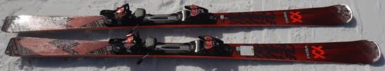
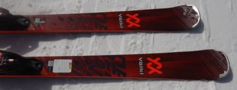
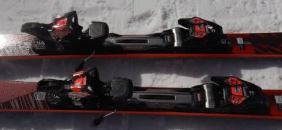
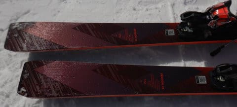
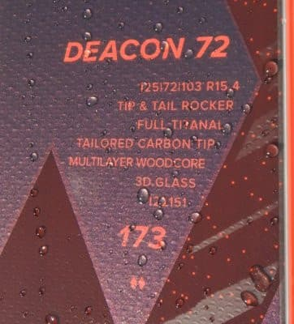

# 2023シーズンモデルのスキー板，試乗レポートその9…VOLKL DEACON 72

📅 投稿日時: 2022-06-04 00:31:45

🏷️ カテゴリ: [スキー板試乗](c0bd8048615710cee890e403a36cc9a2b.md)

あぁ…今日で渋峠が終わってしまった．

明日はそこそこ天気も良さそうだったのに…

残念（涙）

なぜ私が行こうとした前の日に…（以降，えんえん昨日と同じ愚痴を繰り返す）

ってことで．

今週末はスキーに行けなくなって

かなりがっくりしているSkier_Sです．

とりあえず．

スキーに行け無くなったので．

本日も2023シーズンモデルのスキー板インプレッション．

今回はフォルクル編．

目立たない板だし，私にはちょっと弱いけど．

この板，地味に良い板なんだよなぁ…

では，どうぞ～！

○VOLKL DEACON 72 173cm

オールラウンド

センター幅が72mmと，ちょい広めの

オールラウンド板．

以前のDEMO SXの後継機になります…

長さ173mでR=15.4ｍと，

大回り・小回りどっちにも行けそうな

サイドカーブの板です．

履いてみた感じ，センター72mmですが

そんなに幅広さ感じません．

グリップはトップからテールまで

板の張りはすごい強いわけではないけど，

そこそこの張りがあって，

エッジがしっかり雪面を捉える感じで，

エッジの接雪長が長く感じます．

全体がしっかりグリップする感じ．

谷回りでたわみを出しやすい板で，

トップを押さえれば小回り気味の

小さめのRで回っていくこともできます．

テールの張りがそこまで強くないので，

山回りでどうしようもなくグリップして

板が動かせない…ということは無く．

しっかりグリップした中でも，

グリップを外して動かそうと思えば

比較的容易に動かせる手軽さも

あります．

板にはそこそこのばね感が感じられ，

そこまで早く，強い返りではないので

板なりに滑ればロングからミドルっぽく

なっていきます．

なので，Rは小さめに感じるけど，

縦に落とそうと思えば落としていくことも

できるし．

たわませて行けば小回りまでしっかり

作れるし．

さらに切ってもずらしてもいい．

ずらしの操作性も，非常に素直で動かしやすく，

いろんな小技が使える板です．

すごい尖ったところがあるわけでないけど，

全体的な完成度は高い感じ．

あまりにも無難にまとまりすぎて，

個性がない板に感じるのが惜しい…

もう少し売れてもいい板なんじゃないかな？

とりあえず，ガツガツハイスピードで

飛ばすわけではないけど，

ある程度の技術力を持った上手い

スキーヤーがオールラウンド用として

履くにはすごいい板だと思います！！
