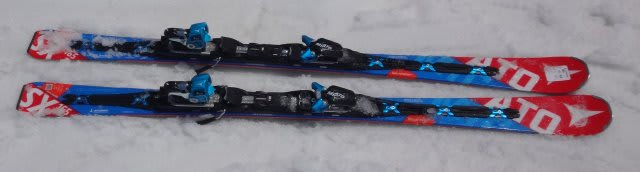
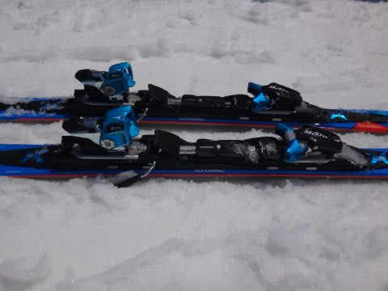
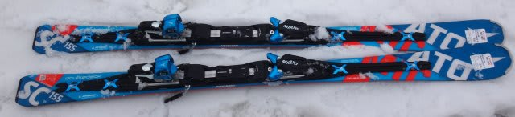
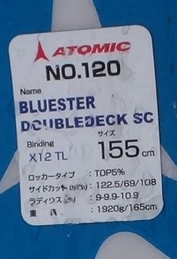
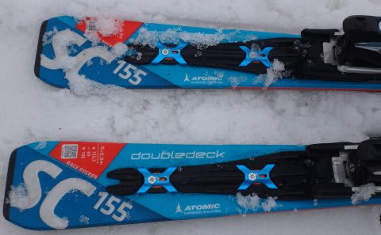

# 2017シーズンモデル，スキー試乗レポート最終回…ATOMIC編その3

📅 投稿日時: 2016-06-21 01:37:54

🏷️ カテゴリ: [スキー板試乗](c0bd8048615710cee890e403a36cc9a2b.md)

えー．

長きに渡った，2017シーズンモデルスキー板の

試乗レポートも，今回がラストです…

ラストはアトミック編．

では，どうぞ～！

○ATOMIC Bluester DoubleDeck3.0 SX +X12TL 165cm

基礎小回り．

前回の一の瀬では，強いVARビンディング付きモデルでしたが，

こちらは弱めのTLビンディング付きモデルです．

履いてみた感じ…

あぁ．SXだ．

やっぱり，SXだ．

荷重ポイントは明確にテール寄り．

弱めのTLビンディングの板ですが，

テール寄り荷重でコントロールしていけば，

しっかり固い斜面でもしっかりグリップし，

テール側で切れ上がるように回っていきます．

ただ，VARビンディングよりもコントロール性は

多少上がっている気がします．

谷回りでの板の動かしやすさ，板がガッツリ

グリップするターン中盤以降での扱いやすさ

（たわませやすさ，動かしやすさ）は

おそらくTLビンディングの方がいい感じ…

だけど．

高速耐性，テールの張りの強さを活かしたヌケ感，

エッジホールドの強さはVARビンディングの方が

上かな～．

この板，ビンディングで特性が変わるので，

どっちのビンディングにするか，よく考えて

選んだ方がいいと思います．

○ATOMIC Bluester DoubleDeck3.0 SC +X12TL 155cm

基礎小回り．

SXより扱いやすさ方向に振った小回り板ですが…

この板は，ビンディングはTLビンディングが標準です．

VARビンディングは選べません…

で，滑ってみると．

155cmと短すぎるからか，クルクル回ります．

かなり小さい半径で回る，超小回りスペシャル．

また，155cmと短めの板を履いたからか，

SXと比べて，ずらしのコントロール性がいいです．

切っていこうと思えば切れますが，

そこからずらそうと思えば妙に板ががんばらず，

簡単にずらしに持っていくこともできます．

テールを使ってずらしていくと，

ズレのコントロール性が高く，

ズラして滑っていく中でも，比較的気持ちよく

滑っていけます．

がんばらずに簡単にズラすことができる楽な板です．

オガサカとはちょっと違うけど，

ズレを使った際のコントロール性もいいし，

切ろうと思えば切った小回りもできるので．

それほど体力・体重が無い人でも手軽に

気持ちよく滑れる手ごわくない板として，

ATOMIC入門用（？）には良いのかも…

＃165cmとか，もう少し長い板を履くと評価が変わるかも
