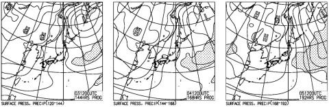

# この年末年始の志賀高原の天気は？12/30～1/5までを予想してみるが…30日は悲惨な雨(涙)，31日は冷えるが，志賀はそれほど積雪が無いかも？そのあとはそこそこの冷えが続く

📅 投稿日時: 2019-12-29 23:16:24

🏷️ カテゴリ: [スキー天気予想](c6554f5c3c106093b511a8daae23757e8.md)

ということで．

昨日，朝からナイターまで滑るという

超ご無体日帰りを強行した後．

本日はまた睡眠4時間で起きて．

年末の家の用事を必死に

済ましてました…

私が滑らなかった本日の志賀高原．

晴天で，雪も冷えてて．

いい感じだったようですね…

そして本日，

寺子屋がほぼ全面オープン，

西館もほぼ全面オープン，

東館も林間コースオープン…

([志賀高原中央エリアHP](http://shigakogen.co.jp/archives/5278)より）

さらに焼額も，

白樺コースとビギナーズコース，

そしてイーストコースが

オープンしたようですね．

…あぁ…滑りたかった（涙）

でも．

明日再び志賀高原に舞い戻り．

30日から4日までの6日間を，

志賀高原で過ごす予定です！！

…てなことで．

やはり気になる，年末年始の

志賀高原の天気を，予想して

みましょう…

えー．

まず，明日30日の850hpa気温図を見てみますが…

…

……

…やっぱりダメか…（涙）

水色の+6℃線が志賀高原に

かかってます(泣）．

この日はやはり降れば液体の気温です（泣）

前回に雨になった27日の時は，+3℃線がかかるかどうか

というレベルでしたが．

今回はそれより3～4℃気温が高いので，

かなりヤバい感じ…！

そして．

30日の地上天気図を見てみますが…

やっぱりダメです(激涙）

志賀高原にも，水色の

降水域が…

やはり．

30日は雨降りか…（止まらぬ涙）

そして．

翌日31日朝9時の850hpa図を見ると．

うーむ．

ギリギリ朝9時で0℃線が志賀を

通過する感じ．

分かりにくいので拡大すると，

こんな感じなので，

…これは，朝のリフト営業直前

くらいまで，気温が高いままで，

雨っぽいかも…

そしてさらに．

この図のように，等温度線の密度が

高い…すなわち，温度傾斜が強い場合．

専門的にいうと，この部分が強いシアーで

あることを示しているので．

ものすごい強風が吹きます．

地上天気図では志賀高原に降水域が

かかっているので．

この日は終日強風の吹雪になりそう…

…これはつまり．

30日～31日早朝までの雨のあと，

31日は激烈強風吹雪で，

ゴンドラの運転はできないかも…（涙）

雨の翌日は吹雪と．

2日連続で，辛い日になりそう…

まぁ，でも．

吹雪になるのは許そう．

雨じゃなく，雪が降って積もってくれるなら，

許そう…←だからなんでそんなに偉そうなの？

そして．

元日の850hpa気温図ですが…

うむ！これは素晴らしいっ！！

赤い0℃線ははるか南．

水色の-9℃線が志賀にかかっているので．

朝は-12℃以下に冷え込みそう…！！

で．

元日の地上天気図を見ると…

え！？？

ちょっとヤバい！

この等圧線の向きは…

完全に西風パターンじゃないかっ！？？

降水域は日本海側にかかってるけど，

北アルプスでブロックされて，

志賀に雪雲がかからないパターン．

…これって．

30日の雨のあと．

31日から1日にかけて，

西風で，志賀高原はそれほど

積もらないってこと！？？

そんなバカな．

31日に吹雪くというのに．

それほどの積雪が無いということを

意味しているのか！？？？

…そんなことにならないよう，

ここは，全力で祈って踊らなくてはっ！！

で．

その次の2日は…

うむ．

まぁ，赤い0℃線は志賀高原より

南にあるし．

地上天気図も弱い冬型だし．

まぁ，2日はそこそこ冷えて，

終日曇り～雪だな．

で．

そのあとの3，4，5日をまとめて見ると…

850hpa気温は，3日とも-6℃線が

志賀高原に近づくレベルで．

5日は特に-9℃線が志賀より南に

下がります！！

そこそこの冷え込みで，5日は激烈な

冷え込み！

…地上天気図を見ると，

3，4，5日とも弱い冬型ながら．

5日は日本海側にしっかりした

降水域があるので．

3，4日は曇り時々雪，

5日は終日雪…

といった感じでしょうか．

というところで．

まとめると．

30日：朝は曇り．気温は0℃を下回る程度．

　あさイチはまだいい感じのシマシマを楽しめそうだけど…

　昼間に向かってグングン気温が上がり，

　午前中，ぱらついていた雪は．

　昼ごろに雨に変わり，午後は降ったりやんだり．

　時折強く降るかも…（激涙）

　午後の雪質は，湿った4月の雪になっていき，

　無残に荒れていく（泣）

　そして，この雨は夜通し降る．

　激烈なザーザーぶりにならないことを祈るばかり…

31日：明け方に雨は雪に変わり，朝イチは雨で

　溶けた雪が固まったガチガチの上にうっすら

　積雪という，楽しくなさそうなコンディション．

　さらに，朝から風が強く，雪も強く吹き付け，

　滑る意欲を失うほど．

　たぶんゴンドラはアウト．

　ヘタすれば，強風で止まるリフトもあるかも…

　昼に向かい気温は激烈に冷えていき，

　強風の中雪が降り積もり，前が見にくいうえ

　下地ガリガリ，その上にモサモサ雪が積もって

　行く．

　…おそらく，この日は修行の一日になりそうな気配．

1日：朝は雪降り．ただ，西風が強いので

　降りはそれほど強くない．

　激冷え，-10℃以下の一日．

　朝はドサドサパウダーではなさそうだけど，

　最低10cm，運が良ければ20cmくらいの積雪．

　あさイチは柔らかいシマシマが楽しめそうだけど…

　運が悪いか，風が強くて雪付きが悪いコースは

　下地の硬いのが出てきそう．

　終日雪が降ったりやんだり．

　西風なので，時折雲の合間から日も射すかも．

　午後は雪が荒れていき，急斜面は下地の

　硬いのが出てきて手ごわくなるかも

2日：朝は-7℃～8℃の冷え．

　運が良ければ，朝はそこそこの雪が

　積もってるかも…

　天気は終日雪がぱらつく．

　あさイチのシマシマは冷えてて柔らかくて

　いい感じ．午後はコースが荒れていきそう…

　終日冷える．

　雪が解ける心配なし．

3，4日：朝は-10℃行かない程度．

　2日間とも曇り時々雪，

　朝イチはいい感じのシマシマ！

　終日冷えて，トップシーズンらしい

　一日．

5日：朝は-12～13度まで冷えるか．

　この日はそこそこ雪が降りそうだけど…

　朝に積もってるのかどうかはまだわからず．

　終日冷え冷えの雪降りの一日

…って感じでしょうか．

うーむ．

30，31日は修行になりそうだけど…

31日～1日にかけて，あまり強い西風にならず

志賀高原にドサドサパウダーが積もるよう，

祈りましょうっ！！

ってなことで．

これから4時間半後に出発です～！

…また4時間弱しか寝られない（涙）

## 💬 コメント一覧

### 💬 コメント by (やっさん)
**タイトル**: Unknown
**投稿日**: 2019-12-30 06:59:17

はじめまして。昨日このブログを見つけました。天気予想付きでとっても役に立ち参考にさせてもらってます。毎年必ず志賀高原へ行っています。今回も年末年始を利用していく予定でしたが、雪不足かなと思い、少し延期しようか考えていたところです。気をつけて滑ってきてくださいね。また情報をお待ちしています。それにしてもパワフルですね❗️関西の方から行っているのでましょうか⁉️

### 💬 コメント by (かず)
**タイトル**: Unknown
**投稿日**: 2019-12-30 13:12:51

Sさんの予測どうり雨ひどいですね…今日明日は休養にはもってこいですよ！ 緩いところならなんとかでした！今年から車中泊してるのもある意味ラッキー！ポジティブ 笑 元旦待ちです

### 💬 コメント by (ゆーちん)
**タイトル**: Unknown
**投稿日**: 2019-12-30 16:58:45

我慢できずに投稿します。関西は神戸方面のスキーヤー　もう大台のオヤジです。数年前からフォローしてますが、S様のスキー愛　焼額愛となんといってもスキーヤーしか受けないようなその表現と文才に惚れ込んでます。なんか焼額山の情報というよりは今日S様が何をしでかすかその方が気になります。そんなS様や仲間の皆さんに永遠のスキーライフが続くように関西から祈ってます。今年のゴールデンウィークは多分あの方かなと思ったのですが勇気無く　声かけれませんでした。今度は声かけます。Gokuraku Skier がS様ではないかと思うのですが？　モータウンミュージックに乗って滑る　yakebi all stars が私のお気に入りです。

### 💬 コメント by (Skier_S)
**タイトル**: 明日朝は雨にならず！？？
**投稿日**: 2019-12-30 22:15:58

＞やっさんさま

どうも，コメントありがとうございます～！

そして，初めまして～！

私は某K奈川県住人です．

関東圏ですよ～！

＞かずさま

予想が悲しいほど当たりました(涙）

でも，明日の朝まで雨という予想は外したので，

明日の風も弱まってくれて，いいコンディションに

なることを期待…

＞ゆーちんさま

始めまして～！

そして，コメントありがとうございます～！

楽しんでもらえているようでうれしいです．

ちなみに，私とGokurakuさんはいつも一緒に滑ってますが，

同一人物ではありません(笑)．

また今度見かけたときは，ぜひぜひ声をかけてください．

一緒に滑りましょう～！！

