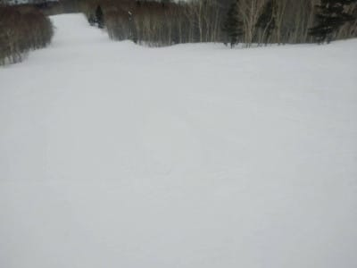

# 3月20，21日の週末の志賀高原スキー場の天気は？…そして，2021/3/16(火)，17(水)の志賀特派員情報！

📅 投稿日時: 2021-03-18 01:53:06

ということで．

昨日はいろいろ切羽詰まって死んでましたが．

今日はちゃんと更新するよ！！

…でも，もうこんな時間（涙）

とりあえず．

昨日載せられなかった，16日(火）の志賀高原ですが．

うーむ．やっぱりポツポツ雨が降ったようです…

まず，朝はすっきり晴れ！

…なれど．気温はあさイチでほぼ0℃と，

結構高め…

でも，朝イチはかなりのガチガチの

電動マッサージバーンだったようですが…

気温はぐんぐん上がり，午前10時過ぎには

雪も緩み．

11時ごろには…

えええ！奥志賀山頂で+8℃！！？？

ってなことで．

午前中のうちに，雪はザブザブに緩んだらしく

さらに，昼ごろには空に雲が増え始め…

…なんと．

朝の晴天からうって変わって，

14時ごろには風も強まり出し…

15時近くに，ポツポツと液体が

空から降ってきたようで．

ゴンドラの窓に水滴が…(涙）

でも，この日は本降りになることは無く．

ポツポツと水滴がつく程度の雨らしき

ものが30分ほど降った後は，止んでくれた

ようです…！

いや．

本降りにならなくて良かった…

ってなことで．

気温は上がったものの，壊滅的な雨は

逃れた16日(火)だったのですが…

本日17日(水)はどうだったかというと．

今日も朝からすっきり晴天だったのはいいけど…

昨日からの積雪はわずか2-3mmだった

ようです(涙）

うーむ．

そろそろ積雪が欲しいところですが．

おこみんはきれいなシマシマの上に

鎮座しています．

ただ，朝イチの気温は-5℃と，

ここ数日では一番の冷え！

…って，これが平年並みなんですが．

しかし．

昨日の高温＆ポツポツ雨で雪が緩んだ

あと，これだけ冷えるとどうなるかというと…

はい．

そうです．

ガチガチ強烈電動マッサージバーンの

出来上がり！

あさイチのバーンは，かなり固かった

ようですが．

昼近くになると表面も緩み，

滑りやすくなったようですね…！

そして，昼になっても気温はわずかに

0℃を上回る程度だったので．

雪もザブザブになるほどひどく緩まず，

表面は柔らかくなったものの，

硬めの下地が残ってくれたようで．

午後になってもそれほどひどく荒れず，

割とフラット気味で滑りやすい

バーンだったようです…！

で．

土曜から故障で止まっていた焼額の第2高速リフト．

修理が完了し，18日(木）から動き出すようです…！

今週末は，無事一の瀬と焼額方面がリフトで

行き来できます！

ってな感じの志賀高原ですが．

…ここ数日，この時期としては高温が

続き，2週間以上まともな積雪が無い

状態が続いてるわけですが．

果たして今週末にかけての志賀高原．

どんな天気になるのか…？

水曜深夜恒例，天気予想です！

…が．

今日は特派員レポート写真がいっぱいで，

さらに天気図を貼り付けて解説すると

すごい長い記事になるので．

天気図解説はやめにして，

予想のみ書きますと…

18日(木)：終日晴れ．

　朝は-3℃くらいまで冷えるか？

　昼間は+2-3℃で，それほどひどく

　気温は上がらないが，日差しで雪は緩む．

　朝はガチガチ，一の瀬方面は昼くらいまで

　割としっかりした雪．

　日差しが強いところは午前から緩み，

　午後は春の重い雪に．

　でも，春スキーと割り切れば

　いい天気で楽しめそうな一日．

19日(金)：おそらく終日晴れ．

　時々雲がかかるかも？

　この日も朝は-3℃，昼間も+3℃程度．

　前日のリプレイを見るような，

　朝はガチガチ，西斜面は昼ごろまで

　硬めをキープ，東斜面は朝から

　日差しで緩み始める．

　午後は表面は緩むけど，よっぽど

　日差しがあたるところ以外は

　そんなにバーンは荒れなさそうで，

　この日も春スキーと割り切れば

　いい一日．

20日(土)：朝は晴れ．気温は0℃をわずかに

　下回る程度．

　朝はガチガチバーン．

　昼間は+5℃以上まで気温が上がるか…

　ただ，昼には雲が増えて行きうす曇りに

　なりそうかな．

　午後はもしかすると…一瞬パラパラ

　液体がぱらつくかも？？

　降ってもウェアに水滴がつく程度で，

　降らない可能性が高いと思うが…

　午後は曇り空．

　雪は春の雪になっていく．

21日(日)：うむ．微妙．

　朝から曇り空．朝から気温は高め．

　昼間は+10℃くらいまで上がるか？

　南風がどこかのタイミングで強くなり…

　ゴンドラは減速運転になるかも？

　そして，どこかのタイミングで降る．

　降り始める．

　…液体が．

　まだ，昼に降るのか夕方に降るのか，

　予想はばらついている段階．

　私としては，降ったとしても夕方の

　リフト営業終了後になるよう願うばかり…

…って感じの予想で．

これから週末にかけても，

全く積雪はなさそうです(涙）

あぁ…ゲレンデに最後に雪が降ったのは

いつの日か？？

これから一週間の天気図を見ても，

日曜21日の夜中~22日の明け方にかけて，

積雪があるかどうか…という程度に

わずかに雪が降る以外．

全然雪が降らなさそうです(涙）

これから，１，2月にまともにスキーに

行けなかった埋め合わせをしなくては

ならないんだけど…

このままだと，今シーズンも太板を

一度しか履かずに終わってしまいそう…（涙）

あぁ…

今シーズンあと1度，冷え冷え

ふかふかパウダーを滑りたい…

せっかく緊急事態宣言も解除されるので．

…願わくば．

これから激烈に冷えて，

毎晩1m位のパウダーが降り続いて欲しい

ところ…←毎日1m降ったら大変だから

## 💬 コメント一覧

### 💬 コメント by (レインボー73)
**タイトル**: Unknown
**投稿日**: 2021-03-18 11:31:55

木曜日の志賀高原情報

朝の上林−１℃ 蓮池ー３℃。気温の割に暖かい。まずはパノラマからカラマツへ。硬いけど気持ちいい。　

ＧＳ２本、硬いけど昨日ほどではない。快適！

そのあとのオリンピックは早くも表面がゆるみ始めて勘違いパーンに。

ダイヤモンドは圧雪されてない。

パーフェクタはというと、あ、ポールがない。やったー！硬めの快適バーン。

ファミリーはもう少し表面が柔らかめの勘違いパーン。

おや！　タンネが何故か休止。こんなに団体様が来てくれてるのに。

高天のＮＨＫも多少のコロはあるものの文句なし。

早くにゆるむ西たては、メインは硬めだけど林道に入ると急にズクズクに。何でかな？

そして11時過ぎには定位置の銀嶺ざる蕎麦。毎日食べてても毎日美味しい。

今日はこれまでの動きがパーフェクトに感じてます。

多分どこも快適で、みんなが感じてるのかも？

### 💬 コメント by (レインボー73)
**タイトル**: Unknown
**投稿日**: 2021-03-18 14:31:33

木曜日の志賀高原２

昼食後の西たては、フーディーはまずまずだったけど、下はズクズク。

さて、来ました寺子屋。視界良好、北アルプスの稜線がくっきり。今日も裏切らず勘違いさせてくれました。

そのあとも悶絶のファミリーを回して、最後はパノラマからサウスへ。ここはズクズクボコボコながらも、妖怪が昼寝していたおかげで、気持ちよく突っ切ることができました。

ここしばらく太板で練習したせいか、ＧＳ板の有り難さが分かった一日でした。

### 💬 コメント by (レインボー73)
**タイトル**: Unknown
**投稿日**: 2021-03-18 17:54:42

エス様、副業のお仕事がお忙しいようで、本業のスキーをサボり過ぎではありませんか？

### 💬 コメント by (アリス)
**タイトル**: 志賀高原は夢のようです
**投稿日**: 2021-03-18 18:00:14

Skier_S様

画像の情報は、ｈｐのライブカメラより詳しくて助かっています。

3/17,18は志賀高原に滞在していました。

3/17はS様を見習ってランチも取らず、ラストまで滑ってしまいました。

3/18はまさにヤケビブルーでした。

素晴らしいバーンを滑っているのが夢のようでした。新発見なのですが、この時期の平日は、AMはヤケビ、奥志賀でＰＭは一の瀬、高天原、寺子屋がいいような感じを受けました。

S様　　少しお借りします。

レインボー様

17日は突然の挨拶で、寺子屋でのお付き合いありがとうございました。

素晴らしいスキーライフを送っていらっしゃいます。羨ましい限りです。

レインボー様初対面でしたが、何かオーラが出ていましたので『この人だ』って分かりました。

あの後、15時前にパーフェクターに行きましたが、2本のつもりが、あまりにもバーンが良すぎてラストまで滑ってしまいました。

18日は二高一番乗りで、ヤケビを10本でAMで切り上げて、先ほど帰宅です。

また、お会いしましたらよろしくお願いいたします。

### 💬 コメント by (ikkun)
**タイトル**: Unknown
**投稿日**: 2021-03-18 20:34:48

こちらは 樹氷が出来た山頂でしたよ❤️  しかしあっという間にザクザクになりましたが？(笑)黄砂も来ましたし(笑) スキー学校も28日で終わりなのでお客様もないけど頑張って参る、ちなみに15日仲間と戸隠スキーしました❗降雪機はスゴいなあ😆

### 💬 コメント by (Skier_S)
**タイトル**: 日曜は覚悟した方がいい天気
**投稿日**: 2021-03-19 01:32:29

＞レインボー73さま

そうなんです…副業が忙しすぎて，本業に身が入りません…

早いところ副業をやめてしまいたいのですが…(涙）

＞アリスさま

おっと．

レインボーさんとお会いされたんですね！

オーラが出てましたか…

分からないでもないですが(笑)．

私にとって，ある意味生き方のお手本と言える方ですから…

＞ikkunさま

あら．あと2週間でスクールのシーズン終わりですか…

今シーズンはまともに滑れないうちにシーズンが終わってしまう感があります…（泣）

