# 2018年8月，子連れ座間味で小5の娘とファンダイビング！その8…ダイビング2日目も晴天！

📅 投稿日時: 2019-09-11 00:55:52

本来．

スキーシーズンが終わると，運動量が

減ってしまう私．

スキーシーズン中の，強烈な[スキーダイエット](edd0452732278bcfc87b9419cd5bf3f1e.md)の

効果により，標準体重以下に痩せて

しまったのを取り返すべく（？），

いつもならスキーシーズンが終わった

今ごろから，なんとか太り始めるんですが…

この夏は，スキーシーズンが終わって

太るどころか，むしろ痩せていくんです

が…っ！！

なぜだろう？

と，冷静に振り返ってみると．

平日は，お昼ご飯を食べそびれたり，

打合せ中にパンやおにぎりをかじりながら

済ませることが多く．

さらに，めんどくさくて夕食を抜いて

しまうことも時々あって．

さらにスキーに行かない休みの日は，

お出かけの予定が無いと，昼過ぎまで

寝てしまい，一日1食で済ませたりと…

夏も痩せていく，極めてマズい状況に

なりつつあるわけですが．

とりあえず．

スキーダイエットに並んで．

仕事ダイエットというのもあるな…

と思った今日この頃．

皆様いかがお過ごしでしょうか（涙）

ってなことで．

本日も，座間味のダイビング旅行記です！

---

ということで．

本日1本目のポイント，『儀名』へ

エントリーしましたが…

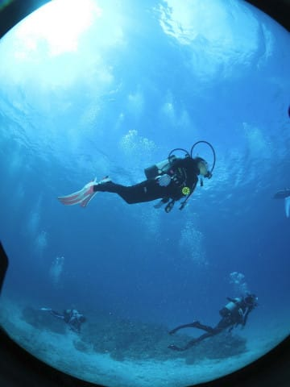

娘は，ダイビングできるのが

よっぽどうれしいのか．

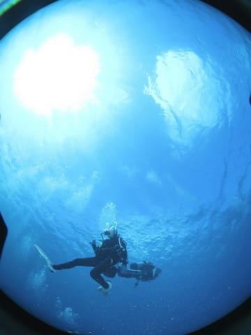

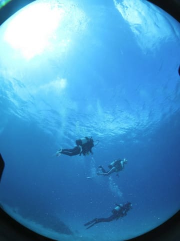

グルグル回ってます…

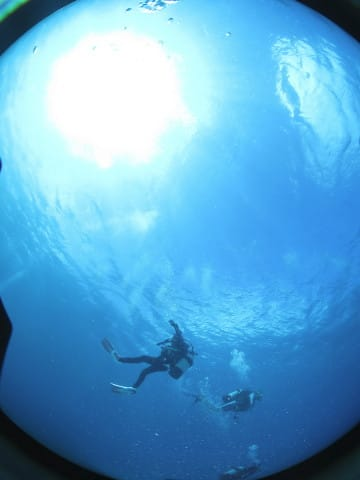

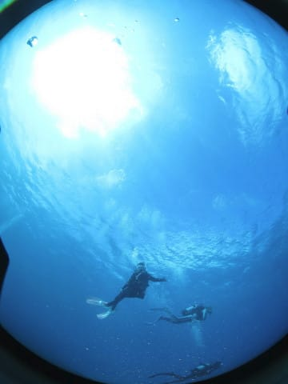

なんだか良く分からないけど．

楽しそうです…

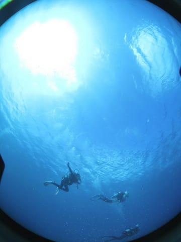

まぁ，本人が楽しそうなので，

良しとしましょう…

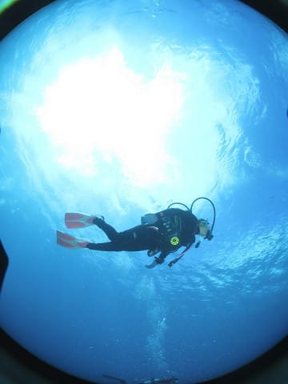

ってな感じで．

晴天の海の中．

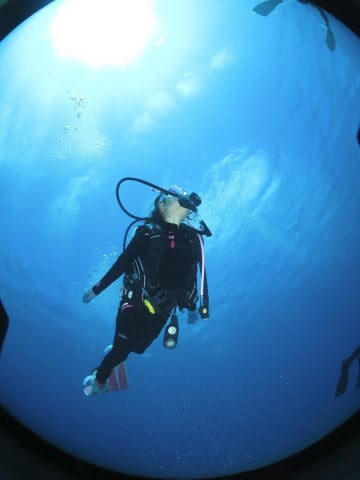

いろいろ巡りますが…

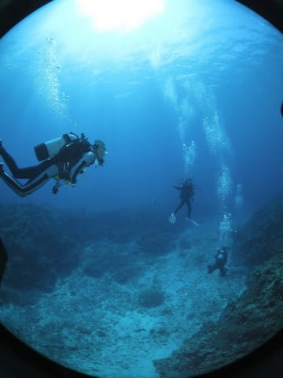

カクレクマノミやら…

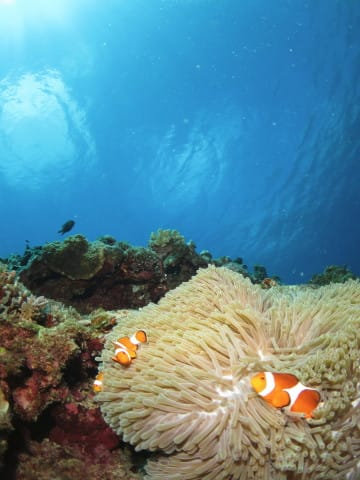

ハナビラクマノミなどを

愛でつつ…

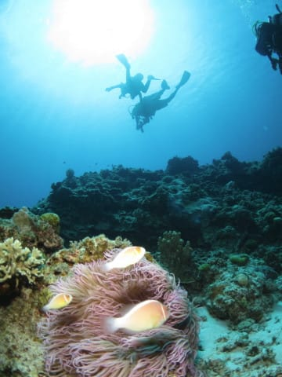

いくつかの根を渡り歩いて

行きますが…

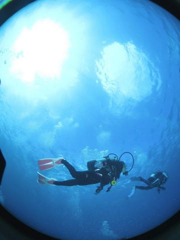

この根には，同じイソギンチャクに

普通のクマノミとセジロクマノミの

2種類が着いてるようですね．

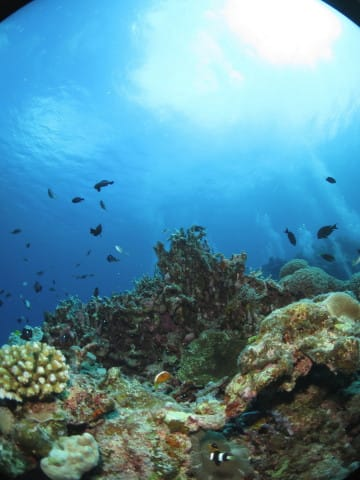

そして，根の下には，

キンメモドキがいっぱい！

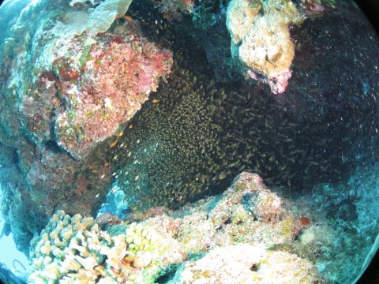

岩陰に隠れているキンメモドキに

近づくと…

かなりの量が群れてます！

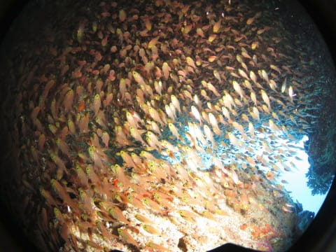

ってな感じで．

いくつかの根を巡ったら…

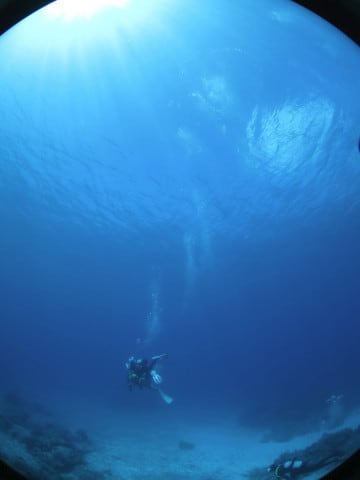

ダイブタイム45分で，

本日の1本目終了！

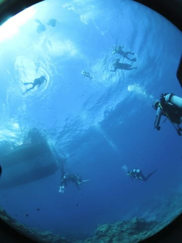

…ボートの周りで，子供たちが

泳いでいる中エグジット．

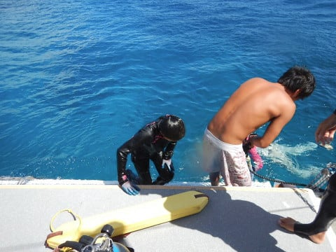

天気のいい，穏やかな海での

ダイビングでしたが．

…撮った写真のほとんどが

娘の写真だったので．

今から振り返ってみると．

おそらく，海の中はそれほど

見どころが無かったんだろうな…

という1本だったのでした．
