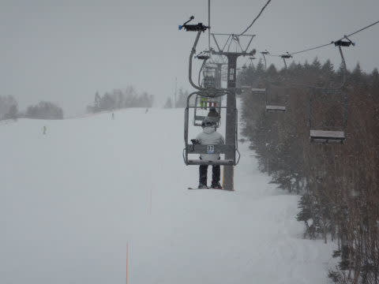
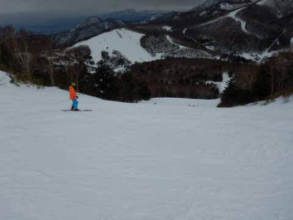

# 2020/2/22(土)，3連休初日の志賀高原スキー場は…気温が高く朝は晴れ，午後は雪~雨（涙）．そして焼額ゴンドラ運休（泣）

📅 投稿日時: 2020-02-23 00:01:30

🏷️ カテゴリ: [2020スキー滑走日記](c282e9230de179e245c7334eabeb0a3b3.md)

ということで．

本日も志賀高原にやってきている

わけですが…

…

…今日は，ちょっとかなり結構残念な

一日でした…（涙）

どう残念だったかというと．

まず，朝の志賀高原への登り路．

…雪がないんですが…っ！！！

はっきりって，夏タイヤでもやって

これるレベル．

（ホントに夏タイヤで来ないでくださいね！！）

全然道路に積雪なし（泣）

で．本日．

強風でのゴンドラ営業を心配しましたけれど．

焼額ゴンドラは無事営業開始するようで，

いつものゴンドラ営業開始前に並びますが…

山頂へやってくると…

山頂の気温は，ぎりぎりマイナス気温の，

⁻1℃．

…って．

あさイチで⁻1℃だったら，すぐに

プラス気温突入確定では！？？

朝イチは，まだうっすら雲がかかって，

日差しも弱く．

そのおかげで，そこそこ締まり気味の雪で，

エッジがガッツリ食い込むいい感じのバーン！

うはーー！

これは，結構いい感じのシマシマバーンでは

ありませんか！！

朝から緩んだ雪だなんて言ってたの，

誰だ！！←自分だから

と，朝イチは気持ちよくシマシマを滑っていたけど．

すぐに太陽さんが顔を出し．

をを！！

すっきり晴天の，いいゲレンデに

なって来たではないか！！！

…と，喜んでいたのもつかの間．

これだけ強烈に晴れるということは…

そうです．

ただでさえ気温が高めだった今日．

気温があっという間に上がり，

日差しで雪が解けるということですね（涙）

もう，朝10時前には，ゲレンデは

ダマ状に固まった雪になってきました…（泣）

そして，奥志賀ゴンドラが強風で

運休のため．

焼額に人が集まってきたようで…

ふぎゃーーーー！！

朝10時の焼額ゴンドラ，

すごい列なんですが！？？

列について振り返ると…

うーむ．

正月でもここまで混まなかった…

強風で減速運転ってのが効いてるのかな…（泣）

とりあえず．

イチゴン待ち時間10分越えは，今シーズン

最高記録ですね…（激涙）

ってなことで．

待つことに耐えられない私は，

奥志賀に様子を見に行ってみました～！

奥志賀ゴンドラは止まってますが，

それ以外のリフトはすべて動いているので．

取りあえずエキスパートコースへ…

をを！

さすが北斜面．

ダマダマになってる焼額と違って，

まだコースは締まってるよ！！

そして，リフトは時々この程度

待つことはあったけど．

焼額のゴンドラ待ちに比べれば，

まだマシ！

…ただ，人口密度が高めで…

昼頃には，やっぱり重めの湿った

ダマダマ雪がところどころに溜まった，

3月末のような雪質に…（泣）

ってなことで．

昼12時に，奥志賀を脱出！

…このころには，太陽が隠れて．

時折雪がぱらつく天気になってました…

うーん．

予想だと，午後は雨だったので．

このまま，雪が液体にならないで

いてくれるといいんだけど…

昼の第1ゴンドラは，朝の混雑が嘘のように

空いてましたが…

かなり霙っぽい雪が降り始め，

ゴンドラ窓に水滴が…（涙）

気温が高い，雨のような雪のため．

ゲレンデコンディションは，一気に

4月の雪になっていきます（激泣）

ダメだ…

ダメだよ…

…と，意気消沈していると．

一の瀬方面がまだ少しマシとの情報が

あったので．

今度は一の瀬へ浮気！！

さすが3連休，一の瀬もちょいと混み気味で…

ゲレンデの人口密度も高めですね（ちょい涙）

でも，パーフェクターコースは．

取りつきに土が派手に出ていたものの．

コース自体は，午後までそれほど荒れておらず，

確かに滑りやすかったかな…

ついでに，高天ヶ原も見に行ったけど．

午後2時には，すごい雨っぽい雪が

結構強く降り始め（強烈涙）

ゲレンデがざぶざぶになって来たので．

もう，こりゃどこ行ってもダメだ…

高天ヶ原のリフトも，珍しく

混み気味だったので．

雨に濡れない，焼額のゴンドラに戻ろうと．

わがホームに戻ってきました！！

…が．

なんだ，これは！！

なぜ，いつもならガラガラの午後2時過ぎで

こんなに混んでるの？？

どうやら，

強風で，第2ゴンドラ，第3高速が止まっており．

その上に第1ゴンドラは減速運転で

輸送量が落ちてしまい，激混みに

なった様子…（涙）

と，思ったら．

なんですと～！！！！

午後3時に．

第1ゴンドラも，ついに運休？？？（止まらない涙）

うがー！！

午前は意外とマシだったけど．

予想通り，午後3時には1ゴン，2ゴン揃って

討ち死にか…（涙）

それどころか，第3高速も止まったので．

まともに滑れる高速リフトは，第2高速のみ（泣）

だもんで，第2高速は，結構混み始めてきました…

とはいえ．

雨の中第4ロマンスの低速リフトを

長く乗ってるのは嫌だし．

もう，ここを滑るしかないのだ！

第2高速で，唐松コースを滑る以外，

選択肢はないのだ！！

…と．

リフトストップの16:15まで，

雨に打たれながら，第2高速を

ひたすらグルグルし続けたのでした…

…

…が．

なに？？

今日も一の瀬は16:50まで営業！！？？

だとすると…

ワーーーーープっ！！！

やってきました，一の瀬へ！

午後5時頃には，雨もすっかり止み．

それどころか，日も射すような

コンディションの中…

雨でぬれて重くなったゲレンデを，

16:50の一の瀬リフトストップまで．

滑ったのでした…

ってなことで．

朝から

晴天→小雪→雨（山頂付近はぎりぎり雪）＆強風→うっすら晴れ

という，かなり目まぐるしい天気の移り変わりに

翻弄された本日．

ゴンドラの待ち時間が異常に長かったり，

ゴンドラが営業中止になったり．

そして，雨に打たれたりと．

一日滑ったわりには，満足感が少ない，

残念な一日だったのでした…

…そうです．

こんな日は，ナイターだ！！

今日は3連休だから，久しぶりにサンバレー

ナイターの営業がある日だ！！

と．

サンバレーそばの宿に泊まっており，

サンバレーナイターに行く気満々だった

私に向かって．

無情な通告が…

「悪天候のため，サンバレーはナイター中止です」

…ふぎゃーーーー！！

なんの仕打ちだ！！

朝から激混み＆強烈春の雪，

午後は強風＆ゴンドラ運休で，

さらに雨に打たれ．

…そして夜はナイター営業中止だと！？？

「でも，一の瀬はナイターやってますよ」

…って．

…サンバレーで宿の食事を食べてたら，

一の瀬ナイターに行くのはつらいのですが…

…うーん．

どうしようかなぁ…

…

…はっ！！

…え？？？

なぜか，宿で夕食を食べ終わったら．

一の瀬ダイヤのゲレンデに…っ！？？

…どうやら，私の強烈な執念が，

サンバレーそばの宿から，

一の瀬まで瞬間移動させてしまった

ようです！！

…そして．

ナイター中のゲレンデは，結構な勢いで

雪が降ってます！！

おかげで，ゲレンデにはかなり

思いながらも新雪が降り積もり…

プチ新雪バーン状態！

…でも．

午後8時過ぎには降りやんでしまい，

積もったのは，激烈に重めの雪が，

せいぜい5cm程度ですが…

ってなことで．

本日もナイターストップの9時まで，

ダイヤナイターを滑り倒しましたが．

…この5cm積もってくれただけで．

今日の雨で解けた雪が固まったガリガリバーンは

隠れてくれるので．

明日のコンディションは，かなり良くなるかな！

…そして．

明日は一日，雪が降ってくれそうなので．

今日解けて締まった雪が，少しは回復

することを期待…！！

（でも，降り始めは営業開始後になりそう．

　何かの嫌がらせかな…？（涙））

## 💬 コメント一覧

### 💬 コメント by (まいる)
**タイトル**: Unknown
**投稿日**: 2020-02-23 00:40:32

お疲れ様です

今日のコンディションはいまいちでしたね

ずぶ濡れでした・・・

月曜日にもう一度焼額に行く予定です

### 💬 コメント by (かず)
**タイトル**: Unknown
**投稿日**: 2020-02-23 00:43:59

気になって早速見にきました  笑 ヤケビゴンドラ15時運休なら予想より良かったですね！しかし3連休で減速もキツイなあ… 明日も風強そうですよ

### 💬 コメント by (ゆーき)
**タイトル**: Unknown
**投稿日**: 2020-02-23 06:47:31

確かに朝は良かったですね、焼額山。

私はその後、一ノ瀬方面に行きましたが、

14時くらいから、寺子屋と、一ノ瀬高天ヶ原山頂以外は雨になって、意外と、普通に降る時間もあり、家族のものが、もう嫌と言い始めて、久々でしたが、一ノ瀬ラストは、滑れませんでした。。。私も不完全燃焼。。。　今日明日、頑張ります

### 💬 コメント by (たむとも)
**タイトル**: Unknown
**投稿日**: 2020-02-23 07:44:24

初めましてコメントさせて頂きます50代スキーヤーのたむともです。

学生時代から37年連続して志賀高原(ここ10年は年に1〜2度程度ですが…)に行って滑っていましたが、今年は病の為(只今、長期入院長期(悲))とうとう自身の記録が止まりそうです。そんな辛い中…こちらのブログを拝見するとゲレンデ情熱(毎週行っているのが凄すぎ！)が詳しく…自分が滑っているよう(下手ですが…)でとても元気が出ます！。

これからも頑張って下さい！。因みに私は、奥志賀と焼額がベースです。

### 💬 コメント by (いちと)
**タイトル**: Unknown
**投稿日**: 2020-02-23 12:17:19

朝イチのジャイアント山頂は、ハードな条件で心が折れました

それを回避し東館のゴンドラ目指したら、今までの最高待ち時間50分です

### 💬 コメント by (ノムノム)
**タイトル**: 今日は吹雪でしたが、雪は良かったですね
**投稿日**: 2020-02-23 18:04:47

本日はお会いできて嬉しかったです。ステッカーありがとうございます！！

妻と一緒に板とヘルメットに貼りますね！(笑)

別れた後、ついて行ったつもりでしたが直ぐに見失ってしまい…。さすが、Sさん！

板が1年でヘタる理由が分かりましたよ～。

またお会いできる日を楽しみしています。来シーズンかな…。

### 💬 コメント by (Skier_S)
**タイトル**: 回答遅れてごめんなさい
**投稿日**: 2020-02-25 02:39:31

＞まいるさま

今回はお会いできず…

月曜は焼額いらっしゃいました？？

土曜は悲惨でしたが，月曜は最高でしたね！

＞かずさま

日曜はゴンドラ運休せずにもちました．

昼間の積雪5~10cmってところでしょうか…

＞ゆーきさま

土曜は悲惨でしたね…

普通の人は，雨が降ったら帰りたくなると思います(笑)．

一の瀬ラストは晴れてくれてよかったです～！

＞たむともさま

はじめまして～！

ようこそ，このBlogへ．

37年連続志賀高原ですか！私より志賀高原歴が長いですね(笑)．

病気療養中とのこと，早期快復＆志賀への復活を祈っています．

それまでは，このBlogで志賀高原へいった気分になってください！

＞いちとさま

東館ゴンドラ50分待ち！？？

さすがにそんな待ち時間は聞いたことありません…

お疲れ様でした…

＞ノムノムさま

イチゴン山頂で，無事お会いできましたね(笑)．

そうでしたか…

後を追ってこられたなら，ちょっとゆっくり滑ればよかったかも．すみません．

今度は新車でぜひお越しください！！

