# 2018年8月，子連れ座間味で小5の娘とファンダイビング！その3…勝負の朝！果たしてフェリーは出るのか？満席のフェリーに乗れるのか？無事座間味に渡れるのか！？？

📅 投稿日時: 2019-09-02 00:18:48

…なんと．

もう9月だよ…！

もう，2019年も，3分の2が

終わっちゃったんですよ！

早い…早すぎるっ！！！

…でも．

9月と言えば．

あと1か月ちょいでYetiが

オープンじゃないですか！！！

もうすぐ，長い間，ひたすら

待ちに待ったスキーシーズンが

始まるのだ！←いや，つい2か月前までスキーしてなかったっけ？

1週間前に．今年最後のダイビングを

終えて．

あとはスキーシーズンまで，

どうやって襲い来るストレスを

乗り越えればいいんだろう…

と，心配になっていたけど．

もう，スキーシーズンはすぐそこです！

おそらく．10月18日ごろに

Yetiがオープンするはずだから．

あと1か月半でスキーシーズンです！！！

ということで．

スキーシーズンが近づいてますが←いや，普通の人にとってはまだまだシーズンインは先だから

今日は，夏の名残のダイビング旅行記です～！

---

ということで．

那覇に到着した翌日の，日曜日．

熱帯低気圧により海が荒れていて．

予約していた高速船の欠航はほぼ確実．

フェリーも出るかギリギリで，

かつフェリーは満席のため，

キャンセル待ちで乗れるかどうか…

という．

ホントに座間味に行けるのかどうか．

微妙な状態の朝を迎えましたが…

昨晩，娘は一生懸命てるてる坊主を

作っていたけど．

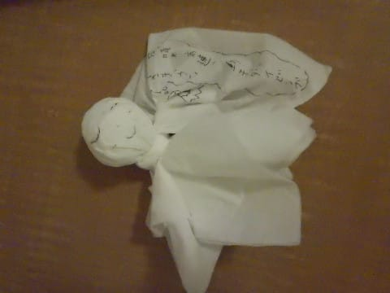

果たして，その効果はあったのか…？？

とりあえず，朝の天気は…

晴れてます！

でも，引き続き海は荒れているようで…（涙）

それでも，朝10時発のフェリーが

出てくれるという，一縷の望みをかけて，

私一人，あさイチに泊港のキャンセル

待ち列に並びに行くことにしました…

ってなことで．

朝7時オープンの泊港ターミナルの

オープン前に並んで…

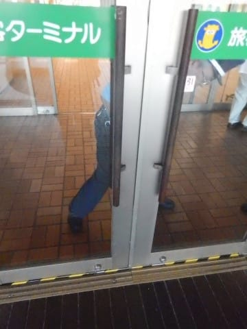

警備員の人が玄関の鍵を

開けると同時に，

座間味行きフェリーのキャンセル

待ち列へ！

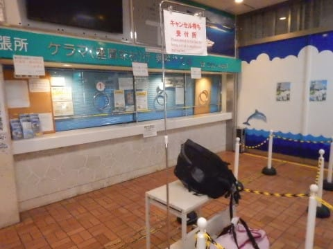

やったーーー！

ぶっちぎりの一番！！

…って．

他の人もいっぱい来ると思っていたのに．

私一人だけなんですが…

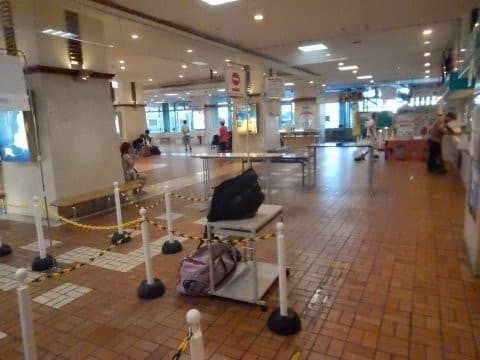

うーむ．

そんなに慌ててこなくて良かったかな…？

とりあえず，ぶっちぎりのキャンセル待ち

1番だから，フェリーが出るなら，さすがに

これで乗れないってことは無いだろうな…

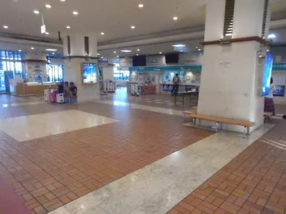

…もしかしたら．

もうフェリーが出ないことが

決まっていて，誰も並んでないとか？？？

…でも「キャンセル待ち」って並ぶところが

作ってあるんだから．

それは無いだろうなぁ…

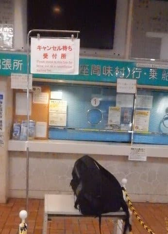

ちょっと心配になって，

係員の人に聞いてみると．

「まだ，フェリーが運航するかどうか決まってません．

　きわどい状況なので，まだ船長が様子を見ているところで，

　朝8時ごろに判断すると言っています…」

とのこと…

…もう，ここはフェリーが出てくれるのを

祈るばかり！！！

で．

待つこと一時間．

さすがに，朝8時ごろなると，ちょっと列が

長くなってきましたが．

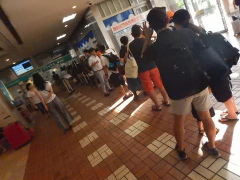

8時を過ぎたころに，

本日の運行予定が知らされました！

はたして，本日フェリーは

運行されるのか，否か！？？？

…

…

…

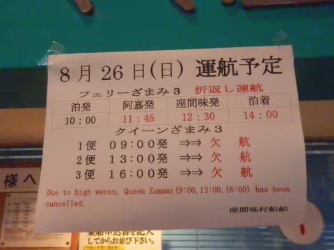

をををををを～！！！

無事，フェリー運航！

帰りは本来午後4時発のところが，

12:30発と折り返し運行で，

かなりきわどい運行ですが．

なんとか運行が決定しました～！！！！

良かった～！！！

…当然，高速船のクイーン座間味は

すべて欠航ですが．

でも，これで無事座間味に渡れそう！！

ちょっと安心…

ってことで．

運行が決定した8時過ぎに，

窓口がオープンして．

無事キャンセル待ち一番の

私は，チケットをGet!

のんびりやってきた家族と

合流し，座間味行きフェリーに

乗り込みます…

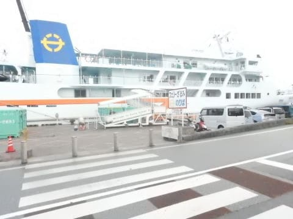

うーむ．

本来なら，高速船で朝10時には座間味に

到着して．

午前中から潜れるところ．

フェリーだと昼到着で，

午後からのダイビングになっちゃうのが

残念だけど…

まぁ，今日中に座間味に行けただけ，

良かった．

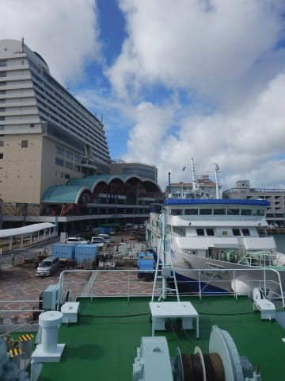

これまで，座間味のフェリーには何度も

乗ってますが．

今回乗るのは，就航から1年ちょいしか

経ってない，新造の3代目フェリー座間味．

私がこの船に乗るのは初めてです…

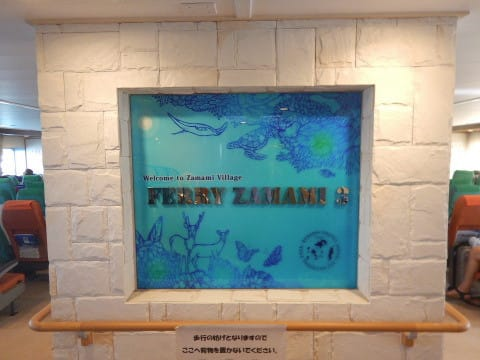

船室も，何もかもまだ新しいですね～．

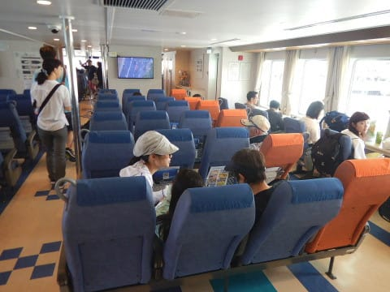

ってなことで．

定時の10時に，座間味に向けて，

出航！

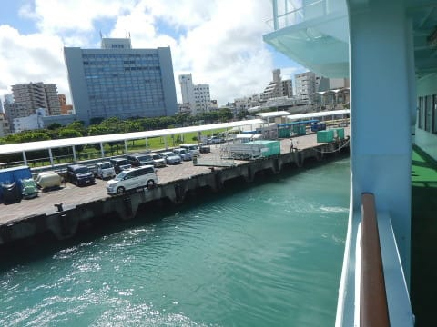

いやーー．

座間味に行けて，良かった…
