# 臨時天気予想！志賀高原の17，18日の天気は…はたして雨が降るのか，否か？？

📅 投稿日時: 2018-01-17 03:03:33

🏷️ カテゴリ: [スキー天気予想](c6554f5c3c106093b511a8daae23757e8.md)

えー．

本日．

[焼額山のホームページ](http://www.princehotels.co.jp/page.jsp?id=217105)を見て．

2月1日から使える，[2ndシーズン券](http://www.princehotels.co.jp/ski/shiga/files/pdf/ski-zunn.pdf)なるものが

発売されることを知った，Skier_Sです．

…うーむ．

しかし．

2月1日からシーズン終了までで3万円か…

早朝・ナイターに使えるとはいえ．

シーズン前の特早割と同じ値段とは．

ちと，微妙な値付けだなぁ…．

3月下旬からの春シーズン券が，早朝込みで

1万円台で出るようなら考えようかな…

ってことで．

本題．

えー．

ニュースなんかで，ここ数日の高温予想が

伝えられてますが．

確かにこんな感じで．

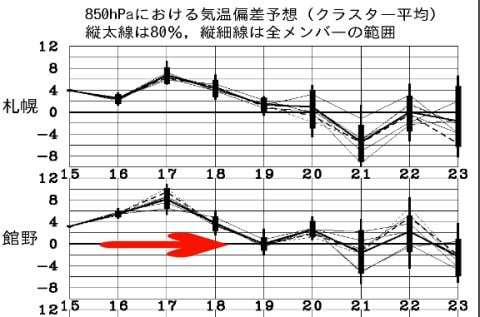

矢印で示すように，15日～18日は，平年より

気温が高く．

特に，17日は平年比+8℃まで気温が上がりそう…（涙）

で，17日はスキー場でも雨になるかも…

という予想もされているようですが．

はてさて．

志賀高原では，雪になるのか？雨になるのか？

…そして．

週末までに雪質は回復するのか？？

ってあたりを，予想してみましょうか…

えー．

まずは．

17日朝9時の850hpa気温を見てみると．

うーむ．

0℃線は東北まで上がっちゃってます（泣）

志賀高原はプラス気温ですね…（涙）

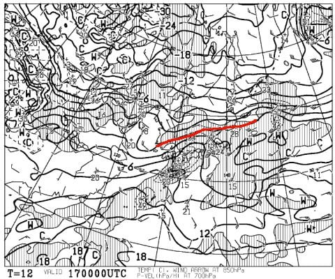

だもんで．

降れば雨の可能性が…（泣）．

で．

17日朝9時の地上天気図ですが．

志賀高原にぎりぎり水色の降水域が

かかるか否か…

という微妙な感じ．

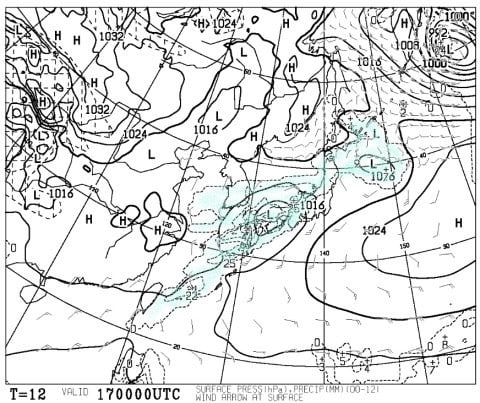

低気圧による降水というよりも，

太平洋にある高気圧の辺縁流で降水になる，

夏っぽい天気図パターンに見えるのは

気のせいか…

そのせいで，西風ベースなので．

志賀高原の降水量はそれほどなさそう．

とりあえず，17日の朝にかけては．

山頂付近は湿っぽい雪がわずかにぱらつき．

麓は…ミゾレ，標高が低いところは雨っぽいのが

ポツポツ降る感じでしょうか…

あ，風が強そうなので，焼額2ゴンと奥ゴンは

ヤバいかな．

そして．

17日の夜9時の850hpa気温図は…

こんな感じで，まだ赤く印した0℃線は

志賀高原より北（涙）．

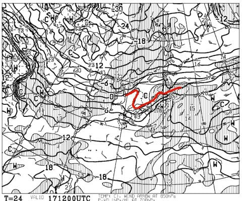

同じく地上天気図は…

……

…

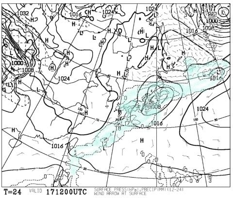

だめだ．

日本全国を，降水域が覆ってます…（泣）．

17日，終日パラパラ雨っぽいのが降る可能性が…

一の瀬より上の山頂付近ならぎりぎり雪か…

標高が低いサンバレーとかは液体ですね（悲）．

でも．

引き続き西風ベースなので．

そんなにひどく降らなさそうなのがせめてもの

救いかな…．

そして，18日の850hpa気温は…

うーむ．

ようやく，0℃線は志賀より南に行ってくれましたね．

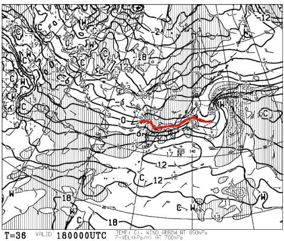

これなら，降ってくれれば雪．

雪が降ってくれれば，悪化した雪質も

改善するはず…！

と，期待して地上天気図を見てみると…

あら？？

水色の降水域，志賀高原にかかってないよ…（涙）．

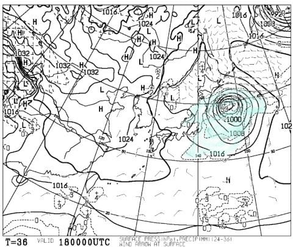

ということで．

18日は雪がほとんど降らず．

雪質改善はなさそう…

じゃ，19日の金曜に期待だ！

週末の前日は，雪になってくれるのかな…？？

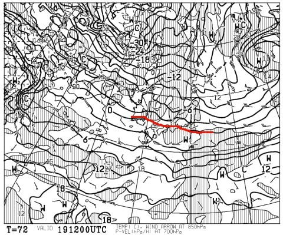

よし．0℃線は，志賀よりずっと南まで下がって

くれましたよ…

んじゃ，地上天気図は！？？

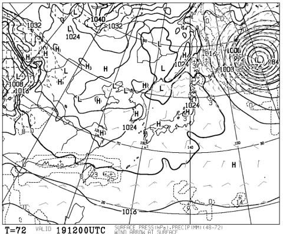

…

…

…

ダメだ（激涙）

19日，全く降りそうにありません…

週末は，17日の高温でやられた雪が固まった，

氷ころころバーンを覚悟か…（泣）．

で．

20，21日の週末を予想すると．

850hpa気温はこんな感じで．

どちらも0℃線ははるか南．

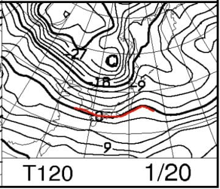

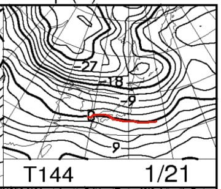

この土日，気温は冷え冷えでしょう…

そして，地上天気図はこんな感じで．

どちらも降水が予想される網掛けが本州に

かかってないので．

2日とも，晴れそうかな…

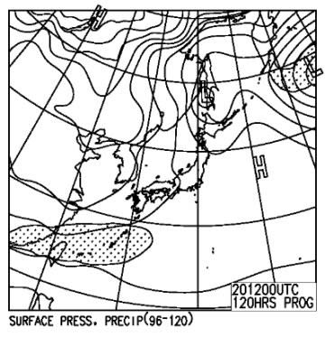

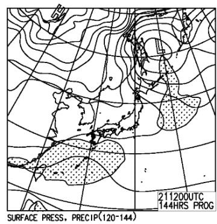

どちらも冷え冷え晴れで良さそうな週末だけど．

バーンはこの時期としては硬め，

朝イチ圧雪は良さそうだけど，

じきに氷のコロコロや固い下地が出てくる

バーンになるかも…

ってことで．

まとめると．

17日（水）朝から風が強め，曇り．

　山頂付近では湿った雪，ヤケビの麓ではみぞれ程度が

　時折ぱらつきそう．

　標高が低い西館，サンバレー方面は雨がポツポツ降るか…

　でも，そんなにひどい降りにならず，せいぜいポツポツ

　程度で済みそうな気配．

18日（木）平年より気温は高めだけど，マイナス気温．

　曇り～晴れ．

　雪質は，先日の湿った雪が冷えたのが圧雪された，

　固めでコロコロが大量発生しそうなバーン．

19日（金）平年並みの気温へ戻る．

　圧雪かけたての朝イチはマシだけど，

　積雪がないので…やっぱりじきに硬めの

　コロコロが大量発生するバーン．

　人が多く滑る急斜面では，下地の固めの雪が出てくるか…

20，21日（土日）　どちらも天気がよさそうで，冷えそうだけど…

　積雪がないので，朝イチはいいけど

　コロコロが多い，硬めのバーンになりそう．

って感じでしょうか．

うーん．

12月は良かったけど．

1月に雨が2回降るって，どうよ？？

とりあえず．

22日の後半から冷えて雪が降りそうなので．

そこに期待かな～．

あした，週末の詳細予想しますね～！

PS.日曜志賀の詳細レポートやってないけど…

まぁ，速報で十分詳しかったから，良しと

しておこう←ホントにそれでいいんか！？？

## 💬 コメント一覧

### 💬 コメント by (aqura)
**タイトル**: Unknown
**投稿日**: 2018-01-17 11:54:16

久しぶり、久しぶりのaquraです。16日、2年ぶりにスキーに行きました。訳あってスキーどころではなくなり、ようやく日帰りですが、志賀高原に行ってきました。行くにあたりSkier_Sさんの天気予報を参考にさせて頂きました。いい天気の中、人の少ないゲレンデ、最高でした、何年ぶりの娘も同伴でしたので足慣らし程度でしたが、やっぱりスキーは楽しいですね。次もSkier_Sさんの天気予報を参考に計画をしたいと思います。でも下りの道路は春のように水浸し、車、泥だらけになってしまいました。

### 💬 コメント by (つーちゃん)
**タイトル**: 先週みたいなのを！
**投稿日**: 2018-01-17 20:08:46

ライブカメラ見ると降ってますねぇ

液体が、、、

週末までに予想に反して

ドカドカ雪が降ることを期待します！

(黒魔術のご準備を)

### 💬 コメント by (はっち)
**タイトル**: Unknown
**投稿日**: 2018-01-17 21:37:45

残念ながら予想通り雨だったようですね。

20:15時点で蓮池より上は雪に変わったようですが、アイスバーン＆氷ゴロゴロの予測も当たってしまいそうですね。

### 💬 コメント by (しんちゃん)
**タイトル**: 毎週末に雪を
**投稿日**: 2018-01-17 23:09:39

黒魔術（スマホで志賀高原の上をクリックし雪を降らせる神がかった魔術）で、金曜の夜にドカドカ雪を降らせ、土日は晴れるよう、これから毎週お願いします(笑)

ここのところ、Ｓさんが雪が降ると言ったら降るし、晴れると言ったら晴れるし、まるでＳさんの言う通りに志賀の天気が操られているのではと錯覚しています(^^;

### 💬 コメント by (Skier_S)
**タイトル**: 今日の天気予想記事を書くのに2時間かかったよ…
**投稿日**: 2018-01-18 02:43:50

＞aquraさま

ををを！！！

お久しぶりです！！

お元気でしたか？

…しかし，２年ぶりのスキーですか！？？

…私なら死んじゃいます．それだけスキー中断したら…

16日は直接予想していないので，参考になったのか

心配ですが，

16日はあたりだったと思います．

17日だと雨だったし，大変でしたよ…

またバンバンスキーに行ってください～！

＞つーちゃんさま

あの黒魔術は，私が焼額に行かないと

発動できないので，週末までに雪を降らせるのは

難しいです…（大嘘）．

今週末は間に合いませんが，来週はすごそうですよ！どさどさ積もることを期待！

＞はっちさま

かなりの精度で予想を当てましたが，

かなり残念な感じです…

1月に2回も雨が降るとは！

今週末も，斜面は固そうです（涙）．

＞しんちゃんさま

あの1ゴンの中でのスマホを見ながらの天気予想は，

まさに私がスマホで天気を操っているように

見えますよね…

…いや．

実はホントに操っているんです．

やっぱり，志賀高原の天気は私が決めているんです（嘘）．

