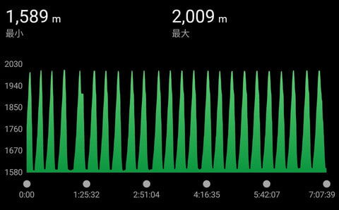
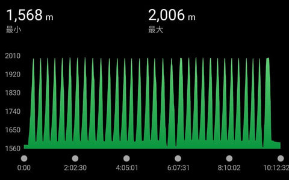
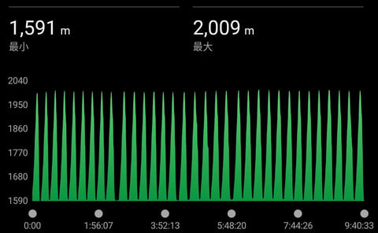

# このBlogの読者でも，私のスキースタイルを知らない人もいるようなので…

📅 投稿日時: 2024-07-26 02:13:51

えー．

今シーズンのまとめ記事を書いた際に

コメントを頂いたのですが．

どうやら，最近の読者は私のスキースタイルを

知らないようなので．

改めてそのあたりを書いてみますか…

かつての，[Skilineってのがあって](ee1717b9bc6aba03174ad4f25f2fb7333.md)，20000mクラブという

言葉が頻繁に使われていたころの読者は，

私のスキースタイルを良く知っていると

思うので．あえて繰り返しのような

ネタになっちゃいますが…

まず．

この点はご存じの方も多いと思いますが．

私は検定やら講習やら，そういうのに情熱を

かける真面目なスキーヤーではなく．

我流で自分の好き勝手に，ひたすら

自らの快楽のために滑り続ける

純粋レジャースキーヤーです…！！

ええ．レジャースキーヤーです．

レジャースキーヤーですよ！

（大事なところなので3回繰り返す）

ただ．

スキーの目的が．

普段の仕事のストレスを解消するため

なので．

ストレス発散のため，ひたすら滑る．

寝不足でも滑る．

営業開始から滑る．

途中で止まらず滑る．

休まず滑る．

リフトが動いている限り，

朝から晩までひたすら滑る…！

ナイターがあれば夜まで滑る！

…だいたい，滑走標高記録を見ると

普通の日はこんな感じですね．

ゴンドラ待ちやトイレなどで

滑り終わってから登り始めるまでに

ちょっと間が開いてる時が何回か

ありますが…

これで滑走標高差13000mくらいかな？

後半二つは，早朝6時から滑りはじめ，

午後3時半のラストゴンドラで登って

滑り終わる午後4時前までの約10時間近く，

ほぼ止まってないし休んでないのが

分かるかと…

ここまで滑り続けるのは，ストレス発散の

ためというのも一つの理由ですが．

関東から高い交通費と往復8時間の

運転時間をかけてまで志賀高原に来てるん

だから，滑らないともったいない

というのも，大きな理由かも…

しかし．驚くなかれ．

志賀高原にはこんなスキースタイルの

スキー廃人スキー星人がいっぱいいます．

信じられないかもしれないけど，私以上の

ハイペースで，朝からひたすら止まらず休まず

滑り続ける，終わっている人スキーを愛する人が

いっぱいいるんです．

もうホントに止まらず休まず，

ひたすらリフトの一部と化して

滑ってます…

というより．

リフトが大好きで，ゲレンデが嫌いだから，

いかに早くゲレンデを突っ切って

1本でも多くリフトに乗ろうとしているん

じゃないか

説に納得するレベルのおかしい人たちすごい人たちです…

とりあえず．

志賀高原に行くたびに，志賀高原に生息する

[いろんな名言](e65eab67106451604af9e684daad8d321.md)を残すようなヤバい人たちすごい人たちに

会って．

あぁ…自分はここまで逝ってしまっていない

突き抜けていないから大丈夫

と，いつも安心する，Skier_Sだったのでした…

自分のスキースタイルの説明記事じゃなく，志賀高原の

レジェンドたちのおかしさを訴える記事になってしまった

## 💬 コメント一覧

### 💬 コメント by (カンタロス)
**タイトル**: Unknown
**投稿日**: 2024-07-26 13:20:35

エスさま、こんにちは。

普通の人（？）もこのブログの読者になると感染しますよきっと（笑）

このシーズンでわかった事はr30をはくと小回りベースの板をはくよりも疲れない！て事でした。

やはり滑走スピードが上がった時の安定感の違いからかな…。

エスさまもやはり、rの大きい板にのると疲れは違いますか？

### 💬 コメント by (Skier_S)
**タイトル**: >カンタロスさま
**投稿日**: 2024-07-26 22:22:37

このBlog，そこまで感染力ありますかね…

感染力というより，怪しい人を集める「危ない人ホイホイ」なんじゃないかという気がしますが（笑）．

でも，最近のR30は乗りやすいですよね…！そして，楽！

私もR=27やR=21などを

メインに履くようになってから，小回り板よりつかれなくなった気がします．

ターン数が違うので…

### 💬 コメント by (Skier_S)
**タイトル**: Unknown
**投稿日**: 2024-07-27 05:20:24

＞ Skier_S さんへ

＞ >カンタロスさま... への返信

スキーが好きな人が見る

→エスさま、他の人のコメント見てまだまだ自分は大丈夫!（なにが？（笑））と感じる。

→より深みにハマり普通の人からずれていく。

→結果、ちょっとだけ普通の人から見たらおかしな人が読者として定着。

のサイクルかと（笑）

### 💬 コメント by (Skier_S)
**タイトル**: >カンタロスさま
**投稿日**: 2024-07-28 00:14:14

まぁ，このBlogを見ると，世の中かなり逝ってしまっている人が多いというのに

安心できる（？）のはあるかと思いますが．

どちらにしろ，このBlogの読者はちょっと（かなり？）世間一般から見たら

危ない人が集まっているのは間違いないですね（笑）

