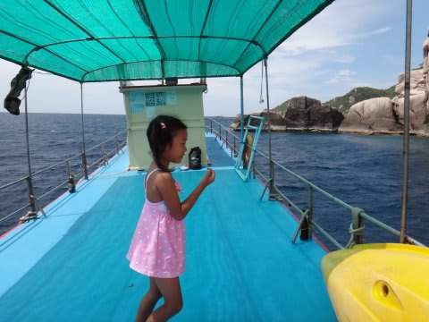

# 2013年9月　子連れタイ・タオ島ダイビング旅行記　その7…タオのダイビング，スタート

📅 投稿日時: 2013-10-10 01:33:46

ダイビング初日の朝…

…なんだか，天気が良くないし．

…風が結構強いんですけど(涙)．

…やしの葉っぱが強風にたなびいてます…．

とりあえず．

朝食後，ダイビングへ向かうわけですが．

今回のショップは，子供乗船OKということで選んだので．

娘も連れて，ダイビング集合場所の桟橋へ向かいます．

水上タクシーが迎えに来るので．

こいつに乗って本船へ．

…だけど．なんだか，波が高いんですけど…

(この写真だと分かりにくいけど…結構ざっぷんざっぷん揺れて，しぶきが飛んでます)

ってことで．

波に洗われながら，

ダイビングボート本船に到着．

本船の中はこんな感じで．

水，お湯が準備されていて．

ティーバッグやインスタントコーヒー，砂糖＆ミルクなど，

飲み放題．

上には日よけがかけてあるトップデッキがありました．

（これは後日，波が高くないときの写真)

とりあえず，全員が本船に乗り移ったところで，

船は出航しますが…

すごい波だよ！

…この，タイ独特のスタイルの船．底が丸いので．

波を食らうと，ぐわんぐわん揺れるよっ！

ガイド「…今日は風が強いので，外洋には出れませ～ん！

　島沿の風下側で潜りますっ！」

うーむ．

…それは，仕方ないなぁ…

って思ったところ．続けて

ガイド「…皆さん，船には強いですかっ！？」

…って．

あのー．

「弱いです」って言って，揺れが弱まるわけではないんですよね…

ガイド「今日は揺れますから～っ！」

…揺れるのは，分かってますから．

ってか，もうかなーり揺れてますから…

船に弱い人はゲロゲロ状態．

ダイビングポイントは，波の低い島の風下側を選ぶので．

ダイビングポイントに近づくと，なんとか波は収まってきました…

んで．

1本目のダイビングですが．

妻は揺れのためちょっと気分が優れないし，ジンベエが出る

外洋ではないので．

「娘とお留守番してる…」

ってことで．

私が潜りに行くことに．

いざ，タイの1本目，エントリー!

…

…

…うーむ．

…

透明度が…

なんだか，地形ポイントっぽいんですけど．

…サンゴもない，岩場だなぁ…

…うーむ．

と，透明度が…

…特にこれといったものも無く，安全停止に入り…

45分でExit.

…うーむ．

なんだ．

まぁ．

波が強い日の，避難場所的なポイントだと．

こんなものなのかな…(ちょっと涙)．
