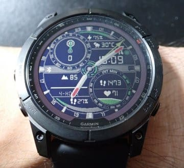

# 新しいスマートウォッチ，Garmin Fenix7Xを買ったよ！その4…ウォッチフェイスをダウンロードしてみる

📅 投稿日時: 2022-08-16 04:31:06

（Garmin Fenix7Xのレポート全16回のもくじ

機能説明，登山用地図の作り方，登山で使ってみた…など

は[ここをクリック](e516b23a4874189de2e9208be87fa5184.md)）

ってなことで．

前回は標準ウォッチフェイスの話でしたが…

今回はウォッチフェイスのダウンロードの

お話です．

ウォッチフェイスをダウンロードするには，

スマホに

「Garmin IQ」というアプリをインストール

する必要があります（赤矢印）

これ，情報を見たり設定したりする

「Garmin Connect」(水色矢印）とは別の

アプリになります．

で，このGarmin IQってスマホアプリ．

Garminウォッチにアプリをインストール

するためのアプリで（ややこしい…）

このアプリを立ち上げると…

こんな感じで，

Garminウォッチにインストールできる

アプリがいろいろ表示されます．

ウォッチフェイスだけじゃなく，

地図系のアプリやら，何やら，

いろいろあって…

例えばこんな，潮汐グラフと月齢を

時計に表示するアプリやら…

どこにどんな飛行機が飛んでいるか確認できる，

フライトレーダーをウォッチで見れるように

するアプリやら．

かなりマニアックなアプリもあったり

して．

これだけでもGarminウオッチは面白そうって

思いますよね…

でも，一番豊富なのはウォッチフェイス．

数え切れないくらいのウォッチフェイスが

選べるんですが…

データリッチ系の表示情報たっぷり

ウォッチフェイスだけでも，

もう選びきれないほどあります…

この中で，私が選んだのはこいつ．

かなり情報量が多いウォッチフェイスです．

この画面から「インストール」ボタンを押すと

時計にインストールされますが．

なぜかこのウォッチフェイスの設定は

時計からでもGarmin Connectからじゃなく，

このスマホのGarmin IQアプリのこの画面の

左に「設定ボタン」があるので，ここから

設定します．

ウォッチフェイス以外の設定は，

Garmin Connectからの設定なので，

一瞬，「ウォッチフェイスの設定って

どこでやるんだ？？」

と悩みますが…

なぜかGarmin IQでインストールした

ウォッチフェイスの設定だけは，

Garmin IQで設定です～！（同じことで悩んでいる方へメッセージ）

私が選んだこのウォッチフェイス．

こんな感じで，Custom Data1から7までの

7か所のカスタム可能なデータエリアが

あって…

カスタムデータエリア1～7の表示内容が

Garmin IQでアプリで設定できます！

カスタムデータエリアの表示内容は，

例えばカスタムデータエリア4だと

これだけの内容から選べます…

ってなことで．

アクセントカラー，針のポイントの色やら

なにやらも自分の好き勝手にカスタマイズして．

自分のオリジナルウオッチフェイス，完成！！

画面一番上は電池残量，

その下は本日の天気予報，

さらに左上はソーラー充電強度のメーター，

右下は歩数と心拍数＆時間変化グラフ，

左下は高度と4時間の高度変化グラフ．

さらに日付の横には月齢も出ていて，

自分が欲しい情報を一目で見れる

わがまま画面を作り上げました…

ちなみに，緑色の細い針は世界時計．

私の場合はお仕事相手が多い

アメリカ西海岸の時間を24時間制で

示してもらってます…

いや．

これだけでも十分楽しめるわ…

（続く）

## 💬 コメント一覧

### 💬 コメント by (Seeker.NT)
**タイトル**: Smart Watch
**投稿日**: 2022-08-16 12:26:59

お久しぶりです。

Watch Face のカスタマイズは楽しいですよね。

私は2年前に買ったFitbit Iconicが年初にリコールされたことで返金サービスがあり、ドル建てだったこともあり円安のおかげで購入時の４倍近い収入になりました。そのおかげでfenix 7Xの購入に踏み切れました。

ちなみに、Fitbit製品も対象者の特別割引もあり40%オフで購入が可能だったので、思わずポチッとしちゃいました。なので、最新のSmart Watchが２つもある状態で、どうやって使い分けようかなと試行錯誤中です。なんか無駄なことしちゃったかなと少し後悔しています。。。

ちなみに、CASIO OCEANUSは眠らせているのですか？　あれもすごく良い時計ですよね。

### 💬 コメント by (Skier_S)
**タイトル**: ＞Seeker.NTさま
**投稿日**: 2022-08-17 03:15:40

お久しぶりです～！コメントありがとうございます！

Fitbit，リコールがあったんですね…

しかし，円安は4倍も進んでないのに収入4倍？？

そしてFenix7X購入ですか！？？

さらにFitbitも40％割引って…うらやましすぎます…

ぜひ両腕にFitbitとGarminを付けて過ごしてください（笑）

私も登山やスキー時は，両腕にスマートウォッチつけてましたから…

CASIO OCEANUSをもっていることをご存知とは，さすがこのBlogの

ディープな読者でいらっしゃる（笑）．

この時計は，私の机の上で卓上時計になってます．

こいつもおっしゃる通りのいい時計なんですが，今はほとんど

腕時計としての出番が無くて，確かにもったいないんですよ…

### 💬 コメント by (Seeker.NT)
**タイトル**: 回答
**投稿日**: 2022-08-17 16:57:52

なぜ４倍か？

元値は299ドルでしたが、購入時にはモデルチェンジのタイミングだった事もあり9,500円程度だったんです。。返金は299ドル＋取引手数料(つまりリコール手続きのお手間賃)10ドル＝309ドルでした。換金をもたついていたら¥130/$を超えて得したというカラクリでした。。。

しかし、OCEANUSが置き時計とは・・・。

私はProtrekにしたけど、後からOCEANUSにすれば良かったと少しだけ後悔しました。改めてあのフォルム、機能、性能・・・良い時計ですよね。私も今ではSmart Watchオンリーですが。

### 💬 コメント by (Skier_S)
**タイトル**: ＞Seeker.NTさま
**投稿日**: 2022-08-18 03:49:25

そんな格安で買ったのに，定価で払い戻しだったんですか…

見事な錬金術でしたね(笑)．

OCEANUSは置時計化してますが，毎日仕事する机で使っているので，

実は時間を見るのにはFenix7Xよりもよく使っている時計かも…

と思って慰めています．

