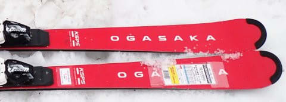

# 2024シーズンモデルのスキー板，試乗レポートその18…OGASAKA Keo’s PS + SR585

📅 投稿日時: 2023-06-23 05:31:39

🏷️ カテゴリ: [スキー板試乗](c0bd8048615710cee890e403a36cc9a2b.md)

あかん…

今週はいかん．

またなんだか朝になってる…

もう寝るぞ…

そういえば．

この週末に車検に出したときに．

「LEVORGのD型って何か情報入ってますか？」

と聞いたら．

「詳細はまだわかりませんが…

グレードが一つ追加されます」

とのことで．

噂通り，LEVORGのD型以降，

SUVっぽいグレードが追加になるようです…！

追加モデルは最低地上高が高くなるようで，

もしかしたら雪道メインの私にはいいのかも…

でも，標準グレードより高くなるのかな．

あんまりお高いと考えるけど…

どんな外観になるのか，ちょっと興味が

ありますね～…

秋に販売開始ということで，まだ時期は

わからないけど夏，8月ごろ発表じゃないか…

ということで，ちょいと楽しみ．

ってなことで，本題へ

今日も2024シーズンモデルのスキー板の

試乗レポートです！

今日も昨日に引き続きオガサカ編．

では，どうぞ～！

〇OGASAKA Keo’s PS + SR585　165㎝

基礎小回り

Keo'sはどちらかというと小回りベースのP〇,

オールラウンド性の高いE〇，

ロングターンっぽいサイドカーブのXXと，

3種類のラインナップがありますが…

これは，小回りベースのシリーズのトップ

モデルのPSとなります．

それも，プレートが強いSRプレート，

弱めのFMプレート，

プレートなしと選べますが…

一番強いSRプレートが付いているので，

Keo'sのP〇シリーズとしては一番

強い組み合わせとなります．

実際に滑ってみると…

プレートが強いのもあり，結構張りがある

しっかりした板に感じます．

Keo'sシリーズはTCシリーズより優しめという

思い込みで履いてみると，TC-SBのFMプレート

付きよりは足元がしっかり強く感じて，

ちょっとびっくり…！

テールの張りが強いのか，テール目を抑えていくと

ラディウスが13mというわりには結構縦目に

落としていけ，ロングターンまで引っ張っていける

ので，オールラウンド性は高そうです．

トップ目をしっかりたわませていくと，

カービングで切れて回っていきます．

ただ，SRプレートだからか結構張りが強いので，

R=13という小回りのサイドカーブから想像する

ほどクルクル回る小回り板ではないです．

だけども板は意外と軽快で動かしやすさが

あるので，谷回りでしっかり板を動かしての

小回りも作れます．

この板も，ずらしていったときにズルズル逃げて

行くズレではなく，しっかりした足場を

感じながら旋回性が出てトップが回ってくる

という積極的なズレが使える板で，ずらして

いった操作性が極めて高いです．

かなりハイスピードでも，しっかり足場の圧を

感じながら板を動かして，安定感のあるズレを

作っていけます．

ただサイドカーブに乗っていっただけじゃなく，

板を動かした行った時にも面白さがあり，

ハイスピードでもグリップ（板の圧）を

しっかり感じる，楽しい攻めたズレが使える

のが印象的な板．

SRプレートのせいかフレックスが意外と強めなので，

カービングではR=13というより大きめに回ってきて，

カービングでは大回りに近いところまで行けます．

しっかりキレに乗ったカービングで気持ちいい

中回りもできるし，縦目に落とせばエッジに乗って

大回りまで行けるし，

そこからハイスピードのズレを使って

板を動かす小回りまで作っていけるという，

コントロール性が高いのに，オールラウンド性が

高く，ズレ・キレ，ロング・ショートどこまでも

行ける板です．

ズレのコントロール性・旋回性も高いので，

荒れた斜面やコブ斜面でも行けそう…

SRプレートだと，使えるスピード域はかなり

高いところまで行けそう．

そこまでスピードを出さない，

あるいはカービングで小回りまで行きたい…

というのであれば，弱めのFMプレートを

選べば，小さめの半径までカービングで

行けるんじゃないかな？

TC-SBは小回りスペシャルな感じでしたが，

Keo'sの方はかなりオールラウンド性が高く，

ゲレンデでオールラウンドとして使いたいなら，

オガサカのおススメ通り，TC-SBより

Keo's PSのほうがいいですね…
