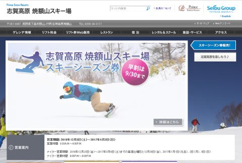
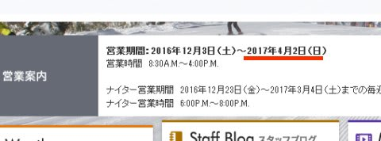
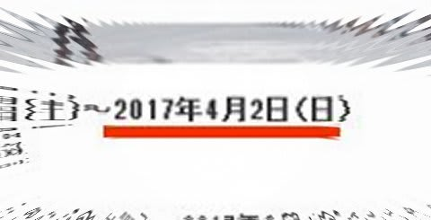

# なに～～っ！！！！来シーズンも焼額が4月2日で終了だと！？？

📅 投稿日時: 2016-08-29 02:08:25

🏷️ カテゴリ: [日記](cc4b5682fb7b8b144980957a978653fb0.md)

な，な，なんということだっ！！！

[Gokuraku SkierさんのBlog記事](http://red.ap.teacup.com/gokurakuskier/561.html)を見て知ったのですが…

[志賀高原，焼額山のウェブページ](http://www.princehotels.co.jp/ski/shiga/)を見てみたら…

ふむ？？？

ううむ！？？？

な，なんだ～っ！！

焼額の営業，

来シーズンも4月2日で終了

だとっ！！

な，な，なんということだ．

なんということだっ！

来シーズンも，4月は焼額の営業が無いのか！！！

あの4月からGWにかけての．

快楽の朝イチ早朝スキーができないのかっ！！（涙）（涙）（涙）

いや．

きっと．

きっと，今シーズンは3月下旬に大雪になって．

さらに，お客さんがいっぱい押し寄せて．

「やっぱり4月も営業します～」

とか．

そういう奇跡が起こるに違いないっ！！！←そーゆーことは期待薄だから

しかし．

まさか，このまま永久に春営業が復活しないとか…（恐怖）

…いやっ！

そんなことは無いっ！

無いはずだっ！

…と，強く信じたいSkier_Sなのだった…

## 💬 コメント一覧

### 💬 コメント by (はなげ親分)
**タイトル**: う～ん!!
**投稿日**: 2016-08-29 18:30:59

い、意識が遠くなる～!!

もう、プリンスホテルのオーナーが代わらないと、4月のあの快楽早朝スキーは楽しめないのでしょうかねぇ。

17～18シーズンの奇跡を待ちましょうか～

### 💬 コメント by (Skier_S)
**タイトル**: はなげ親分さま
**投稿日**: 2016-08-30 00:59:12

私も意識が遠くなりました～（涙）

18シーズンと言わず，今シーズン中に

奇跡が起きてほしいものです…

いや．まさか，このままずっと4月に営業

しないなんてことになったら…

暴れたい気分です

### 💬 コメント by (まうちゅう)
**タイトル**: Unknown
**投稿日**: 2016-08-31 21:04:45

人材派遣や契約社員、人事異動とかも絡むでしょうし、延長とかしなさそうですね。

ゲレンデマップからエキスパートコースも消されています。

### 💬 コメント by (Skier_S)
**タイトル**: まうちゅうさま
**投稿日**: 2016-09-01 04:16:28

ををををを～っ！！！

ゲレンデマップが更新されていたとは気づかなかった！

そして，エキスパートコースが無くなっていたとは…っ！！

…昨シーズンは一回もオープンしなかったので．

実際の影響は少なそうですけど…

でも，パウダーが積もった日は面白かった

コースですよね…

無くなると残念です…

あと，リフト営業期間の延長ですが…

人が確保できないのもさることながら．

リフト営業は国土交通省運輸局へ申請が

必要だったと思うので…

4月までの期間で申請されていたら，それで

アウトですね（涙）．

なんとかGWまで営業してほしいよ～っ！！

