# まだ終わってないの？GW後，5月8日（月）の奥志賀高原は…ガラガラフラット，GW後で最高のコンディション！

📅 投稿日時: 2017-05-09 00:04:24

…鋭い人は気づいていると思いますが．

そうです．

実は昨日，志賀高原から帰宅せず．

まだ本日まで，志賀高原に残って

滑ってたんですね～．

…明日から仕事なのですが．

自分の席が残っているかどうか…

明日職場で確認するまで心配なSkier_Sです．

というわけで．

長く続いたGWスキー場レポート．

皆さんも飽きていたと思いますが．

ようやく本日で，ラストになりますので．

「うがーー！もう，スキー場レポートはいいから！！」

などということなく，お付き合いのほど…

えー．

本日．

志賀高原に登ってくる道は完全ドライ．

さすがにもう，普通に夏タイヤで登って来れる

路面状況です．

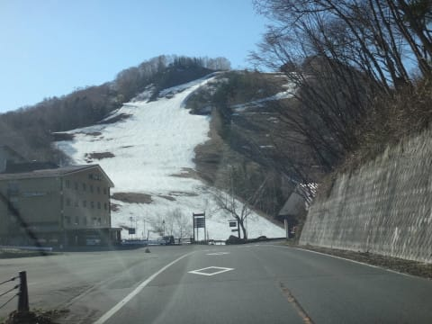

…サンバレーの雪も，かなり

解けましたね…

丸池の道路の気温表示は，朝8時前というのに．

もう13℃ですか…（涙）

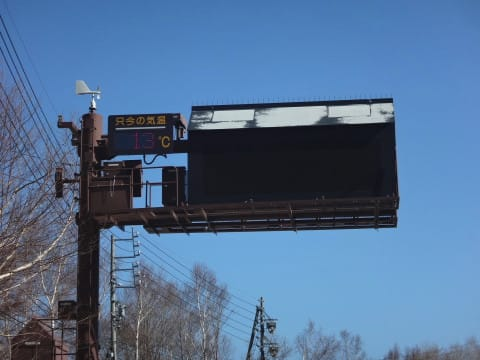

こら，朝からザブザブのゲレンデ状況か…（泣）．

で．

本日は第2高速ペア1本のみ営業の奥志賀高原．

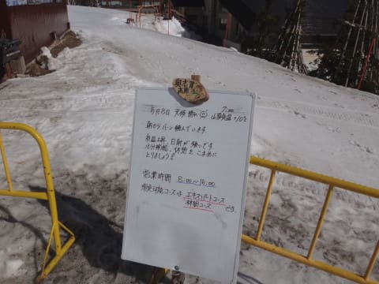

朝7時で，気温10℃ですか…（涙）

リフト営業は15時までと短くなってます．

そして．

意外なことに．

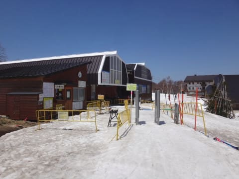

ありゃ？

ICゲート？

…リフト券，ICカードなの！？

ということで．

シーズン券は昨日で終わったものの．

予想外に，本日の奥志賀の標高差．

まだSkilineの標高差に加算されます…←そんなこと気にする人ほとんどいないから

で．

朝イチのリフトに乗ると…

うはー！晴天！

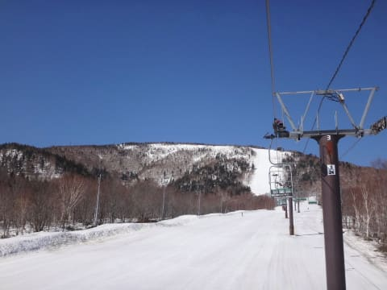

そして，山頂は…

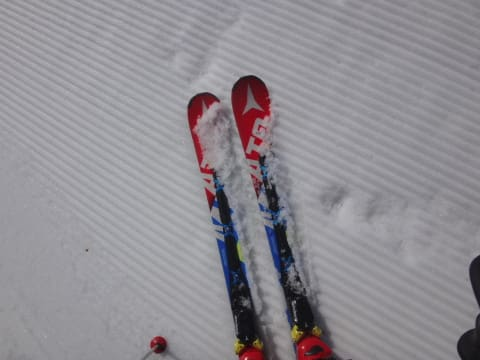

うほう！

シマシマッ！！

気持ちいいシマシマ！

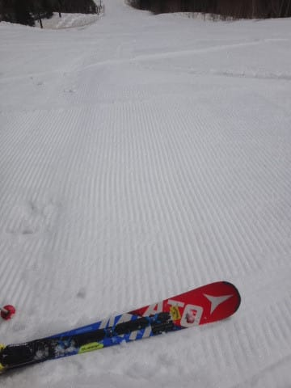

ザブザブを覚悟したけど，

意外としっかりした雪で．

柔らかめだけど，しっかりエッジが効く

気持ちいいシマシマバーン！！

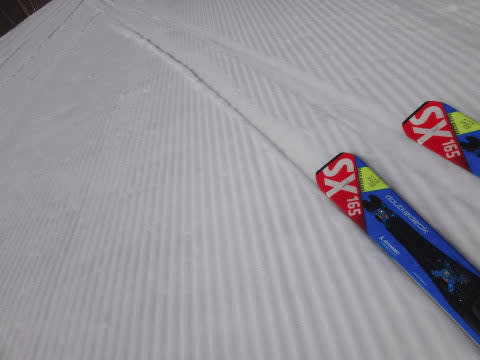

これは…

もしかしたら，かなりの好コンディションでは！？？？

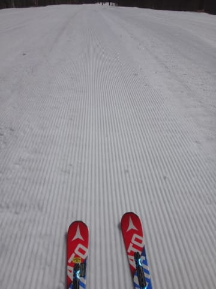

そして，人も全くおらず，

自分の好きなライン取り放題！！

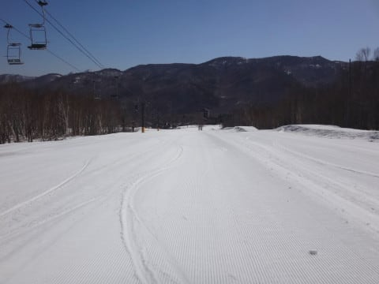

見ての通り，全然人がいないので…

開始後何本か滑っても，シマシマが残ってるし．

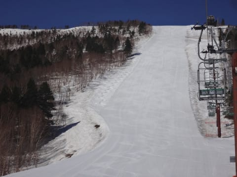

そして，意外と雪が適度な柔らかさで…

ザブザブにならない！

これは，トップシーズンの気持ちよく

エッジが効く雪に限りなく近い感触かも？？

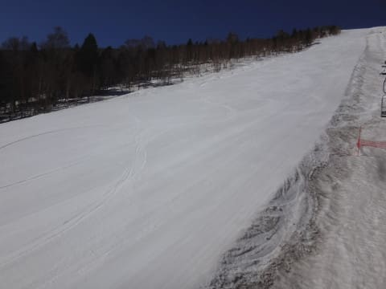

まさか，GWを過ぎて．

こんな気持ちよくターンができるゲレンデが

待っていようとは！！

想定外っ！

嬉しい想定外っ！！

開始後1時間経っても…

ゲレンデはまだ最高コンディションのまま！

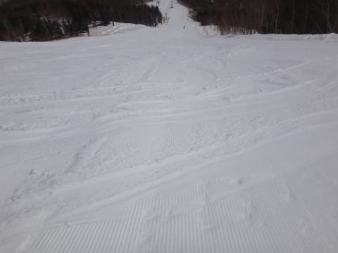

そして…

開始後2時間，10時になっても．

相変わらず貸し切りバーンで．

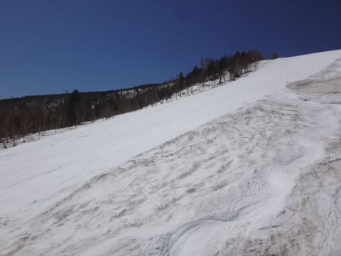

そして，激烈快適エッジ食い込み

傾きまくり大回りができますっ！！！

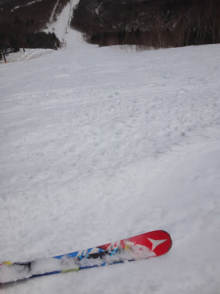

意外にも，昼間はそれほど気温が上がらず．

昼になっても，長袖Tシャツ＋ウェアのジャケットで

ちょうどいい感じの気温だったので．

思いのほか，雪が緩まず…

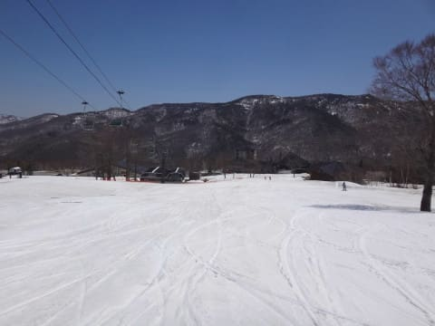

いや．

11時になってもこんな感じなんですが！！？？

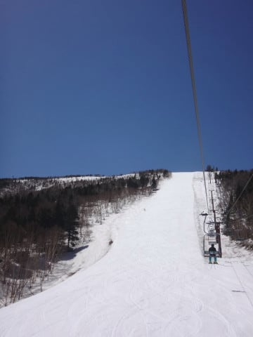

まだまだ大回りできるんですけど？？

で．

この写真が唯一，他の人が写ってる写真かな？

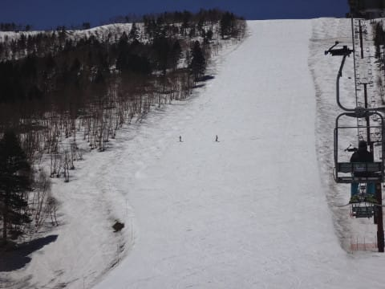

いやーーー．

GW明け，昼ごろの写真とは思えない…

コース幅いっぱい，全然ブッシュの影も形もないし．

写真の左端のコブライン以外，全然フラット．

さすがに12時頃になると．

ちょっと雪は荒れてきたものの…

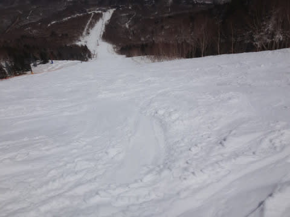

でも，人もいないし．

板も走るし．

まだ大回り行けるよ！

いやーー．

トップシーズンでも昼ごろには荒れ荒れで

大回りができなくなる日が多いというのに…

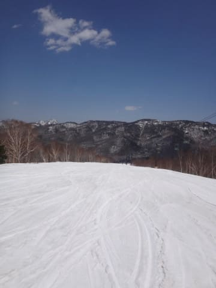

なんて恵まれてるんでしょう…

ただ．

下の緩斜面は．

10時を過ぎると．

ちょっと汚れが浮いてきて，滑りが

悪くなってきたかな…

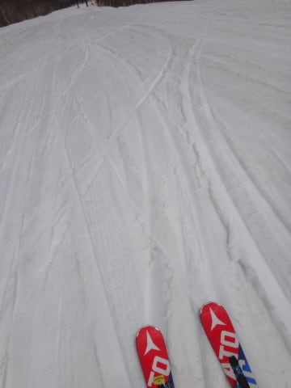

ということで．

本日はいろいろ都合があり，

午後1時過ぎに切り上げましたが．

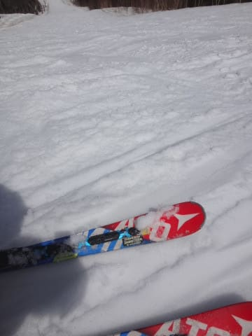

午後1時のラストでも，

ザブザブに緩みきっておらず．

まだ楽しいゲレンデで．

帰るのが惜しい感じでした…

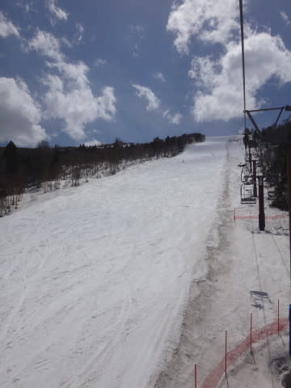

しかし．

奥志賀高原．

まだまだ雪はたっぷりありますよ～！！

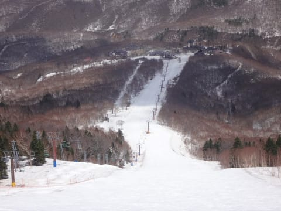

まだリフト乗り場近辺も，

雪はたっぷり！

いやーーー．

今週末まで，十分楽しめそうな感じだな～．

ということで．

GW前半5日間，後半4日間の計9日間．

たっぷり滑りまくった，Skier_Sだったのでした．

PS.　しかし，帰り道の途中で…

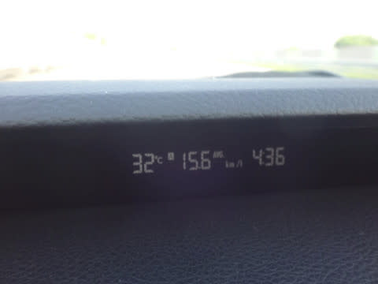

　なぬ？気温32度？？

　…とてもスキーからの帰り道と思えない…

## 💬 コメント一覧

### 💬 コメント by (いか)
**タイトル**: Unknown
**投稿日**: 2017-05-09 00:21:23

あらっ、GW後の平日とはいいですね！

私は、豪雨の6日でシーズンアウトと相成りました。最後は全身から水が滴る模範スキーヤーでした笑（お昼はランチドライブ兼ウエアチェンジで下山しましたが、、、）

### 💬 コメント by (Skier_S)
**タイトル**: いかさま
**投稿日**: 2017-05-10 03:32:20

あら．

投稿直後の速攻コメントでしたね（笑）

GW後の平日，良かったですよ～．

そちらは6日で終わっちゃったんですか．

7日も良かったのですが…

私のシーズンは，まだまだ続きますよ～！！

