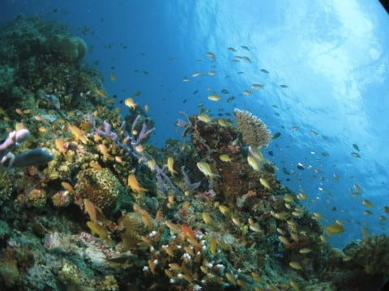

# 2016年8月　子連れで再訪！モアルボアル旅行記その18…3日目の1本目，ぺスカドール島ダイビング

📅 投稿日時: 2017-09-27 00:49:53

🏷️ カテゴリ: [ダイビング日記](ce3a7a8d424d112fce83ee85c81a0e344.md)

ということで．

娘が船の上でお留守番してくれているので．

夫婦2人で揃ってのぺスカドール島ダイビング！

エントリー直後から．

いきなりきれいなサンゴが広がります…

朝日を浴びてキラキラ輝く

サンゴの間の小魚たちを眺めつつ進みますが…

さすがぺスカドール島．

この魚の密度！

いいね～！

そして，ちょっと進むと．

地形ポイントっぽいところもあったり．

ちょいと深めのところには，スミレナガハナダイが

いたり…と．

そんなのも眺めつつ．

魚にあふれるドロップオフ沿いを進んでいくと…

その隙間に．

おおっと．

サイコロ大の，ミナミハコフグ幼魚．

こいつは，小さいうちはカワイイですね～．

さらに，ドロップオフを進んで行きますが．

やっぱりきれいだわ…ここ．

次にガイドさんが示してくれたのは．

…デカくてあんまりかわいくない，

オオモンカエルアンコウ．

そんなのを眺めながら進んでいくと．

そろそろダイブタイムも終了の時間．

ボートの下まで戻ってきます…

で．

浅瀬で安全停止しますが．

…ここもまるで水族館みたいじゃないか！

さすが，ぺスカドール島…！！

って感じで．

満足のダイビング，終了！

船の上に上がると．

ええ？？

娘…おまえ，まだ絵を描いてたの？？

まったく泳がないで，ひたすら1時間近く，

お絵かきを続けてたの…？？

…あ，アサミさんと「お絵かきしりとり」してたのね．

そう．楽しかったの．

よかったね…

…すみません，アサミさん．

1時間ひたすら，娘のお相手してくれてありがとう

ございます…（感謝）．
