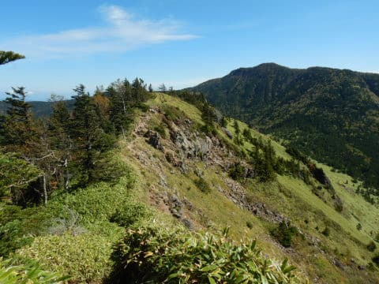
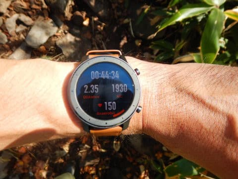

# ちょっと長野に山登りに…根子岳＆四阿山に登ってきた

📅 投稿日時: 2019-10-06 00:10:22

えー．

9月は仕事が忙しかったのもあり，

週末は家にこもることが多く．

伊豆やら長野やらにちょくちょく

遊びに行っていたものの．

娘を連れてののんびり旅行で．

8月末のダイビング旅行に行って以来．

体を激しく動かしていないので

体がムチャクチャなまっている

…という感じがしたので．

自然だ…

自然の中で体を動かしたいっ！！！！

と．

昨晩は深夜に帰宅し，

夜中1時までBlogを書いていたというのに．

本日は朝5時過ぎに起き出して，

山登りに出発したのでした…

で．

志賀高原への忠誠度が高い私ですから．

また，志賀高原方面に繰り出して，

寺子屋から岩菅方面へ抜けてみよう…

と，思っていたのですが．

朝5時の段階で，志賀高原は豪雨（涙）

天気図を見てみると．

「志賀高原より数10km南に下がれば，

　今日は雨は降らない！！」

と見切ったので．

急遽行く先を変更し．

かねてより気になっていた，四阿山を

登ることにしたのでした…

いや．

この山．

結構いろんなところから見えますし．

昔，某都道府県連の関係で，菅平で

滑ることが多かった時に，根子岳と

その奥にそびえる四阿山．

結構気になってたので…

ってことで．

朝のうちはちょいと雲が多かったけど．

登っていくと，雲は眼下に雲海となり．

山の上はすっきり晴れた，

気持ちいい登山日和となりました～！！

ってなことで．

スタートから1時間ちょい．

まずは根子岳山頂に到着！

いやーーー．

今日は気温が暑いくらいで．

絶好の山登り日和だわ…

山頂からの景色もバッチリ！！

…しかし．

山頂から見えた志賀高原方面．

やっぱり雲の中に隠れて，山頂のみ

かろうじて見えてる感じですね…

志賀高原にしなくてよかった…

と，山頂からの景色を満喫しましたが．

いや．

今日の目的はこの山じゃないのだ．

こちらにいかねばならぬのだ…

ってことで．

根子岳から四阿山に向かいます…！

最初は景色のいい尾根筋で．

こんな景色を愛でながら，

トコトコ歩いていくと…

え？

何？

この向こうに見えるのが四阿山

だよね…

…これを降りて登り返すの？？？

ってなことで．

150mほど降りて，300mほど登り返しです（涙）

必至に四阿山を登り返しますが…

山頂付近で振り返ると，

さっきまでいた根子岳が

遠くに見えます…

ってなことで．

根子岳山頂から1時間半．

四阿山山頂にやってきました～！！

山の形を見て，四方の視界いいだろうなぁ…

と思っていた通り，見晴らしはGood！

浅間山方面の，遠くに富士山のてっぺんも

見えましたし…

（この写真では富士山は写ってない）

雲に隠れた志賀方面も見えます．

いや…

景色最高じゃないですか！

ってな感じで．

朝，長野方面が雨で

かなりガックリ来ていたけど．

最高の景色の山頂をたっぷり

堪能して．

下山コースも，景色は最高で．

山頂から約2時間半で下山．

トータル6時間の山登りを

堪能してきたのでした…

そして．

今日の本来の目的．

なまった体に運動をさせる

という目的を果たせたかというと．

本日の消費カロリー，2886kcal！！

いやーー．

十分運動しましたね～．

でも，Amazfit GTR．

標高や心拍，歩行距離が

リアルタイムで出るので．

山登りでも役に立ちました…

とりあえず．

なまった体に，いい鞭に

なりました（笑）．

## 💬 コメント一覧

### 💬 コメント by (aoisorae)
**タイトル**: Unknown
**投稿日**: 2019-10-06 06:55:54

いやあ、山登りまでされるとは・・しりませんでした。

この二つの山は14年前の秋に登りましたが、あの登り返しと登り返してくる登山者の小さな光景が、急に甦って懐かしい思いになりましたよ。

また、どんどん登ってくださいよ。次はアサマ2000に敬意を表して、浅間山でも。あ、今禁止されてますね(笑)。

### 💬 コメント by (Skier_S)
**タイトル**: ＞aoisoraeさま
**投稿日**: 2019-10-07 00:48:04

いつもBlog拝見してます～！

…私はaoisoraeさんみたいな本格的山登りはせず，

お気楽な山を年に1-2回登る程度です…

10月から7月頭までスキー，8月はダイビングなので…

9月，10月のわずか2か月だけ，体力作りに登ってる感じです（笑）．

ホントは今日アサマを登ろうかと思ってましたが

（警戒レベル2なので山頂は行けませんが…），

天気が悪いので諦めました．残念…

