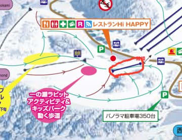
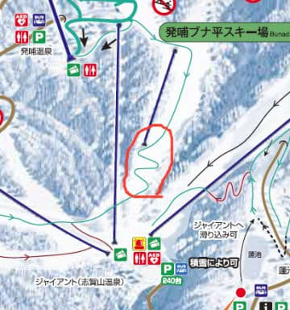

# 志賀高原，中央エリアの2018シーズンゲレンデマップが公開されたけど…またリフトが減ってるっ！！！（涙）

📅 投稿日時: 2017-09-07 00:51:54

ということで．

夏の志賀高原レポートが終わったばかりですが．

まだ続く，志賀高原ネタ←なんて志賀高原愛にあふれたBlogだろう…！！

それも，久しぶりのスキーネタですね．

…いったい，いつ以来のスキーネタでしょうか…

＃あぁ…このBlogがスキーBlogだということを

＃忘れていく…

さらに今回は．

かなりマニアックなネタです．

ある程度志賀高原に精通していないと

分からない，志賀高原変態マニアにのみ

通じるネタのような気がするのですが．

えー．

つい先日．

[志賀高原中央エリアの，2018シーズンのゲレンデマップ](http://www.shigakogen.co.jp/information/4318.php)．

こいつが，志賀高原リゾート開発のWebページで

公開されたので．

（志賀高原リゾート開発Webページより引用）

志賀高原マニアなら間違いなく，

無意識のうちにやってしまうであろう，

2017シーズンのマップとの比較．

＃少なくとも，20000mクラブメンバーはやるはず．間違いなく，やる

こいつをやってみました…

…まず．

ダイヤモンドスキー場．

こいつが2017シーズン

矢印で示してある，トリプルリフト．

こいつが，2018シーズンでは…

うぎゃーーーーっ！！！

き，消えているっ！！

一瞬，赤丸で囲ってあるのがトリプルリフトかと

思ったけど．

向きから考えると．

これはサンキッド（ベルトコンベア）ですね…

サンキッドが，リフトと同じ表記に変わったようで…

（追記：実はサンキッドの位置に新しいリフトが架かる

ようです…ほっぽさん，コメントありがとうございます）

なんということだ…っ！！

2018シーズン．

一の瀬ダイヤモンドのトリプルリフト，消滅です（涙）

そして．

次はサンバレー．

こいつが2017シーズン．

矢印で示されている，リフト2本．

こいつが，2018シーズンは…

うぎゃーーー！！

2本とも，消えてる！！！

リフトが2本も無くなっている…！！（泣）

…右側のシングルリフトが無くなるのは予告

されてたけど．

まさか，真ん中のペアリフトまで消えるとは…

昨シーズン，サンバレーナイターが

当初予定のペアリフトではなく，クワッドで営業していて．

「ペアリフトが壊れたから」

という説があったけど…

まさか，壊れたまま直さずに，廃棄になっちゃう

とは…（大量にあふれ出る涙）．

ということで．

法坂第3リフト，サンバレーペアリフトの2本，消滅です．

サンバレーに残るのは，リフト1本のみです…．

ああ…次々リフトが減っていく…（涙）

まぁ，これで．

サンバレーナイターがクワッドで営業される

ようになったら，まだ救いようがあるけど．

「2018シーズンはサンバレーナイター中止です～♪」

とか，軽いノリでいわれたら．

かなり再起不能レベルのショックを受けるかも…

というより．暴動を起こすかもしれません．

で．

次は，ブナ平スキー場．

2017シーズンは，ブナ平クワッドが営業されておらず．

「こいつも廃止か？？」

というウワサがありましたが…

2017シーズンマップにある，このブナ平クワッド．

このリフトは，無事2018シーズンマップに

残りましたね…

ただ，○で囲った最後の落ち込み部分．

フラットな一枚バーンだったのが，

昨年，ジグザグコースに改修されて

むちゃくちゃ不評だったのに，

今年もジグザグのまま残るようです…（泣）．

…次シーズンには，元に戻すと思ったのに…

で．

もう一つ気づいたのが．

2018シーズンマップを見ると．

赤丸で囲った，西館山のFISコース．

…ここが，コースとして表記されてないよ…（泣）

不整地を楽しめた西館FISコース，

2018シーズン，オープンしないのかな…

という感じで．

毎年リフトが減っていく，志賀高原．

2018シーズンも順調に，リフトが減り続ける

ようです（激泣）．

お客さんが減ってるから，仕方ないのかもしれないけど．

…けど．

ゲレンデマップを見て．

昨シーズンと比べて「良くなったね～！」ってポイントが

ひとつもないってのは．

ちと寂しいかもしれない…

## 💬 コメント一覧

### 💬 コメント by (マルハバ)
**タイトル**: ダイヤモンドのトリプルリフト・・
**投稿日**: 2017-09-07 10:11:54

消滅ですか・・

学生時代ここの横でポールを張っていたので

想い出深いリフトだったんですが・・

いったん休止されると

復活されたっていう話あまり聞かないですもんね

### 💬 コメント by (ほっぽ)
**タイトル**: ダイヤモンドはリフト架け替え
**投稿日**: 2017-09-07 20:03:39

はじめまして。

maeさん、yamaさんにお世話になっている志賀高原好きなレジャースキーヤーです。

何度かヤケビや春のアルペン試乗会でお見かけしていますが、すれ違いばかりで遠目に眺めています。

さて、ダイヤモンドトリプルは撤去、その乗り場付近からサンキッド降り場付近までリフトが架かるそうです。

多分ペアリフトかと。

連絡リフトならいっそ道路を渡ってファミリー側まで架けてくれれば良いのですが、道路を渡ると手続きが面倒なようで、着地点は今まで通りとなったようです。

サンキッドは雪に弱かったですが、これで運休なくダイヤモンドからファミリーに移動できるのが、志賀高原唯一の朗報でしょうか。

サンバのリフト2本撤去は想定内でしたが、ブナ平が残ったのは想定外でした。

とはいえ、多分今シーズンも殆ど稼働しないように思います。

年々寂れていく志賀高原を見るのは忍びないですね。

今シーズン、お会いできたらお声掛けさせて頂きます。

### 💬 コメント by (Goku)
**タイトル**: また減るんですか
**投稿日**: 2017-09-07 20:47:16

以前、チャレンジカード時代は74基あったリフトが今や49基ですか・・・

でも、これで経営が成り立つのならそれも良しとしなければなりませんね。

なんだかさびしいですね(T_T)

### 💬 コメント by (Skier_S)
**タイトル**: 寂しくなりました…
**投稿日**: 2017-09-08 02:48:56

＞マルハバさま

ダイヤモンドトリプル，消滅です…（涙）．

それも，休止ではなく．

どうやら撤去されるようです．

復活はなさそうです…（泣）

でも，撤去されてコースが広くなって，

滑り良くなるのかも？？

＞ほっぽさま

あ，初めまして～！！

yamaさんからいつも話は聞いてますし，

HPも見てますよ～！！

…私も一度お会いしたいと思いつつ，

機会がなくて…

で．

ダイヤモンド，現トリプル乗り場からサンキッド終点まで，

リフト架けるんですか？

かなり距離が短いリフトですね…（笑）

それに，降り場付近，橋の付け根部分．

今の広さだとリフト降り場作れないだろうから，

かなり広げるんでしょうか…？？

でも．これで，大雪でも歩かずに済むようになるので

いいかも…

唯一のいいニュースでしょうか…．

今シーズン，ぜひお声がけください！

お会いできることを楽しみにしています！

＞Gokuさま

もう，減りました．

リフト減りすぎです…

焼額，奥志賀，横手，熊の湯はさすがに

もうリフトは減らないとは思いますが．

一応，これまでに止まったリフトは

並行するリフトがあって，廃止しても

大きな影響がなさそうなリフト

ばかりでしたが．

今後は，これ以上リフトを止めるとなると，

どこかのコースが滑れなくなるってリフトばかり

しかもう残ってないので．

これ以上止めるとなると，

これまでは「リフトは止まっても，コースは減ってない」

という状況から，

「コースが次々減っていく」

という状況になりそうで．

＃今シーズンも，法坂第3が止まってコースが減ったけど

そうなったら，志賀高原の魅力が落ちていく

一方です…

そうならないように願うばかりです…

### 💬 コメント by (ゴン太(gonta))
**タイトル**: 第２ロマンス
**投稿日**: 2017-09-08 22:29:52

＞Sさま

ちなみにヤケビの第２ロマンス（もはやどこだっけ？という感じですが）も、撤去工事中でした。

ダイヤモンドのトリプルも頂上支柱を残すのみでした。

いずれも先月最終週の状況ですが。

来週末も山登りに行く予定ですので、機会あれば状況お伝えします（グリーンシーズンもちょこちょこ行ってますので）。

### 💬 コメント by (ほっぽ)
**タイトル**: 寂しい、、、
**投稿日**: 2017-09-08 23:56:39

＞Ｓ様

お返事ありがとうございます。

また、当サイトへもお越し頂いているようで重ねてお礼申し上げます。

最近では単なる滑走記録になっていますが、blogやＦＢだと休止や退会するとデータが消えてしまうので、昔ながらにＨＰで記録を残しています。

最近は殆どスキー滑走記録しかアップしていませんが。（汗）

ダイヤとファミリーの連絡リフト、降り場の広さが課題ですよね。橋の手前に降りるとしても、それなりのスペースを確保しておかないとファミリーから移動してくる客と相対するので、結構危険な感じがします。

今シーズンはお見かけしたらお声かけさせて頂きますね。

Ｓさん始め皆さん、スキーを履いていない時の移動速度が速すぎて、見つけてもついていけないのが私にとっての最大の課題です。(^^;

### 💬 コメント by (Skier_S)
**タイトル**: これ以上リフトが減らないことを願うばかり…
**投稿日**: 2017-09-09 03:27:52

＞ゴン太さま

あらららら．

1ロマA,Bや1高が撤去されたときも

寂しかったですが．

ついに，2ロマも撤去ですか…

＃5ロマ撤去はしばらく気づかなかった

これで3ロマが撤去されると．

かなり寂しくなりますね…

一時休止されて，その後一回復活した

こともある，3ロマ．

また復活してくれないかな～！

＞ほっぽさま

HP，試乗ネタも参考にしてます．

あと，車ネタも期待してます～！

でも．

20000mクラブのメンバーの皆さん．

板を履いていても脱いでいても早すぎて．

私も追いつくことは不可能です…

＃大体後ろから追いつかれるパターン

今シーズン，志賀高原でお会いしましょう！

### 💬 コメント by (yama)
**タイトル**: イエティ
**投稿日**: 2017-09-10 22:55:35

ご無沙汰しています。イエティのナイターシーズン券を今年も申し込みしました。日程が合えばまた、ご一緒してください。ほっぽさんとも志賀高原で会う前にイエティで会えると良いですね。

ps 今年も柚子がたくさん取れそうです。今から柚子コショウを作る予定です。イエティで渡せると思います。ほっぽさんも辛いのが苦手でなかったらどうですか｡

### 💬 コメント by (Skier_S)
**タイトル**: yamaさま
**投稿日**: 2017-09-11 01:38:36

お久しぶりです～！

今シーズンも，Yeti同乗よろしくお願いします．

柚子も，娘が楽しみにしていますので，

また取りに行かせてもらいます…！

昨シーズンいただいた柚子胡椒，娘が

なんにでもつけて食べてます（笑）

なかなか渋い味覚です…

### 💬 コメント by (ほっぽ)
**タイトル**: yamaさんへ
**投稿日**: 2017-09-12 06:32:30

yamaさん

### 💬 コメント by (yama)
**タイトル**: イエティ
**投稿日**: 2017-09-13 21:50:06

S様、ほっぽ様へ

イエティのシーズンインが何時になるかが気になります。例年なら１０月２０日金曜日あたりだと思います。この日はナイター行けるか微妙です。２１日土曜日はナイターのみ、２２日は勤務という苦しい状態です。１週間遅れても同じような状態てす。ほっぽさんに会う可能性の方が高いと思います。

柚子は例年通り１１月中旬ぐらいだと思います。昨年は少し緑が残り、最適な時期でした。

### 💬 コメント by (Skier_S)
**タイトル**: ご無体継続中（涙）．コメント回答遅れてすみません
**投稿日**: 2017-09-14 01:26:37

＞ほっぽさま

あ，そうですよね．

志賀の前に，Yetiでお会いできるかもしれませんね…

今シーズンも，Yetiがオープンしたら，

週末の土日どちらかは行こうと思っています…

しかし，ナイター営業短くなったの，痛いですね（涙）．

＞yamaさま

私も10月20日がオープン日かな…と思ってますが．

20日にオープンするなら，私は21日の昼間から

滑ろうかと思っています．

天気が悪そうなら，22日にするかもしれません…

