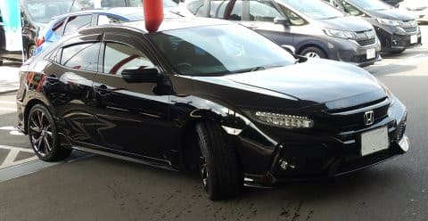
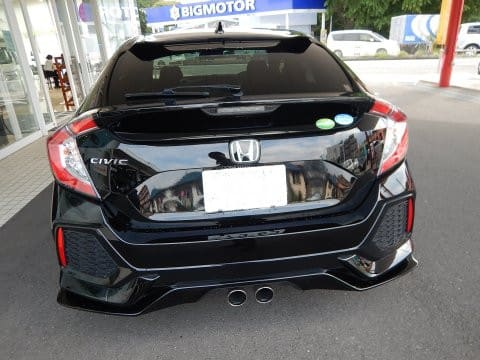
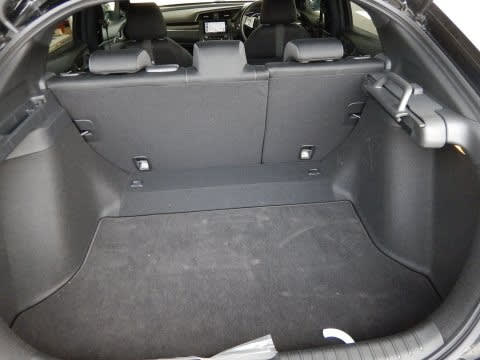
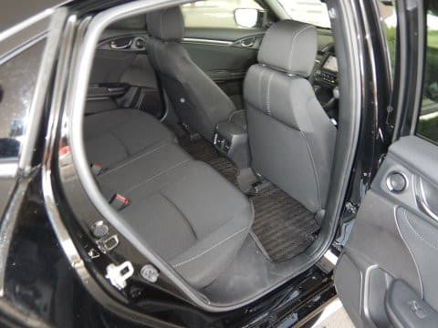
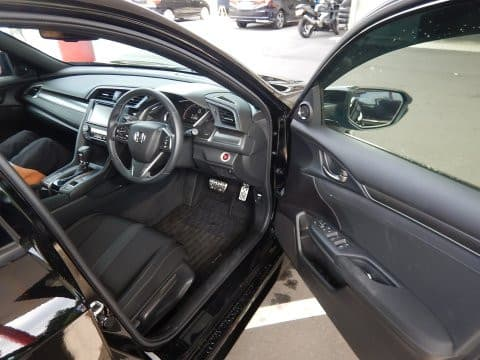
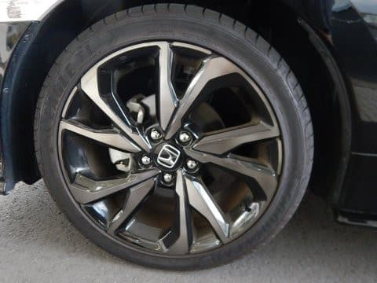

# HONDA シビックハッチバックを試乗してみた…LEVORG買ったばかりなのに，なんで試乗してるの？？

📅 投稿日時: 2018-09-22 00:51:58

えー．

LEVORGを買ったばかりというのに．

先週末，何をとち狂ったか．

ホンダディーラーに行って，シビックに

試乗してきました～！

いや，やっぱり．

ミニバンや軽やSUVじゃない，

ホンダの久々のスポーティーな車．

乗ってみたいじゃないですか…

まぁ，4WDが無いので，絶対に我が家の

購入候補にはならない車ですが．

ホンダの世界戦略のための渾身の力作．

ちょっと味見してみよう…

と思ったわけで．

まずは外観ですが．

うーむ．

長さはLEVORGより15cm以上短いのに，

結構大きく見えるなぁ…

幅はLEVORGより2cm広いだけだけど．

ホイールベースが2700mmとLEVORGよりずっと長いのが，

車が大きく見える理由かな？

後ろ姿もかなり幅広に見える，押し出しの強いデザイン．

センター出しの排気管も迫力を増してますね…

トランクは，ハッチバックだし．

車長も短めなので．

ワゴンのLEVORGほど広くはないですね…

リアシートは…

ホイールベースがそこそこ長いわりには，

ちょいと狭め．

着座位置が低いからか，LEVORGよりちょいと

狭めに感じるかも…

で．

運転席に乗ってみますが．

ステアリングも本革だし．

シンプルな中，安っぽさが出ないように

プラスチックっぽくないように作ってあり．

280万の車とすれば，価格相応の内装ですかね…

全高が低い分，シート位置は結構低め．

でも，ボンネットの両側が高く張り出しているので．

ボディの見切りはかなりいいです．

エンジンをかけてみると．

シュルシュルと軽いエンジン音．

振動も少なく，まぁこんな感じかな…

走り出すと．

ロードノイズは拾うけど，235/40という，

かなりワイドな低扁平18インチタイヤを履いてること

を考えれば，それほどひどくないか…

こんなごついタイヤを履いてるわりに，サスは

予想より柔らかめ．

外見ではガンガンのスポーティーな乗り心地を

予想させるけど．

正統派ファミリーカーっぽい，安心できる優し目の

バネレート．

でも．

かなり早くからしっかりダンパーが効く，いい足ですね．

ストロークの短い高周波入力でも，ブッシュがブルブル震える

感じではなく，しっかりダンピングされて振動が

抑え込まれてる感じ．

ステアリングも，よくできた電動パワステの味付け．

適度な反力があって軽すぎないし，妙に重い人工的な

反力でスポーティー感を出しているわけでない，

「しっとり感」を感じさせるステアフィール．

試乗ルートが街中で，コーナリングはゆっくりした

スピードでしか試せてないので．

コーナーを攻めるとどうなるかは不明ですが…

街中を走る分には，十分な滑らかな乗り心地と

ステアフィールで走っていきます．

そして．

この車の目玉は．

やはり1.5Lターボエンジンですね…！

このエンジン．アクセルを踏んでからほとんど

ラグなく加速していきます．

全くラグが無いわけでは無いけど，人間が

アクセルペダルを踏み込んでいくわずかな間に，

ブーストが上がっていく感じ．

ブースト制御のパラメータに，アクセル開度

だけじゃなく，アクセル開度の1次微分要素

（スロットル開速度）が大きめに入って

いるのかな…？←素人の勝手な推測

アクセルをかなり踏み込んでいくと，1.5Lと思えない，

かなりのトルク感で加速していきます…

車重が1300kg台と，LEVORGより200kg軽いのが効いているのか．

驚くほど軽快に感じる！

ミッションもCVT＋トルクコンバータだけど．

CVTと思わせないダイレクト感．

アクセルを踏み込んでも，CVTでローギアードに変速して

加速するより，ブーストを上げて加速する制御に

なっているようなので．

エンジン回転数がそれほど上がらずにぐっと

加速していってくれて，かなりトルクがあるように

感じます…

…いや，LEVORG2.0みたいな，暴力的なトルク感は

無いものの．

エンジンレスポンスはいいし．

結構よくできたエンジン＆CVTだなあ…

ただ，アクセルペダルの非線形性がかなりあるのか．

開度が小さい領域でもかなり景気よく加速します…

まぁ，こういう味付けにするとパワーがあるように

感じるので，狙ってるのかもしれませんが…

ってな感じで．

決してスポーティーではないけど，足もいいし．

エンジン＆CVTも良くできていて．

結構いい車だな…

と，思いながらも．

4WDが無い時点で我が家の購入対象にはならないし．

我が家にとっては，ちょいとトランクが狭いし．

日本車じゃなく，「イギリスからの輸入車」扱いになるこの車．

輸入＆搬送のために，半年待ちになるようで…

ディーラーさんも「車検が近いお客さんは，車検切れになるから

買えないって言われるんですよね（涙）」

と，嘆いてました．

うーむ．

車自体は良くできてるんだけどな．

惜しい…

## 💬 コメント一覧

### 💬 コメント by (ノムノム)
**タイトル**: 目の付け所がイイですね～
**投稿日**: 2018-09-22 20:44:10

Sさんこんばんは。

シビックは当方も気になる車でして、以前試乗させてもらいました。乗り心地も良く魅力的でしたが、FFなのがネックなんですよね～。厳冬の奥志賀高原とか走れるんかな。。。

昨年冬に野麦峠でスタックしている2駆のワゴンを見ているので、今後も4駆しか選べなさそうです…。

### 💬 コメント by (Skier_S)
**タイトル**: ノムノムさま
**投稿日**: 2018-09-23 00:52:35

あ，やっぱり，シビック気になりますよね…

いい車なんですが．

4WDがない時点で購入候補から落ちてしまうという，

かなり惜しい感じの車です．

FFなので，だましだまし行けばFRよりは何とかなるでしょうが．

宿の駐車場とかで朝に新雪が大量に積もってたら，

脱出とか厳しいかも…

でも．

いい車なんだけど．

FFで280万超えは，ちょっと高いかな～．

と思います…

### 💬 コメント by (おおすぎ)
**タイトル**: 車ネタに反応？！
**投稿日**: 2018-09-24 21:53:13

お久しぶりです、こんにちは！

同じＨユーザーとしても、またＥＫ９年代的にも、結構気になるＦＫ型・・・

Ｓ様が試乗するという事は、何かのフラグか・・・

このままでは終わらない予感が・・・

全ての車種に共通なのですが、もぷ2割くらい、車両本体価格が下がってほしいと思う、自分がいます。

### 💬 コメント by (Skier_S)
**タイトル**: おおすぎさま
**投稿日**: 2018-09-25 11:43:09

お久しぶりです！

EK9…名車ですよね．

今回の試乗は，特に何かのフラグではありません．

車買ったばかりで買い替えはありませんから…（笑）

しかし，最近の車全体的に値上がりしてる感じがありますね（涙）

シビックが300万近いんですから…

### 💬 コメント by (かつぽん)
**タイトル**: Unknown
**投稿日**: 2019-07-03 23:12:20

レヴォーグも無駄に高くないですか？

誰も選ばないでしょ、って装備の最安グレードでも290万円弱しますし。。

### 💬 コメント by (Skier_S)
**タイトル**: ＞かつぽんさま
**投稿日**: 2019-07-04 01:03:22

うーむ．

私はシビックは別に高いと言っていないんですけど…（汗）．

あのエンジン，足回りならお買い得な価格設定なのではないでしょうか？？

LEVORGは，4WDが要らない人には意味なく高く感じるでしょう…

4WDに価値を見出すかどうかでしょうか．

