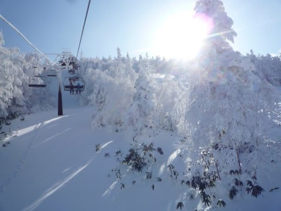
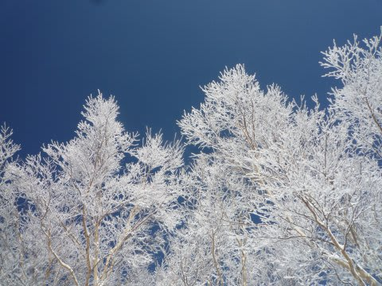
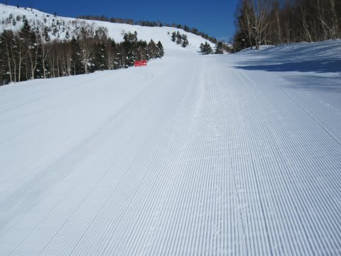
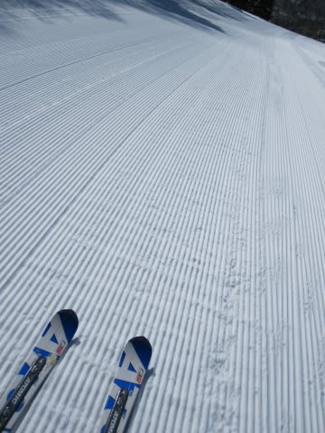
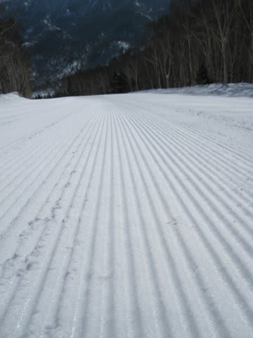

# 2011シーズン終了！　シーズンの総括

📅 投稿日時: 2011-06-27 21:23:01

🏷️ カテゴリ: [スキー雑談](c1f9d2cb7478308da16419928ea3945e9.md)

という感じで．

無事，2011シーズンが終わったので．

シーズンの総括なぞ…

○シーズン滑走日数　62日

あー．

昨シーズンと同じ滑走日数ですね．

でも，スキー場にいった日数は63日なんですけど．

地震でリフトが動かなかったのが1日あるんですよね…

まぁ，地震があったわりには良く滑ったなぁ．

○行ったスキー場

志賀　44日

☆Yeti　4日

かぐら 3日

八方　2日

菅平　2日

月山　2日

アサマ2000　2日

丸沼　1日

八海山　1日

☆小海Re-Ex　1日

（☆は今シーズン初めて行ったスキー場）

あー．やっぱり志賀高原がダントツですね．

…って，シーズン券持ってるからやっぱりそうなっちゃいますけど．

○ナイター滑走日数

12日

例年なら20日くらい滑っている気がするんですが…

ちょっと少ないですね～

地震以降，全くナイター滑れなかったので

仕方が無いか…

○トータル滑走標高差

487490m

…487kmですか．

ナイター無かった割にがんばってますね．

大体，国際宇宙ステーションより100kmくらい高いところから，

ひとシーズンかけて滑り降りた計算になりますか．

大体，滑った標高差の5倍程度が滑走距離（標高差300mのリフト

なら1.5kmくらいが滑る距離になる）と見積もると…

今シーズン滑った距離は，約2500kmになりますね．

…あれれ．意外と少ない．

○自動車走行距離

約25000km

まぁシーズン8ヶ月で2万5千kmという所なので，これは我が家の

平均的移動距離ですかね～． 

○転倒回数

2回

5月に入ってから2回．

4月まではシーズン無転倒で過ごせるか？？

と思いましたが．

1回目，歩くより遅いくらいのスピードでポテっと．

2回目は，5月のすごい重い雪で，トップの逆エッジが引っかかって

「おっとっととと…こらえたか…」

と思ったけど．お尻を着いてストップ．

とりあえず，今シーズンはスキーを外すような転倒は一度も無かったけど．

未転倒記録ならず．

まぁ，62日滑って転倒2回なら，少ないほうかな．

○かかったお金

…Priceless.

計算できません．

怖くて…（笑）

という感じで．

シーズンも終わったので．

次回更新からモード切替です．

## 💬 コメント一覧

### 💬 コメント by (森田勝里)
**タイトル**: 恐れ入りました
**投稿日**: 2011-06-27 21:54:31

滑走日数1/3、ナイター皆無、ヘタレなので月山も断念しました。転倒回数だけは無謀な自主コブ練で勝ったかなと（笑。

車検でディーラーとの攻防感服しました。

来シーズンはYetiから参戦したいと思っております。

### 💬 コメント by (Skier_S)
**タイトル**: コメント，早っ！
**投稿日**: 2011-06-27 22:09:46

コメントの早さにびっくりです…

来シーズンはぜひYetiから参戦ください．

でも，今シーズン，まだ月山が滑れますよ（笑）．

私のブログ，これで冬モードはしばらくお休み．

次回更新からは夏モードです．

