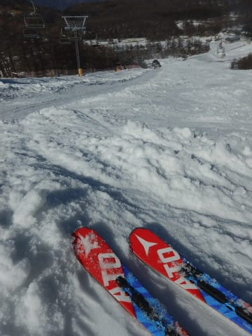

# え？3月26日の月曜はアサマ2000？？仕事休んで平日スキー！…今日も晴天，午後は雪は緩んだものの，楽しめたよ！

📅 投稿日時: 2018-03-27 01:53:16

🏷️ カテゴリ: [2018スキー滑走日記](c11b88dc181f34079ab41db74a3587646.md)

えー．

このBlogを熟読している読者なら．

「あれ？いつも日曜深夜は速報モードなのに…

　なんで昨日は速報モードじゃなかったんだろう…？」

と，不思議に思ったことでしょうが．

いや．

実は．

なぜか本日月曜．

ありえないことに仕事を休んで．

今日も滑ってました～！

だもんで．

今日のスキーレポートを書くために．

昨日は速報モードではなかったんですね～．

ってなわけで．

今日やってきたのは，アサマ2000．

…アサマ2000までの登り坂．

全く雪がないんですけど…

夏タイヤで突っ切れるレベルなんですけど…

雪，大丈夫か？？

って感じでやってきたアサマ2000．

いやーーー．

今日も晴天ですね～！！

そして，ゲレンデに雪があるのを見て

一安心…

しかし．

やっぱり．

気温が高かった3月．

今シーズン，すでに雪不足で第4リフトが終わっている

ようですね…

動いているのは，第1ペア，第2クワッド，第3ペアの3本

ですか…

そして．

アサマ2000の平日のリフト一日券料金，

なんと2000円っ！！！

これ，焼額の早朝券と同じ値段で，

一日滑れるってことだよな…

…ってか，一の瀬のナイター券より安いよね…

志賀高原のリフト券が高すぎるのか．

アサマ2000が安すぎるのか？？

営業開始の一番搬器に乗り込み，

まだ誰も滑ってない，シマシマ

ゲレンデへ向かうわけですが…

第2リフト沿い，STAGE2は人工雪がつけてあるので，

まだ雪たっぷり！

コースへ出ると．

うはははは．

シマシマっ！

それも，予想外カリカリじゃなく．

ここしばらく滑ってなかった

かなり柔らかめのバーン！

まさか，アサマで志賀より柔らかい朝イチ

シマシマが滑れるとはっ！！！

もう，朝イチ最高っ！！

シマシマ最高！！！

リフトも平日で，ほとんど待ちが無くて．

あぁ…

シアワセ…

ただ，天気が良かった本日．

気温もぐんぐん上がって，暑いくらい

だったけど．

西側斜面で日が当たらないので，雪は意外と

緩まずにいてくれて．

…さすがに11時近くになると，

ちょっと表面が緩み始めてきたけど…

でも，春の重いザラメにはならず，

ちょっとボソボソした程度の雪で．

まだ全然大回り可能！

人が少ないので，全然バーンが荒れてこないよ！

いや，昼の12時でこんな感じだったら…

志賀高原よりいいんじゃない？？

ただ．

さすがに午後1時ごろになると．

もう，ウェアを着てるのが暑いくらいになり．

気温は+10℃くらいはあるんじゃないかな？？

雪もちょっと重くなり始めましたが…

人が少ないので，重いながらもそれほど

凸凹にはならず．

まだまだ大回り可能っ！！

ただ，午後1時を過ぎると．

さすがに雪がかなりしっとりし始めて．

ちょっと小回りレーンっぽいのが出てきました…

そして．

午後2時過ぎには…

うむ．

もうこれはやばいね．

でも．

ウェアを着ているのが暑いくらいだった本日．

午後2時でもせいぜいこのくらいで済んでいる…

ってことの方が驚きかも．

荒れてはきたものの，全然コブになってないよ！

…そして．

ゲレンデに人がいない…

もう，午後2時を過ぎてゲレンデが荒れだすと．

誰もいなくなっちゃいました…

しかし．

ゲレンデの雪は多少緩んだものの．

土日の焼額の荒れ荒れゲレンデで鍛えられた私．

このくらいなら，フラット斜面と言えるのだ！

と．

ときどき飛ばされながらも．

楽しく大回りをしていたけど…

午後3時半を過ぎて．

日が陰ってくると…

うむ．

雪が固まってきましたね（涙）．

さすがに，この形のまま固まると

かなり手ごわい…（泣）．

そして．

手ごわすぎるからか．

誰も滑ってない…

ってな感じで．

最後はかなり手ごわい斜面だったけど．

リフトが動いていると帰れない宿命を

背負った私は．

営業終了となる4時半まで．

ひたすらSTAGE2のみをグルグル滑り続けたのでした…

いやー．

でも．

午前中は意外と雪も良くて．

人も少なくて飛び乗りだったし．

結構楽しい一日だったな！！

…で．

カンのいい人は分かっているでしょうが．

そうです．

今日，アサマ2000に行ったのは．

…こういうわけです．

ってなわけで．

今後のレポートをお楽しみに～！

## 💬 コメント一覧

### 💬 コメント by (tatskl)
**タイトル**: 昨日はありがとうございました
**投稿日**: 2018-03-27 07:25:00

昨日は、突然のお声掛け失礼いたしました。

このBlogの隠れ読者で、昨日、リフト乗車中とラストに

お声掛けさせていただいた者です。

Ｓ様も驚かれたと思いますが、自分も、まさかこの時期、

しかも平日にアサマにお見えになるとは

夢にも思わなかったので、驚きました。

たまたま隣に居られたので、失礼を承知でお声掛けしてしましました。

そして、ステッカーを頂き大変恐縮しております。

目的は（自分と同じで）試乗会だったようで、

Blogネタの為の、行動力に感服いたします。

そして、いつもBlogを楽しみにしておりますので、

今後ともよろしくお願い致します。

### 💬 コメント by (かず)
**タイトル**: Unknown
**投稿日**: 2018-03-27 13:20:53

今週末少し気温下がるみたいですね　早めに行かないとやばそうなんですよね～あそこの店の店長　Sさんのこと知ってますよ　神ブログと超人の人で

### 💬 コメント by (Hide)
**タイトル**: さすがです・・・・
**投稿日**: 2018-03-27 13:54:04

S 様

土曜日にや焼額でご挨拶させて頂いたと思ったら、まさかの3連チャンで月曜にアサマ2000にいらっしゃるとは・・・さすがです。

私は既に6シーズンを消化したi.SUPERSHAPEですので、来季は買い替え予定です。

候補は「SUPERSHAPE i.SPEED」か「SUPERSHAPE i.MAGNUM」です。

→試乗レポートお待ちしてます（笑）

### 💬 コメント by (Unknown)
**タイトル**: リフト代を見ると達成標高差が気になる
**投稿日**: 2018-03-27 15:03:21

「アサマ2000×平日（2000円）×試乗会×Skier_S体力（これ重要！）」という条件で標高差はどれくらいでしたか？

### 💬 コメント by (マルハバ)
**タイトル**: わぁ～！！
**投稿日**: 2018-03-27 17:51:29

ホントに月曜休んで試乗会に行ってたんですね・・残念！！

ダイヤモンドのナイターでそんなこと仰ってたんで

実は先週Sさんの週末動向をずっと注視していたのですが・・

日曜日の段階で「これはないな」と思い

ハンターMt.のツアーに変更しちゃいました（涙）

でもよくよく考えると

今シーズンはまだ試乗会に参加された様子はないし

まとめて試乗できる月曜開催に興味を示されていたので

私の読みが甘かったか！？

想像するに・・

昼食・トイレ休憩はもちろんなし

板の交換は走って行い

リフト乗り場への斜面ではストック漕ぎまくり

20000m倶楽部さながらの試乗会だったのでは（笑）

### 💬 コメント by (いー)
**タイトル**: Unknown
**投稿日**: 2018-03-27 21:21:04

日曜日はいろんな場所でお世話さまでした。

今年はダイヤモンドの試乗会がないですね…

ファミリー試乗会 4/21.22まで雪があるかしら？

これから季節外れのパウダーがあったりして‼

### 💬 コメント by (yama)
**タイトル**: 26日の志賀高原
**投稿日**: 2018-03-27 22:11:29

久しぶりの平日スキーは朝から晴れて気温が高かったです。一の瀬正面バーンは固いアイスバーンですが、ヤケビも奥志賀もしっとりとした雪でした。すぐに荒れそうでしたが、人が少ないのでそんなに荒れません。１１時からは１番条件が良かった正面バーンとパーフェクタをヘビーロテしてラスリフまで頑張りました。コンスケさんとsawaさんKさんにあいましだ

### 💬 コメント by (しんちゃん)
**タイトル**: HEADi-RACE　PROが気になる
**投稿日**: 2018-03-27 22:23:27

3/25ヤケビのゴンドラで、HEADﾚｰｼﾝｸﾞキャンプのスタッフの方が来シーズンモデルのi-RACE　PROを所持してました。実物はカラーリングもよくかっこよかったです。

（Goku様も同乗していたのですが興味津々で物欲選手権の種火がついていました）

格好だけでなくその性能も気になりました。今後の試乗レポートよろしくお願いします。

### 💬 コメント by (新潟のスキーヤー)
**タイトル**: Unknown
**投稿日**: 2018-03-28 01:38:00

Sサンも平日にスキー行くんですね！

私も昨日、今日と妙高でボッチスキーヤーしてました！決して寂しくなんかありません！笑

ただ、気温が高くて昼前にはザブザブでブーツの中は大洪水でした！泣

XレースとSX乗りのSサンの試乗レポート楽しみにしております！.

### 💬 コメント by (Skier_S)
**タイトル**: コメントたくさんありがとうございます
**投稿日**: 2018-03-28 05:15:26

＞tatsklさま

アサマではお世話になりました～！

コメントありがとうございます．

いやーー．

しかし，驚きました．まさか試乗板を

履いているのに，アサマ2000のリフトで

声をかけられると思ってませんでした…

また志賀にいらっしゃる際は焼額で

お会いしましょう！

今後もよろしくお願いします～！

＞かずさま

30日に一瞬気温が平年並みに下がりますが，

それ以外は平年より高い気温の日々が

続きそうです（涙）．

で…あのお店の店長とまだ話してないのですが，

私のことをご存知なんですか…！？？

さらに，神ブログって…？？

＞Hideさま

まさかの3連ちゃんでした～！

でも，6シーズン目の板は買い替え時では…？？

今回，残念ながらSuperShape iSPEEDもMUGNUMも

試乗していません…

が，iSPEEDは良かったかも？？

また今後の試乗レポートお楽しみに！

＞Unknownさま

今回の標高差はわずか7200mでした…

なにぶん，低速リフトなのが効いてます．

もう少しリフトが速いと嬉しいんですが…

＞マルハバさま

直前まで，月曜休めるかどうかわからなかったの

ですが，強引に休みを取って行ってしまいました．

4月頭のダイヤモンドでの試乗会が無くなったので，

急遽アサマ2000にしました…

ご想像の通り，昼食抜き，板の交換は

走りました（笑）

5時間半で18機種，20分ペースで

板を交換し続けました…

いつもは土日の2日で試乗している分，

1日で試さなくてはならなかったので

なかなかしんどかったです（笑）

＞いーさま

日曜はいろいろな場所でお会いしましたね…

ダイヤ試乗会はないし，ファミリー試乗会は

雪があるかどうかきわどかったので，

急遽アサマ2000の試乗会に参加してきました．

うーん．

これからもう一降りほしいのですが…

そろそろドカ雪は望み薄な感じです（涙）．

＞yamaさま

月曜も気温が上がりましたね～．

ヤケビ，奥志賀は早々に緩んだんですね．やっぱり…

でも，月曜もいろんな人がいたんですね（笑）．

＞しんちゃんさま

i-RACEはあったのですが，Proではなかったです…

時間がなかったので，i-RACEには載れませんでした．

でも，i-SPEEDはよかったですよ！

＞新潟のスキーヤーさま

お久しぶりです！

今回，いろいろ休みを取らねばならず平日スキーとなりました．

できれば，雪がいい1月か2月に平日スキーしたかった…

でも，アサマ2000の試乗会は楽しんできました．

試乗レポートお楽しみに待っててください！

…アサマ2000は試乗会があったのでお客さんが

そこそこいましたが，ほとんど試乗会のお客さんだったので，

試乗会が無ければ超寂しいスキー場だったと思います…

