# 2020/1/1，2020年元日の志賀高原スキー場は…朝は晴天最高コンディション！午後は曇り～雪降り，ところどころ硬いところあり．積雪量は問題なし！

📅 投稿日時: 2020-01-02 05:49:19

🏷️ カテゴリ: [2020スキー滑走日記](c282e9230de179e245c7334eabeb0a3b3.md)

えー．

いつも通り，スキー場で過ごしていると．

新年を迎えた感じが全くないのですが．

どうやら，2020年を迎えたようですので．

とりあえず，ご挨拶しておきます．

あけましておめでとうございます．

今年もよろしくお願いします．

ってなわけで．

無事新年を迎えた，元日の本日．

朝は，焼額山スキー場恒例の，

新春ファーストトラックに参加してきました～！！

太陽がまだ登っていない，朝6:40ごろに

ゴンドラに乗りこみ…

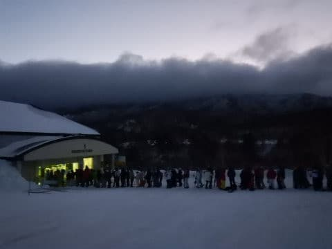

山頂で，元日の初日の出を待ちます．

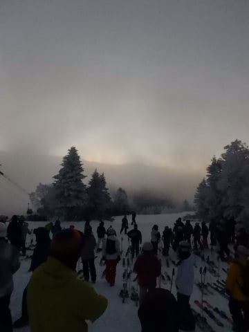

これまで，このイベントに20年以上参加してますが．

晴れて初日の出が見れたのは，せいぜい2～3回．

今年は無事，初日の出が見れるのか…？

一応，空はうっすらかすんでいるものの，

晴れてそうなんですが…

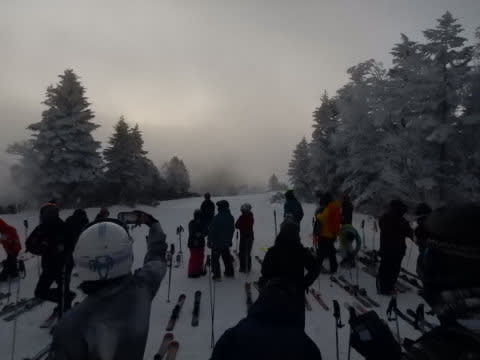

…でも．このイベント．

初日の出が見れなくても．

日の出後の朝7時過ぎから8時までの早朝に，

ゴンドラをひたすら滑れるというおまけが

あるので．←おまけじゃなく，そっちがメインじゃないの？

ガチ本気勢の皆さんが，スタートラインで

日の出を今や遅しと待ちかまえています…

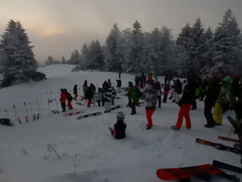

果たして，今年は初日の出を拝めるのか？？

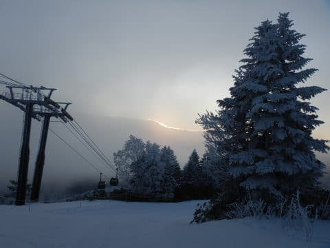

…空は晴れ渡っているのですが．

太陽が昇る付近にちょうど雲がかかって

いたので．

日の出時刻には，太陽が出てくるのを拝めず…

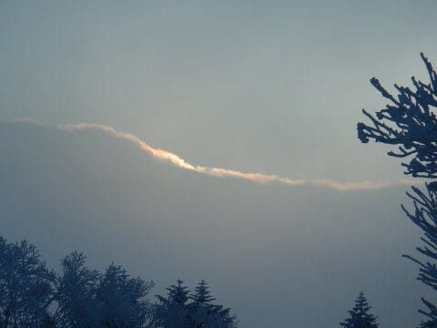

だもんで，日の出時刻の7:15頃．

太陽が雲の上に顔を出す前に，

３，２，１のカウントダウンで

数10人が一斉にスタート！

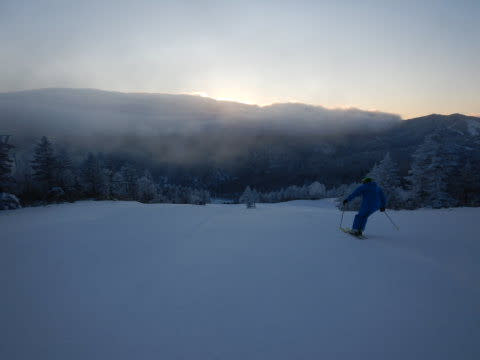

2020年最初のシマシマ，いただき～！！！！

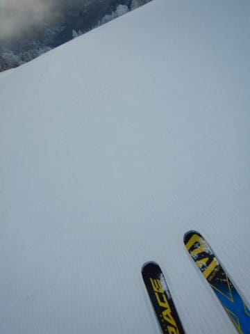

昨日からの積雪は1cmほどしかなく．

結構締まり気味ながら，エッジがん噛みで

スピードが出る，超快感コンディションっ！！

うはーーーー！！

シアワセっ！！！

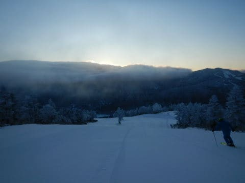

そして．1本滑って山頂に戻ると…

そこには2020年の初日の出が！！！

…これは，2020年は幸先がいいぞ～！！

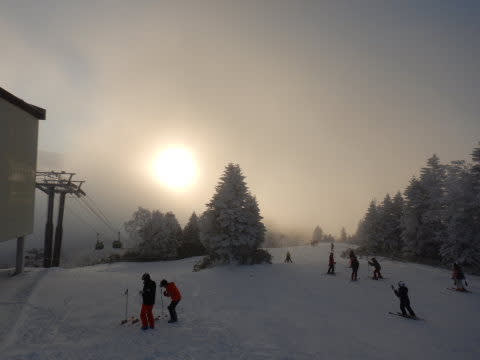

ってな感じで．

早朝の晴天のシマシマ，

ひたすらいただき続けます！！

もう，最高．

天気よし，雪良し，

そして，早朝ファーストトラックは200人限定なので，

ゲレンデもガラガラ…

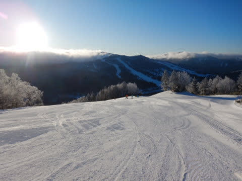

いや．

最高．

2020年は，しょっぱなから最高

コンディションで始まりました～！！

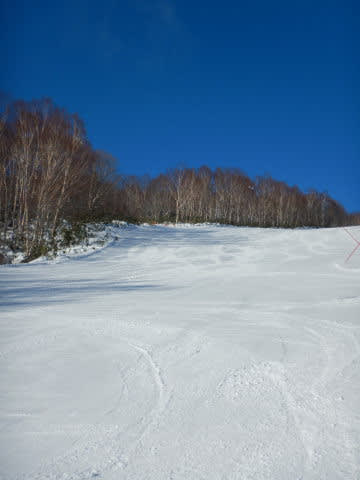

そして，8:30からは通常営業が

開始となりますが…

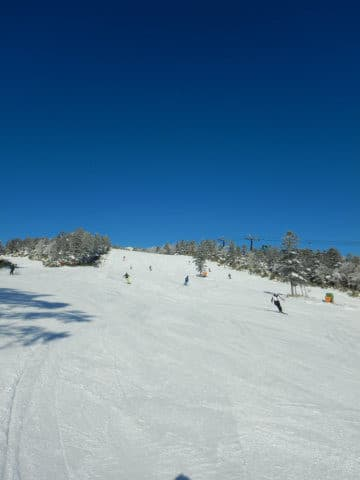

すっきり晴天の本日．

例年，元日は朝イチから出てくる人が

少ないので．

朝のうちは，人が少なめの，

ガラガラ晴天バーンを楽しめます！

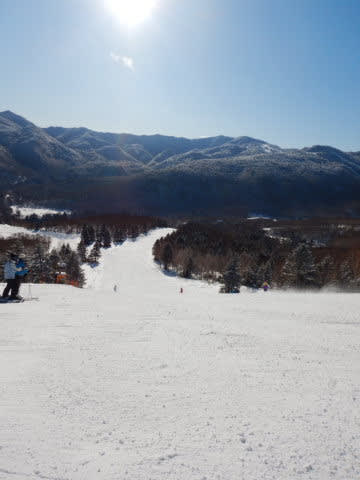

…昨日からの積雪は思ったほど

なかったけど．

でも，朝の気温は-10℃以下まで

冷え込んでいて，雪質はいいし．

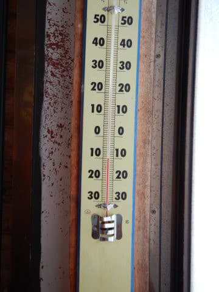

雪も解けてないので，

ごく一部に浮石が出ているところは

あったものの．

コース全面，滑走には問題なく．

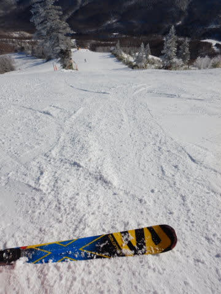

…そして本日．

ようやっとオリンピックコースがオープンしました！

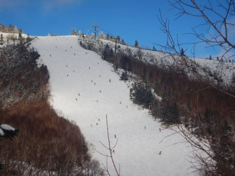

急斜面で雪つきが良くないこのコース．

まだ積雪不足で圧雪車が入れないので，

非圧雪でのオープンとなりましたが…

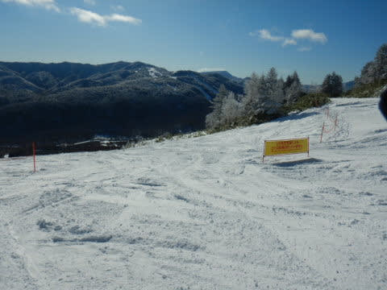

でも，思っていたより雪は十分！

地面が露出しているようなところはなく．

ちょっと背の高い草のてっぺんが

ちょろっと出ている程度．

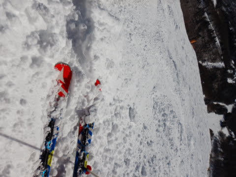

しかし，雪は，ちょいと硬めの

コロコロと積もりたてのやわらかい

雪が混ざったうえ…

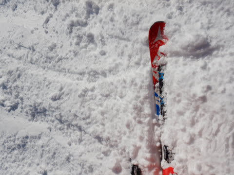

非圧雪の凸凹だったので，

ちょっと楽しいとは言えない

コンディションでしたが…

でも，全面しっかり雪が着いていて．

思ったより良かったかな！

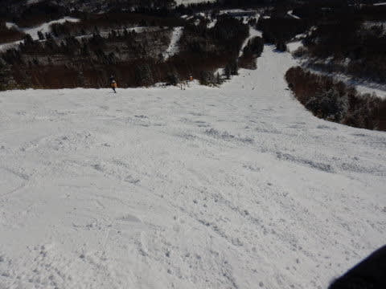

…と，晴天最高のゲレンデを楽しんでいたら．

やはり，人出が少なめの元日とはいえ．

10:30ごろには第1ゴンドラが6-7分待ちに

なってきました…（ちょい涙）

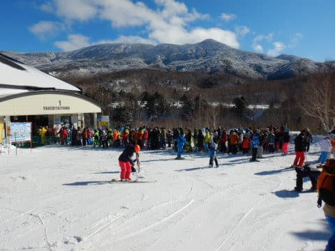

第2ゴンドラは15分待ちまで

行ったようですが．

第3高速，第4ロマンスはほぼ待ちが

なかったので，そちらににげれば

問題なし！

…なんだけど．

やっぱり午前10時過ぎからは，

ゲレンデの人口密度は

高かったかな…

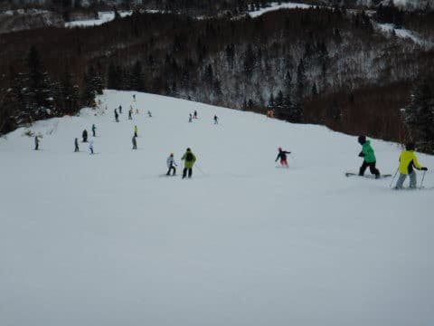

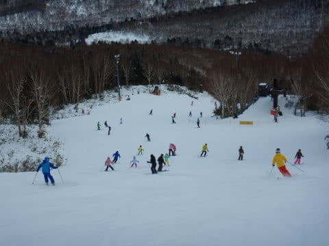

そして．

朝は晴天ピカピカだったけど．

11時ごろには曇り空に…

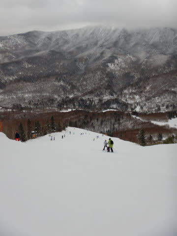

さらに．

大勢の人で削られたゲレンデは，

ところどころ下地に硬いところが

出てきました…（涙）

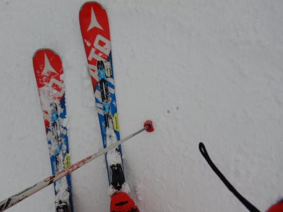

でも．

ゲレンデ全面にしっかり雪があって．

下地が硬い分，ゲレンデがそれほど

凸凹に荒れなかったので．

雪不足の今シーズン．

奥志賀なんかは積雪不足でエキスパート

コースが圧雪できなくなっちゃったらしいけど．

焼額はコンディションがかなりいい方

だよなぁ…

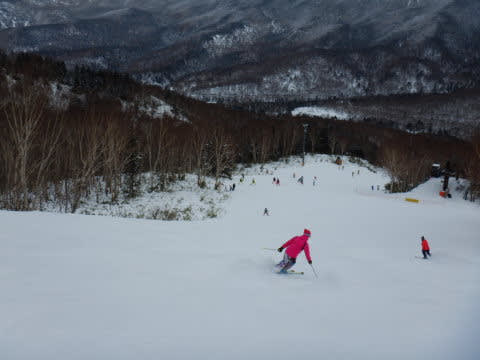

そして．

午後になると，いつも通りゴンドラ待ちは

ほとんどなくなってきました！

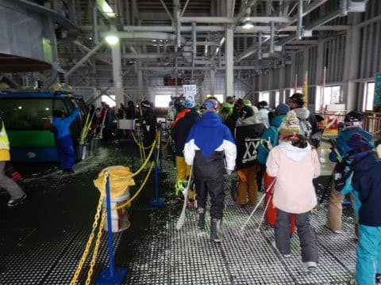

まぁ，ゲレンデの人口密度は

相変わらず高めではあり．

ごく一部．ちょいと雪が薄くなって

来たところもあったものの…

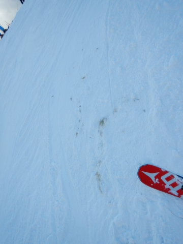

今日は冷え冷えで，この雪不足としては

いい感じのゲレンデコンディションで

一日を過ごすことができ．

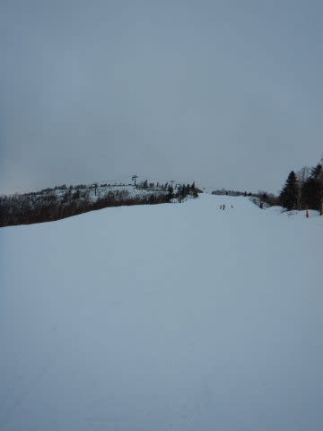

新年早々からいつも通り，

ラストゴンドラまで

しっかり滑ってきました～！！

いやーー．

元日から，朝はすっきり晴天．

午後は曇ったものの．

雪不足を感じられない，ほぼ全面

フラットバーンで滑走可能という，

恵まれたコンディションで，

いい2020年を迎えられたのでした…

…

…

で．いいコンディションだったので．

当然行きますよね．

そうです．

本日は，焼額ナイターに参戦です！！

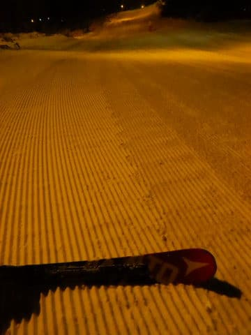

焼額ナイター．

いつも通りの圧雪かけたてピカピカ

シマシマで…

それも，冷え冷えの超最高級

スペシャルグレードの超快楽

脳内麻薬出まくりバーン！！！

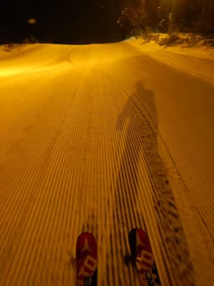

ダメだ！

楽しすぎる！！

最高すぎる…

と，

快楽の雄叫びをあげながら．

2020年の初日も終わっていったのでした…

いやーー．

2020年．

いいスタートを切れました…

今年がこんな感じで，いい年でありますように！！！

## 💬 コメント一覧

### 💬 コメント by (Hide)
**タイトル**: あけましておめでとうございます
**投稿日**: 2020-01-02 08:44:31

S 様

あけましておめでとうございます。

今年もよろしくお願いします。

PS

そろそろ雪が欲しい・・・。

### 💬 コメント by (まーくん)
**タイトル**: Unknown
**投稿日**: 2020-01-02 15:20:20

あけましておめでとうございます。

安比は猛吹雪でゴンドラは11時位まで動かず、それ以降も大雪で視界不良が続きました。降雪量は十分のはずなのですが、地吹雪で飛ばされてしまい積雪量不足です(T_T)

焼額のほうがコンディションは良いかもしれません。

### 💬 コメント by (Skier_S)
**タイトル**: そろそろどか雪が欲しい…
**投稿日**: 2020-01-02 22:37:56

＞Hideさま

あけましておめでとうございます～！

今年の元日午前は最高でしたので，このままいい年になってほしいところ…

＞まーくんさま

あら…

安比はダメだったんですね．

残念…

やっぱり，志賀高原にしておかないと（笑）．

LINEメッセージを見て，志賀高原へ思いを馳せてください．

焼額でお待ちしています！！

