# 2015年8月，子連れでモアルボアルでダイビングその１…いざ，出発！

📅 投稿日時: 2015-10-16 02:02:36

🏷️ カテゴリ: [ダイビング日記](ce3a7a8d424d112fce83ee85c81a0e344.md)

えー．

明後日，初滑りというのに．

目を閉じると，おとといまで過ごした，

エメラルドグリーンの西表の海と

きれいなサンゴ礁の残像が残っており．

…まだ全然スキーシーズンモードに頭が切り替わっていない，

Skier_Sです．

これではマズいと，一生懸命スキー雑誌を読んで，

何とか頭を切り替えようとしています…

…って言っておきながら．

このBlogは，また，夏の話題へ行くのだ！

---

とゆーことで．

世の中がお盆ウィークに入る，一日前の金曜日．

強引に休みを取ったこの日が，モアルボアルへの出発日．

午後の成田発，フィリピンエアーの直行便で，

セブへ向かうわけですが．

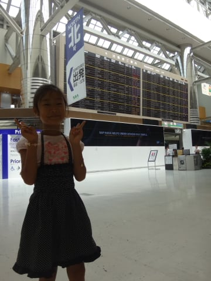

搭乗2時間前ぎりぎりに空港へ到着した我が家．

第2ターミナルのカウンターでチェックインし，

出国審査を通過したら，第2ターミナルのサテライトへ

延々歩いていきます…

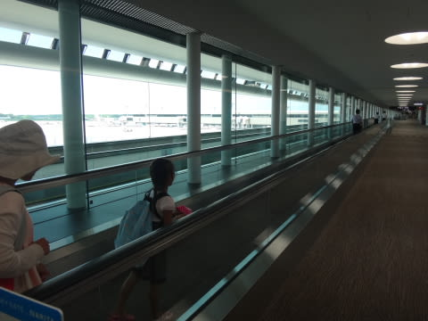

そう．

昔，第2ターミナルの，サテライト連絡シャトルの

リニアモーターが走っていた通路．

今では，こんな感じの延々と長い歩道になってます…

シャトルを待たなくてもよくなったけど，

サテライトまで，かなりの距離を歩くことに…

うーむ．

シャトルのほうが良かったかな？？

んで．

ゆるゆると免税店などを見つつ，搭乗口へやってくると，

ちょうど搭乗開始予定時間．

いや，いい読みだったなぁ…と，思ったら．

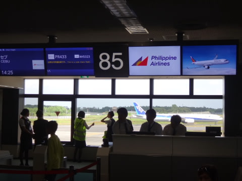

案の定というか…

フィリピンエアーではよくある出発遅れ（涙）．

何分遅れか全く案内のないまま待たされるという，

いかにも，

「これから南国の航空会社で，南国に行くんだなっ！」

って感じで，盛り上がりますね～！！！←必死にポジティブに捉えてみる

しばらく待つと．

予定より約25分遅れで搭乗開始となりましたが…

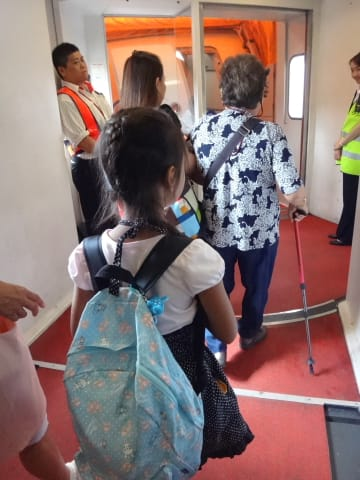

前回と同じく，機体はA321で．

…エンターテイメントシステムはついてません（涙）

TVモニターがないのを見て，ちょっとがっかりな娘．

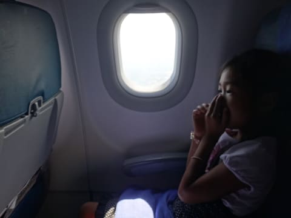

まぁ，わずか5時間半だから，我慢してね…

そうこうしていると，飛行機は成田空港を出発し…

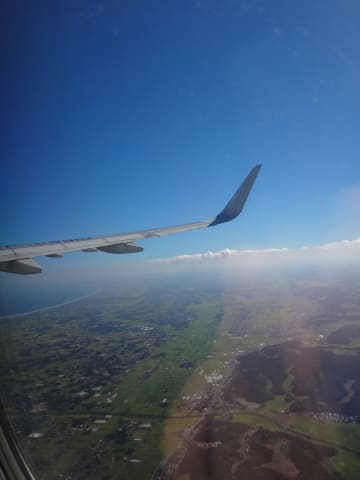

離陸後40分ほどで，機内食のお時間．

だいたい，チャイルドミールが，他の人を差し置いて，

真っ先に運ばれてきますが．

今回も，機内食タイムになると真っ先に運ばれてきた，

わが娘のチャイルドミール．

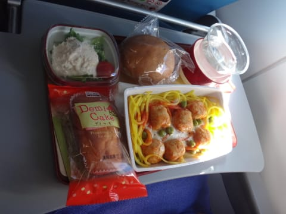

そして，こちらが大人用の和食．

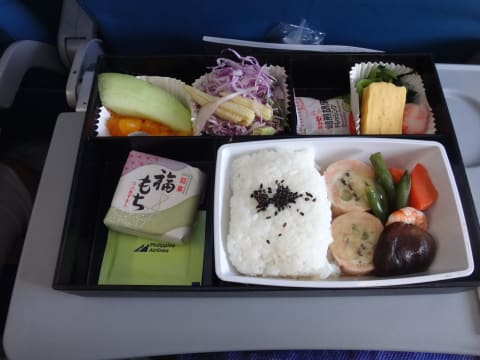

…あまり期待してなかったけど，日本発の便だから，

日本で作った日本食．

普通においしく食べれましたね～．

前回は，チャイルドミールのほうがおいしそうだったんだけど（笑）．

そして…

やっぱり，食事を食べたら寝ちゃうのね．

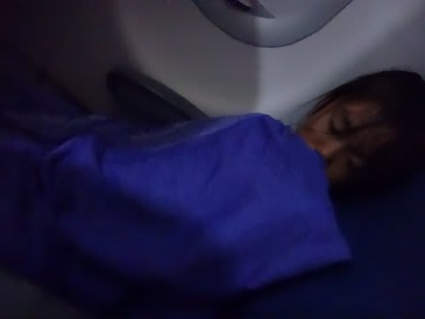

1歳のころから，飛行機に乗ったら寝ちゃうってのは，

変わらんなぁ…

ってことで．

現地時間の午後7時半ごろ，無事セブ空港へ到着！

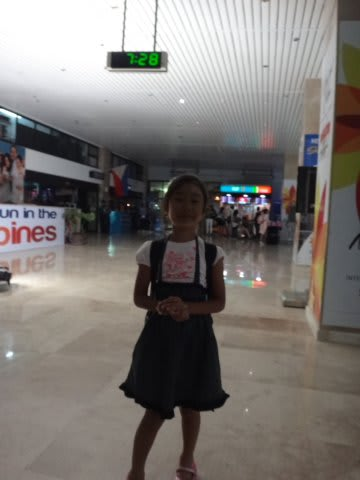

…いや，無事じゃないかも．

[いつも通り](e3f297dded27f560b2aa0917a23a321a0.md)，入国審査で「ちょっとこっちへ」

と，別部屋へ連れていかれ，尋問されるという

特別待遇を受けてからの入国です（泣）

特別待遇での入国後，空港にてフィリピンペソへ両替．

日本国内より，フィリピンのほうがずっとレートよく

円を両替できます．

…が，モアルボアルでは両替するところもほとんどないので，

ここで両替しちゃいましょう．

そして，空港から，ホテルお出迎えの車に乗って…

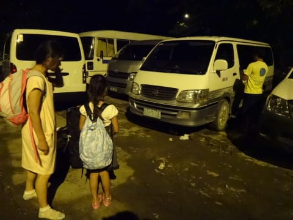

ワンボックスカーで揺られること，

ひたすらひたすら3時間半．

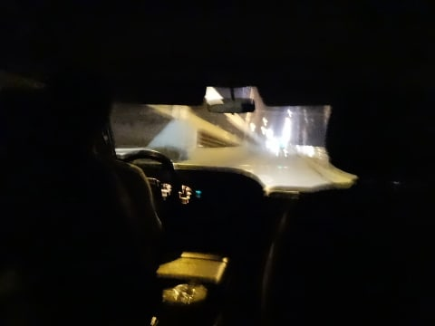

…3時間半って，うちからかぐらスキー場とかまで

行けちゃう時間だよ，これ…

ってことで．

深夜11時過ぎ，ようやっとホテルへ到着しました…

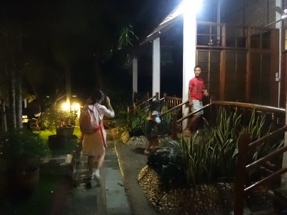

…疲れた…
