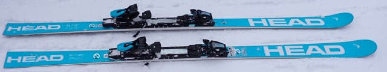

# 2024シーズンモデルのスキー板，試乗レポートその13…HEAD WORLDCUP REBELS e-GS RD

📅 投稿日時: 2023-06-09 04:38:33

🏷️ カテゴリ: [スキー板試乗](c0bd8048615710cee890e403a36cc9a2b.md)

ダメだ…

終わらん．

仕事が終わらんよ…

昨日は3時間寝ることができたけど，

今日は寝られるかな…

もう外は明るいなぁ…

資料仕上げるのに，まだ2時間はかかりそう…

明日も朝から夜まで会議が詰まってるなぁ…

当然，世間は昼休みをとってる時間も会議が

詰まってるよ…（泣）

でも，明日…というか，もう今日だけど．

朝一つ目の会議が9:30スタートと遅めだし，

今のところ最後の会議は19時には終わりそうな

予定なのが救いかな？？

…今晩は追加の会議がなくて，19時からちゃんと

自分の書き物仕事ができるといいな…

ってなことで．

今書いている資料は朝6時には仕上げて，

それから3時間は仮眠するぞ！

（無理っぽいけど…）

ってなことで．

今日も書き溜めておいた2024シーズン

モデルのスキー板の試乗レポートを投下！

今回はヘッド編．

では，どうぞ～！！

…眠い…

〇HEAD WORLDCUP REBELS e-GS RD 181cm

GS競技・基礎大回り用

HEADのGSモデルは，FIS規定に沿った

R>30mのe-GS RD FISと，

FIS規定に沿わないサイドカーブがきつめの

e-GSがありますが…

このe-GSはFIS規定に沿わないほう．

181㎝でR=25ということで，一見

昨年モデルと同じ仕様に見えますね…

e-GS RD FISは白色のみですが，

このe-GS RDは白と水色の2色展開となります．

…ただ，HEADの最新カタログを見ると…

来季は水色をデモ用として別名のシリーズで

展開するのかな？

このe-GSの水色バージョンは，

カタログでは

WC GS-REBEL RP-WCR14 SPEEDBLUE

という名称になっていますね…

そして，白色のGSモデルはこのタイトル通りの

WORLDCUP REBELS E-GS RD

ですが，プレートがセパレートタイプの

Race Plate WCR Teamで，

この水色の試乗モデルについている

Race Plate WCR 14 shortのほうが

強めのプレートになってます…

来季は白色モデルと水色モデル，プレートが

違うかもしれないのでご注意ください！

ってなことで，滑ってみたところ…

今シーズンモデルはもう少し優しい感じがした

けど，来シーズンモデルはちょっとフレックスが

強くなったのかな？

滑り始めた瞬間，結構強い張りと硬さを

感じます．

e-SPEEDも強いと思ったけど，それよりも

さらにしっかりした感じ．

しっかりしてるから曲がりにくいかと

思ったら…

谷回りでしっかりトップから押さえていけば，

トップ側がしっかりたわんで，強いグリップで

ぐっと曲がっていきます．

ただ，旋回半径は私が朝イチ大回り用で

使っている，FISCHER GS MasterのR=27より

大きい感じ…

R=27のFISCHERのほうが，R=25のこのHEADより

よく回ってくる感じ．

まぁ，GS　MasterのR=27はすごい回りすぎる

くらい回ってくれる板なので…

R=25のこの板は，R=25っぽい半径で，

比較的縦目に落ちて行ってくれます．

それも，スピードを出していっても全然余裕が

ある張りの強さで，板がまだまだたわみ切って

ないよ～…という余裕を存分に感じます．

非FISのGS板だけど，FIS規定モデルから優しく

したというより，むしろRが小さい分フレックスを

強めにして，回りすぎないようにしてあるんじゃ

ないかな？？

と思うくらい．

[FISCHERのR=30のモデル](e244bc99fb4779bc9befd0ad6d350691f.md)のほうが，

よっぽど柔らかくて優しく感じますね…

雪が柔らかくて板がグリップしなかったり，

エッジの手入れがしっかりしてないと…

板がたわませられなくて楽しくないと

思います．

スピードを出す人，体重＆筋力がある人，

正しいポジションで板を踏める人が，その真の

実力を発揮させられる感じ．

どれだけスピードを出しても板が負ける

ことがなく，超ハイスピード域でも踏めば

踏んだ量だけ，しっかり板が反応して旋回半径を

コントロールしていけます．

スピードを出してもたわみ切ってしまうことは

ないし，いきなりカツンと食いついて曲がって

いってしまうということもなく．

トップのエッジの食いつきがいいので，

トップが食いついたあと乗り手が踏んで

たわませた量だけしなやかにたわんで，

たわみ量に応じて曲がって行ってくれるという，

実に玄人好みの板．

ただ…私がどれだけ頑張ってたわませてもぎりぎり

ミドルターンまで．

さすがにGS板ベースなので，超ハイスピードの

ロングターンスペシャルの板ですね…
