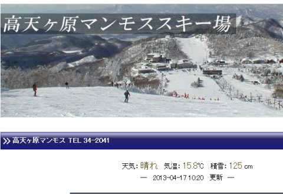
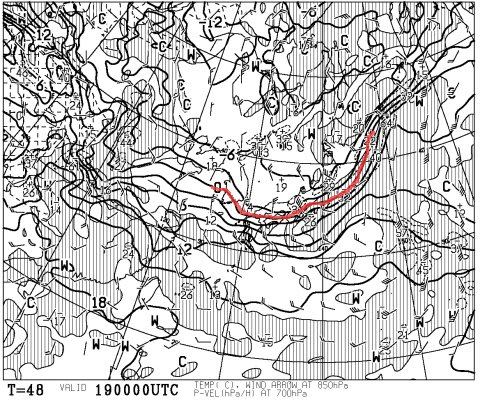
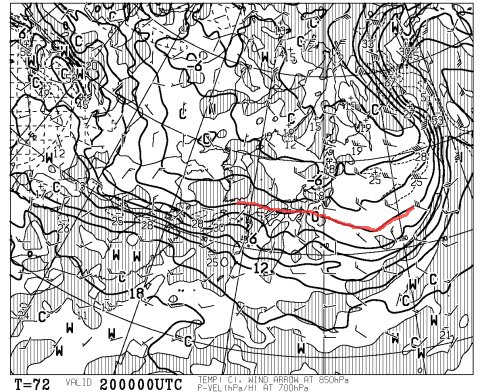
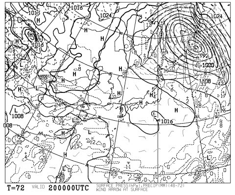
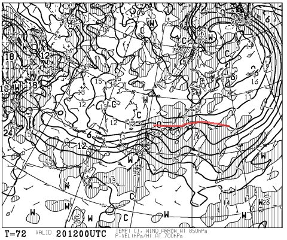
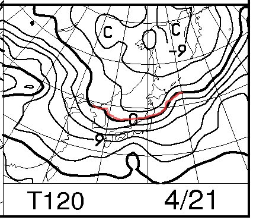
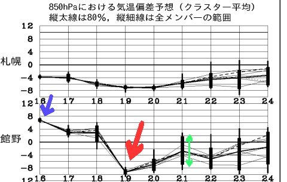

# 定例！この週末の志賀高原の天気予想…うむ？土曜は先週と同じくらいいいかも？？

📅 投稿日時: 2013-04-18 00:57:54

🏷️ カテゴリ: [スキー天気予想](c6554f5c3c106093b511a8daae23757e8.md)

えー．

昨日，今日と．

スキー場でも，異常に暑い2日間だったようですが．

…

…

高天ヶ原の気温が，午前10時で+15.8度ってどうゆうことよ(涙)…

って感じで．

…雪が解けちゃったんじゃないかと心配な2日間だったわけですが．

…でも．

悲しまなくて良いぞよ，みなの衆．

この週末．

また，冷えるのだっ！！！！！！

いつもの高層天気図，FXFE5784を見ると…

OH！グレートっ！

金曜19日の850hpa面の0度線，信州より南に下がってくれてます．

志賀高原はしっかり氷点下に冷えますっ！

そして，この日は降水量がありそうなので…

降れば雪です！積もります！

(そんなにいっぱい積もらないけど)

19日は，夜までちらちらと雪が降ってくれるので…

土曜朝はうっすら新雪が積もっている可能性大！

土曜は…

引き続きこんな感じで，朝9時の850hpa面の0度線は，信州より南．

っていうか，-3度線が信州にかかっているので…

朝の志賀高原．-5度近くまで冷えそうです！

んで．土曜の朝の地上天気図は…

こーんな感じで，晴れそうな感じなので…

土曜は，冷えひえで晴天の，最高の朝になるでしょう！

ゲレンデはしっかり固まった，この時期では恵まれたコンディションのはず！

＃新雪が上に積もらなければ，かなりカリカリに硬いアイスバーンでしょう…

土曜は夜9時になっても…

こんな感じで，850hpa面の0度線は信州より南なので．

この日は終日冷えて，4月にしては気温が上がらず，雪がそんなに緩まないでしょう！

で．

日曜は…

残念ながら，こんな感じで0度線は信州より北に上がってしまうので．

朝早くから，志賀高原でも気温はプラスに上がりますね～．

でも，日曜も終日晴れて，天気は良さそう．

とりあえず．こーんな感じで…

青矢印で示したように，平年より8度近く高温だった16日でしたが．

赤矢印で示した，19日は．一気に冷え込んで，例年より10度くらい寒い日になります！

…でも．緑矢印で示すように，21日日曜の気温予想の幅はまだばらつきがあるので．

日曜の天気はまだ不確定です…

ってことで．

まとめると．

超冷え込んで積雪がありそうな金曜日のあとに，

そのまま冷え込みが続いて迎える，冷えひえの土曜日．

朝の気温はマイナス5度程度，しっかり冷え込んだ硬いバーンになるでしょう．

天気は晴れ！

晴れてても気温が低いので，昼近くまでコンディションはよさそうです．

昼を過ぎて雪が緩んでも，ザブザブな雪にはならないでしょう…

日曜も晴れ．

ちょっと気温が上がりそうだけど…

まだ，予想に幅があるので，また直前に予想します．

…とりあえず．

この週末も，コンディションはよさそうな気配！！！！！

ふはははは．

私の祈りが通じたのだっ！←だから違うって(自己突っ込み)

## 💬 コメント一覧

### 💬 コメント by (gokuraku skier)
**タイトル**: Unknown
**投稿日**: 2013-04-18 19:34:03

土曜日の早朝はマジでイイ感じですね。

でも、でも、でも、仕事です(T_T)

私の分まで思う存分大回りしまくってください。

日曜日も行けるかビミュー。

### 💬 コメント by (Skier_S)
**タイトル**: gokuraku skierさま
**投稿日**: 2013-04-18 23:48:14

なんだか，日曜は天気が崩れそうな感じに

なって来ました…

予想より次の低気圧の接近が早く，

朝から雲が多く，もしかすると雨かも…

うーん．

このままの天気図だと，日曜は多分ダメです…(涙)

