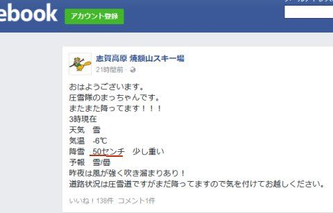
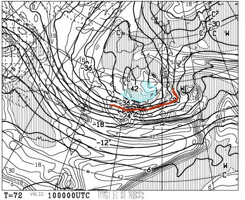
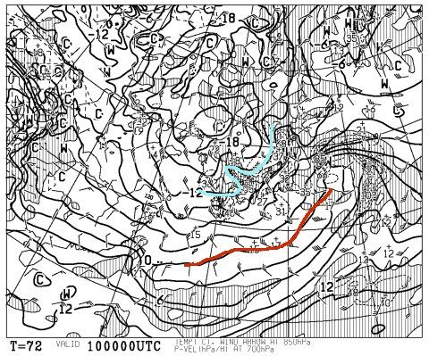
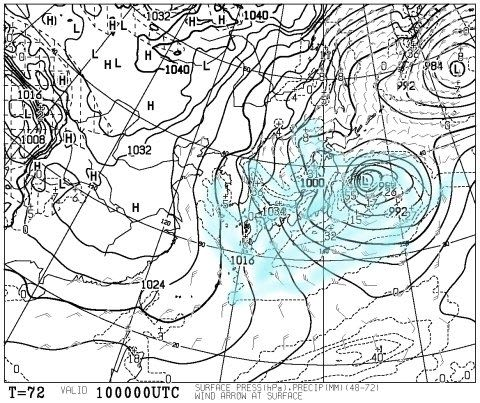

# 9日夜から10日，スキー場はドサドサ降りそう！！…ってか，9日夜は太平洋側も雪か？？

📅 投稿日時: 2017-02-08 03:23:45

えー．

本日火曜の（ってか，もう昨日か…）志賀高原ですが．

…また，降ってます．

降ってるようです…

7日の朝の焼額．

ところによっては，50cmの積雪だったようで…

いやーーー！

今シーズンの志賀高原．

降りますね～…！

で．

これで終わらない．

まだまだ降りますよ～！！

…

な，なんだ，これはっ！！！？？？

10日，金曜の500hpa気温図ですが…

赤の-30℃線が関東まで下がってるどころか．

水色の-39℃線が志賀高原に近づいてますよ！！？

…これは．

普通なら，シーズンに一度あるかないかの寒気なんですけどっ！？？

そして．

10日，金曜の850hpa気温図は…

-12℃線が志賀高原に近づいているので．

この日も志賀高原は，-15度クラスの激冷え．

…ってか，関東上空でも-9℃ですか…

で．

地上天気図を見ると…

ぐほっ！激烈冬型っ！！

…これは．

前日，木曜の夜から金曜終日．

志賀高原は激烈冷え冷えエンドレスパウダー供給デーですね…

そして…

水色で塗った降水域は，

太平洋側まで広がってるし．

関東近辺の上空も．

「平地で雪になる目安，850hpaで-3℃」

を大きく下回ってるということは．

…

これは．

9日夜から10日朝にかけて．

首都圏を含む太平洋側でも雪！？？？

…首都圏で積もって，高速道路が通行止めに

なったりしないことを願うばかり…

とりあえず．

9日夜から志賀高原に降り始めた雪は．

12日の月曜までは降り続けそうですので．

＃月曜は降りが弱まりそうだけど…

今週末は冷え冷え激さむ雪降り続けの

土日になりそう…

太板を持ってる方，今週末も出動ですよ～！！

定番の週末詳細天気予想は，明日しますので，

それまでお待ちを～！

## 💬 コメント一覧

### 💬 コメント by (かず)
**タイトル**: 金土日月滑りますよ
**投稿日**: 2017-02-08 12:40:02

金曜報告しまーす

### 💬 コメント by (Skier_S)
**タイトル**: かずさま
**投稿日**: 2017-02-09 03:28:26

えええええ！

3泊4日ですか！！

…うらやましすぎるっ！！

また報告お願いします～

