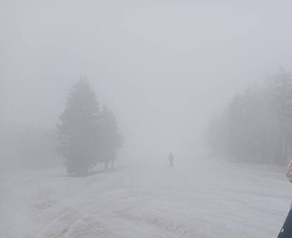
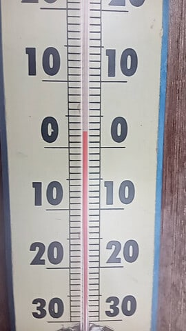
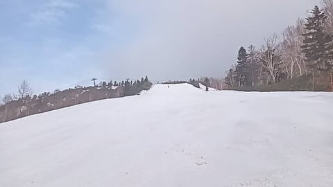
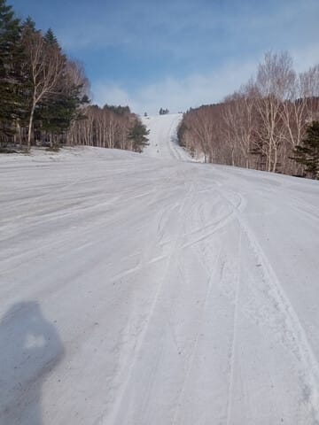
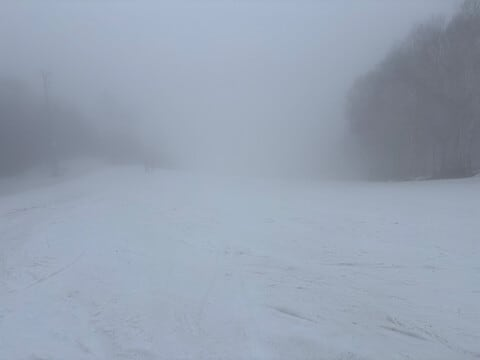
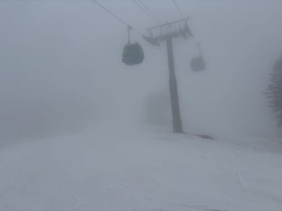
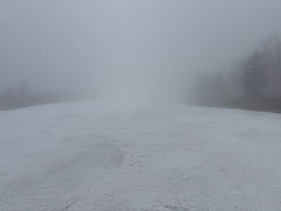

# 5月4日，GW4連休2日目の志賀高原スキー場特派員情報！…曇り→晴れ→ガス，気温が上がって緩斜面は滑りが悪いところも…

📅 投稿日時: 2025-05-05 00:29:13

🏷️ カテゴリ: [日記](cc4b5682fb7b8b144980957a978653fb0.md)

ということで．

GW後半，4連休2日目の今日も泣きながら

家で過ごしていましたが．

今日の特派員からの志賀高原の写真によると，

早朝営業スタートの6時時点では，山頂は

ガスっていたようで…

気温は朝からプラスで，昨晩深夜の雨の

影響で，雪は早朝から緩み気味（泣）

ただ，GSコースの雪が薄かったところは，

かなりしっかり補修されたようで，昨日は

雪が薄くて竿が立っていた部分は完全に

埋められて，雪の薄い部分は無くなって

いたようです…！

さすが焼額のコース整備は素晴らしい！

そして，早朝営業開始から1時間も

経たないうちにすっかり晴れてきて．

朝から雪は締まっておらず，さらに

気温が高くて日差しも強いとなると…

もう，通常営業開始の8時ごろには，

緩斜面は滑りが悪くなっていったよう

です（泣）

ってなことで．昼前にはかなり雪の

滑りが悪くなっていたようですが．

なんと．午後は晴れの予想だったのが，

なぜか午後からガスが出始め…

日差しも弱まったので，午後の方が

雪の滑りが良くなってきていたよう

ですが…

15時半ごろには霧雨っぽい雨になって

いき，ゲレンデの雪はさらにザブザブに

なっていったようです…

ということで．

今日はちょっと残念な感じのあった

志賀高原ですが．

たぶん明日，5日（月）は朝は冷えて

バーンはいい感じに締まってくれて．

そして晴れの一日になりそうです…！

朝のうちはかなり良さそうな感じ．

そして，6日（火）は…

うーん．今のところ，朝のうちは雨に

ならずにもってくれそうだけど…

朝から気温が高く，そして運が悪ければ

午前中に，運が良ければ午後には雨が

降り始めます（泣）

ただ，雨はそこまで強く降らなさそう

なので…

びしょ濡れになるような雨にはならないかな．

ということで．

私は明日から志賀高原へ復活です～！

…あと2時間後に出発？？

…1時間半しか寝られない．

大丈夫かな…
