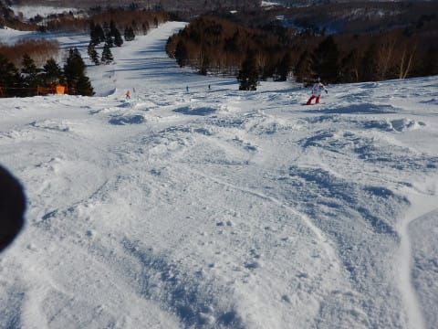

# 2019/3/2(土)の志賀高原スキー場は…朝から晴天ピカピカ！朝は雪も最高！予想よりゲレンデコンディション良くて楽しめたよ！

📅 投稿日時: 2019-03-02 23:42:06

🏷️ カテゴリ: [2019スキー滑走日記](c3e4496fc0fb7f9c17ff21214a35b1ace.md)

ということで．

今日も一日，志賀高原を滑っていましたが．

いやーーー．

天気は一日晴れだったし．

雪も予想より良かったし．

予想より1024倍くらい良かったよ！！

まず．

朝，志賀高原に登ってくる道路に，

うっすらながらも，積雪がありますよ！？？

積雪2-3cmってところか…

でも，これだけでも積雪があれば．

木曜の液体か固体か微妙なものが

降った後に凍った，硬いバーンが

隠れてくれるので…

これは，予想よりいいコンディションかも？？？

ってことで．

いつも通りの焼額第1ゴンドラの

営業前に並ぶわけですが…

いや，もう．

今日は，営業開始前から晴天っ！！

…確か．誰かは朝は曇り，小雪も

ぱらつく…と言っていた気がするが…

予想，外れたということだな

だのに．

山頂温度計の気温は，-8℃と，

冷え冷えっ！！←天気を外しているので，気温を当てたことをあえて主張していないんだな…

晴天で，冷えていて．

昨晩からわずかとはいえ積雪が

あるとは…

…これは，期待できるぞ～！

と，晴天ぴかぴかのゲレンデに飛び込むと…

…そこは．

なんと．

人類が想像しうる，史上最高の快楽を

はるかに超越した，この世のものと

思えない愉悦を与えてくれる，

極楽悦楽バーンっ！！！

木曜の液体か固体か微妙なものが降った

影響で，カリカリで殺人コロコロが

全面を覆う，さみしいバーンを予想

していたけど…

これはうれしい予想外っ！！

うひょひょひょひょ！！！

最高シマシマ！

もう，1本滑るごとに昇天！！

魂が浄化されて，天に召されるような

天国のバーン！！

営業開始から1時間ほどたって，

シマシマが崩れても．

朝の気温は低めなので，

締まったバーンをキープして…

いや，気持ちいい！

オリンピックコースも，

フラットで締まったバーンだし…

天気も良くて，もう最高！！

…だけど．

10時ごろになると．

GSコースはちょいと人が

増えてきましたね…

ゴンドラはそれほど混まず，

せいぜいゲートから外に

出るかどうかという程度

でしたが…

でも，ちょっとコース上の人が

増えてきて．

さらに，日が当たるコースの雪が，

ちょっと緩み始めてきたので…

…今日も焼額の呪いを振り切って．

やってきました，奥志賀高原！！

…焼額では，もう雪が緩み始めている

11時近いというのに．

ダウンヒルコースは人が少なく，

まだところどころシマシマが

残ってますよ…！！！

そして．

エキスパートコースも，

全く緩みの気配も見られない，

冷え冷えバーン！

締まってますが，結構がっつりエッジが

効く，超絶ハイスピードフラットバーン！

昼になっても，気持ちいいガラガラ

ハイスピード大回りバーンが続くん

ですが…っ！！

そのまま，午後になっても．

超絶快感な大回り可能フラットバーンを

キープして．

リフトもガラガラで…

天気も午後になってもずっと

晴天で…

いや…

最高…

最高なんですが…！！

ただ．

さすがに午後3時ごろには．

コースが磨かれて，ツルツルに

なってきましたね…

ツルツルと，雪が削られた粉が

入り混じる，ちょっと難しめの

コンディションになってきましたけど．

でも，奥志賀は，昼間も全く

バーンは緩まなかったので．

わがホームゲレンデの焼額に帰りたい

んだけれど．

奥志賀のゲレンデさんが

「帰らないで～💛」

と必死に訴えかけてくるので．

焼額に戻ったのは，午後3時半ごろ

になっちゃいました…

焼額は，山頂付近は締まったいい感じ

だったけど．

でも，コース途中はちょっと

雪が緩んだのか…

日が当たる東斜面側は，

かなり凸凹になっちゃってますね（涙）

雪も，いったん昼間にゆるんだ雪が

固まった，ザラメ状になっていて．

うーむ．

北斜面の奥志賀は，今日は雪が緩まなかったけど．

東～南斜面の焼額．

全部が緩んだわけではないけど．

日が当たるところは，結構緩ん

じゃったんだなぁ…

でも．

日が当たらないところや，

標高が高いところは全然フラットだったので．

なんだかんだ言って，

今日は予想よりずっと楽しめましたよ～！！

…ってな感じで．

今日もいつも通り，日が暮れる

営業終了時間まで．

たっぷり滑り倒したのでした…

いやーーー．

絶対今日はアイスバーンのツルツル＆

コロコロで，楽しくない一日だと

思っていたのに．

予想よりずっといい雪質で．

楽しめる一日でしたよ～！！←それはつまり，水曜にやった予想を外したということだよな

…だもんで．

今日はナイターも楽しいに違いない！！！

…と．

繰り出したのは，サンバレーナイター！

なんと．

サンバレーナイター．

今日が今シーズンのラストです…

あぁ…

もう，「シーズンラスト」とかいう

声が聞こえる時期になって来たのか…（涙）

で．

サンバレーナイターは．

前回は圧雪車のトラブルにより．

圧雪がかかってないという，

かなりさみしい状態だったけど…

今日はピカピカシマシマっっ！！

この，シマシマバーンをいただくのだっ！！！

と，勢い込んでバーンにとびだしたけど…

ふげげげ？？

シマシマが崩れていく！！

崩れたシマシマが，コロコロになっていく！！！

ってことで．

バーン全体，あっという間に

硬い殺人コロコロが覆う，

殺人バーンと化してしまいました（涙）

…サンバレーナイターラストデーは

ちょっと残念な雪質だったものの．

これでもう来シーズンまで

サンバレーナイターは滑れないんだ！

…と

コロコロにやられながら．

営業終了までの2時間，

ひたすら滑りつづけたのでした…

ってことで．

明日も午前中は晴れそうなので．

朝イチは楽しめそうな感じですね～．

ただ．午後には曇りそうで．

…そのあと．

月曜はヤバそうなものが降ってきそうなので．

明日，朝イチを思いっきり楽しみましょう！

## 💬 コメント一覧

### 💬 コメント by (komu)
**タイトル**: Unknown
**投稿日**: 2019-03-03 07:05:03

サンバレーナイター、ラスト一本残念でしたねー。

しかしあの殺人バーンをえげつない小回りで激しく滑る姿を見るとやはりサイボーグだと確信した次第。

### 💬 コメント by (若杉勲71)
**タイトル**: Unknown
**投稿日**: 2019-03-03 08:22:59

下界情報

岐阜へ帰った途端、ハクション大魔王に。そう、下界は花粉が飛び交う恐ろしい世界。早く湯田中の楽園に戻りたい。

それから、某S本さんの予報が外れてくれると、皆さんにかくも素敵なバーンが提供されるんですね。こうなったらもっともっと外してください。

今後は奥志賀エキスパート（北東斜面）第三（北斜面）が緩みにくいですよね。ところでごく様は自制できたのでしょうか。私は「できなかった」に一万両！

### 💬 コメント by (Skier_S)
**タイトル**: 次の週末はヤバそう
**投稿日**: 2019-03-04 02:03:10

＞komuさま

土曜ナイターはお世話になりました～！

最後の一本，ちょっと悔しかったです…（涙）．

かなり雪が手ごわかったので，全然倒しこめなかったのですが，

えげつない小回りに見えてたのですね(笑)

＞若杉さま

今週末の志賀は，予想より良かったですよ～！

ってか．

予想を見事に外したようです（涙）．

で．

GokuさんのBlogをご覧いただいたかと思いますが（もうすでにコメントされてるようですから…）

Gokuさんは自制できませんでした(笑)．

