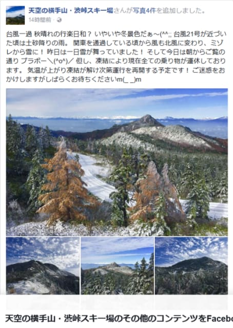
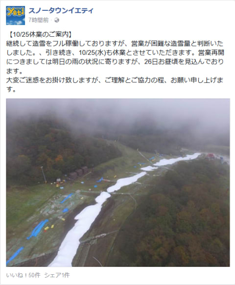
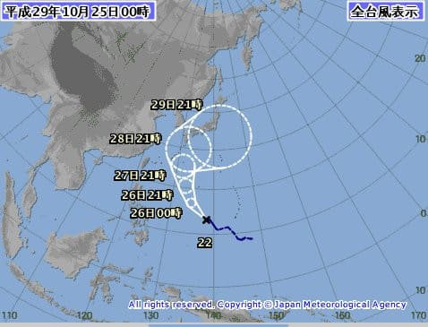
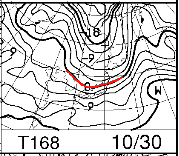

# 火曜日の朝，志賀高原ではかなり雪が積もったようだけど…イエティは水曜も休業のようです（涙）

📅 投稿日時: 2017-10-25 01:31:32

🏷️ カテゴリ: [日記](cc4b5682fb7b8b144980957a978653fb0.md)

えー．

本日，24日の火曜日の朝は．

台風通過後に，北風が強く入る冬型の気圧配置に

なったので．

…なんと．

標高の高いところでは，雪が降ったようですね…！！

いやーー．

この時期，ここまで雪が積もるのは珍しい…！！

（[横手山FB](https://www.facebook.com/yokoteyama2305/posts/1202814803151760)より）

でも．

この雪景色とは対照的に．

Yetiの造雪は間に合わなかったようで…

明日25日も休みが確定みたいです（涙）

（[Yeti FB](https://www.facebook.com/YetiSnowtown/posts/1473333262756045)より）

明日の雨の状況次第だけど，26日木曜の

午後から，営業「できるかも」という状態のようで．

…だけど．

またなんだか，台風が近づいてきているんですが！？？？

この時期に連続して台風がやってくるって，どういうこと！？？

…今のところ，上陸はせず．

日本の南の海上を通過していきそうなので，

このままなら，Yetiにはそれほど影響を

与えなさそうなんですが…

（[気象庁HP](http://www.jma.go.jp/jp/typh/typh5.html)より引用）

…でも．

この予報円の中の北よりのルートを通った場合．

関東付近直撃かも…？？

その場合は，またひどい雨＆風にやられて，

Yetiの雪は…

…

…

いや．

そんなことは考えちゃダメだっ！

そんなことは起きないはずだっ！！

予想通り，台風が日本の南側を通過してくれれば．

週末は雨が降らずに済むはずなのだ！

…そして．台風通過後の本日と同じパターンで，

台風が過ぎ去った翌日は，また冷え込んで…

30日にはこんな感じで，冬っぽい寒気が下りてきて．

今シーズン初めて，850hpaの0℃線が信州近辺

まで下がるという…冬の初めの感じの

冷え込みになるはずなのだ！！！

ということなので．

とりあえず，これから私は

台風が南にそれるよう，念じ続けます

…ので．

土日に晴れた場合は．

それは私のおかげです．←台風で豪雨＆強風になったら半殺しだな…

…でも．

この時期．

無駄に冷えてもどうせ根雪にならないので．

まだ今は冷えなくていいから．

11月中旬以降，しっかり冷えて．

スキー場にたっぷり雪がついてほしい…（祈）．

とりあえず．

明日，今週末の詳細天気予想やります～！

＃この時期に，週末のスキー場の天気を知りたがるのは，

＃ごくごくレアな一部の人に限られる気がしますが…
