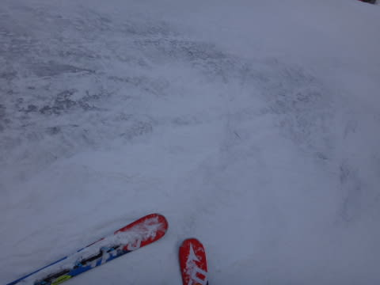
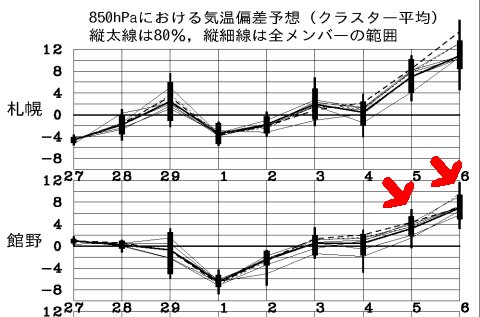

# 2月28日，日曜の志賀高原は…晴天！南斜面の雪は緩んだけど，北斜面はアイスバーン（涙）．

📅 投稿日時: 2016-02-29 01:22:40

🏷️ カテゴリ: [2016スキー滑走日記](c70c67ed5248e9432b899dcd5747048bb.md)

えー．

ということで．

関越道上りが結構渋滞していた本日．

…いつもよりさらに帰宅が遅かったので（涙）．

日曜夜恒例の，速報モードです…

本日は…

ピカピカ晴天で始まりました！！！

…てか．

もう晴れなくていい．

晴れないくていいから，そろそろ積雪が…（涙）．

で．

…雪は降ってほしいものの．

朝イチは気温も低く，

晴天ピカピカのシマシマバーン！

やっぱり，スキーは太陽のもと滑ると

気持ちいいね！

…と思っていたら．

さすが2月の週末，ゲレンデは，結構人が多いなぁ…

でも，ゴンドラ待ちはほとんどなかったから，

まぁ，いいかな．

で．

気温は終日マイナスをキープしたものの．

強烈な日差しだったので…

南斜面の日が当たる部分は…

あれ？

え？あれ？

…2月というのに．

今日も，雪はこんな重い雪になっちゃうんですか？

今週も，2月と思えない雪質に…（涙）．

でも．

日があたる南斜面以外は，雪が緩まなかったですね～．

…だけど．

雪が緩まないという，

それが，何を意味するかというと…

あぅ．

下地のアイスバーンが…

…普通の．

普通の2月の週末であれば．

毎週，冷え冷えフワフワ雪で滑れるところ．

…なぜ，今シーズンは，ブッシュやらアイスバーンやら

5月並みの雪ばかりに…（激涙）．

そして．

今日の日差しのおかげで．

あぁ．

焼額も，そろそろやばそうなところが…

ダメだ．

今シーズン，ダメすぎる…

とりあえず．

また明日詳細レポートしますが．

…このあと，

月曜の夜から火曜の朝にかけて，ちょっと雪が

積もりそうなんですが．

その後．

そう．そのあと．

次の週末の，3月5，6日…

え？？

ええええ！！？？

ま，また週末を狙ったようにっ！！！なぜ！！！

…あえて．

あえて細かく説明しませんが．

日曜は，雨…いやいやいや．

恐ろしくて，口に出せない．

そんなこと，言えない…

…でも，なぜまた狙ったように，週末に…（激烈な涙）．

これは…いったい何の呪いだっ！？？？

＃…まだダメなのか．

＃まだ，踊り続けなきゃならんのか…（泣）．

## 💬 コメント一覧

### 💬 コメント by (はなげ親分)
**タイトル**: まっ、またですか～!?
**投稿日**: 2016-02-29 15:54:01

無理です!!

もう無理です。これ以上激しく情熱的に踊るのは!!

スキーの神様は、私達に何を求めているのでしょうか？

愛の伝道師のS様!!

我等をお導きください(祈)

### 💬 コメント by (Skier_S)
**タイトル**: はなげ親分さま
**投稿日**: 2016-03-01 00:32:35

スキーの神様は…

もう，踊りでは飽き足らず．

何かの生贄をお求めになっているのかもしれません…

そうです！

スキーに狂った誰かを，生贄に捧げなくては

なりません！

…ということで．

来週，スキーに狂った誰かが一人，犠牲になって．

…キッズパークでそり遊びをしないといけないに

違いありません…←違う．違うから

