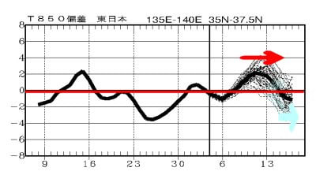

# 横手山スキー場オープンは11月9日を目指すみたい…私は明日はイエティに滑りに行くよ！

📅 投稿日時: 2022-11-06 00:54:46

ってなことで．

本日は朝からひたすら仕事をしていたけど．

こんな時間だけど，まだ終わってない…

でも．

明日はスキーに行くのだ！

今週木曜の祭日も滑ってないので，

さすがに滑らないと死ぬのだ！

ってなことで．

イエティと軽井沢，ウイングヒルズ白鳥と

オープンしている現在．

次にオープンを狙っている横手山．

さすがに11月3日のオープンは無理でしたが…

2日前の記事で，

　11月4日の夜と，5日の夜は，横手山なら

　人工降雪機が動かせるレベルなんじゃ

　ないかな～

と予想した通り，4日夜から冷え込んで，

人工降雪機がガンガン動いているようです！

そして，多分今晩，5日夜も人工降雪行けそう．

ただ…6日夜は，動かせるか動かせないか

きわどいところ．

（[横手山ホームページ](https://yokoteyama2307.com/news/18651/)より）

で…

上の横手山の記事の赤線部分を見ると…

え？？オープン目標が11月9日！？？

うーん．

天気図からの私の予想では，

7，8，9日は人工降雪が無理な気温

だし…

ホントに9日にオープンできるのかな？？

そして，10日は一瞬冷えるかもしれないけど…

そのあとは，2日前の記事に書いたように

高温になるはずだし…

仮に9日にオープンできたとしても，そのあとの

ゲレンデ維持はきわどい感じ…

と，最新の[2週間時系列予想](https://www.data.jma.go.jp/gmd/cpd/data/longfcst/fax/fcvx24_12.png)を見てみると．

ををを！！？？

赤矢印で示した8日から14日ごろまでは，

[前の記事に書いた通り](e85570d830c5138dc8dd6307b4cbd88b7.md)気温が上がりそう

だけど．

そのあと，14日以降は水色矢印で示した

ように平年以下に気温が下がりそうな

予想になってきてます…！！！

さらに詳しく，[FCVX22](https://www.data.jma.go.jp/gmd/cpd/data/longfcst/fax/fcvx22_12.png)を見てみると…

をを！！

850hpa気温の11/15～19までの5日間平均．

平年より温度が低いこととを示す網掛けに

日本全域がすっぽり入っていて，

そして，赤い0℃線が志賀高原近辺まで

下がってます！！

これは…この5日間，結構冷えそう！！

同じ期間の500hpa高度図を見ると，

北太平洋のアリューシャン付近（赤マーク）

が平年より高度が高く，それに伴って

日本付近の高度が低くなる（青マーク）の

傾向が見えて．

アリューシャン付近のブロッキング高気圧

による日本付近の寒気の南下が見えてます！！

ブロッキング高気圧が出ると，しばらく

日本付近に寒気が溜まるので…

これ，11月15日以降，結構冷えるのでは！？？

熊の湯の19日のオープンに間に合うように

冷えてくれるといいなぁ…

とりあえず．

今のところ，11月中旬以降は冷え込みに

期待できそう！！

ってなことで．

…今日は4時間ちょい寝られるかな…

これから5時間後にイエティに出発です～！
