# 2023/5/2(火)の志賀高原横手山・熊の湯スキー場は…朝は冷え冷えガチガチ，昼間は日差しがあるけど気温は低めでそんなに混まなかったよ

📅 投稿日時: 2023-05-03 02:24:31

🏷️ カテゴリ: [2023スキー滑走日記](cd943df30cfcc3d0896469e2ff98720cd.md)

いやー．

今日は良かった…

GWとしては，かなり恵まれたコンデションの

一日でした～！！

けど．

早朝6時から滑るために早起きだったうえ．

さらに久しぶりに志賀高原で集まったメンバーで

深夜まで飲んでしまい…

活動時間が20時間を超えてしまったけど，

眠い目をこすりながら更新！！

まず．

本日の朝イチですが…

積雪ゼロかと思いきや．

うっすら積雪してますよ…！！

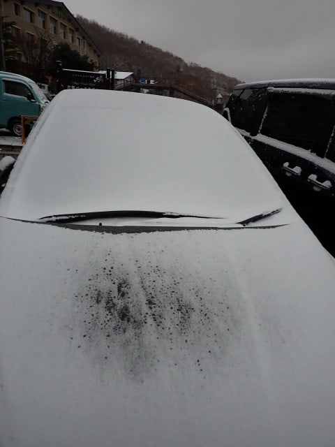

早朝5時半の段階では気温は0度前後で，

道路はギリギリ凍結しておらず，

夏タイヤでも走れるレベルでした…

昼間は全く問題なくノーマルタイヤで

行けましたよ！

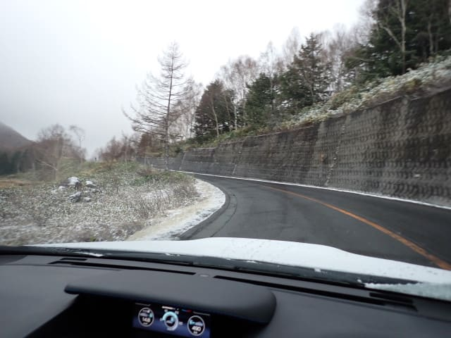

ってなことで，今日は熊の湯の早朝，

朝6時スタートに参戦しますが…

駐車場は予想よりガラガラ！

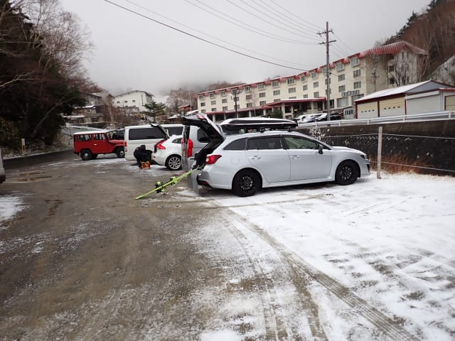

そして…

早朝の熊の湯は，気温は氷点下で冷え冷え！！

激寒のカリカリバーンです！！

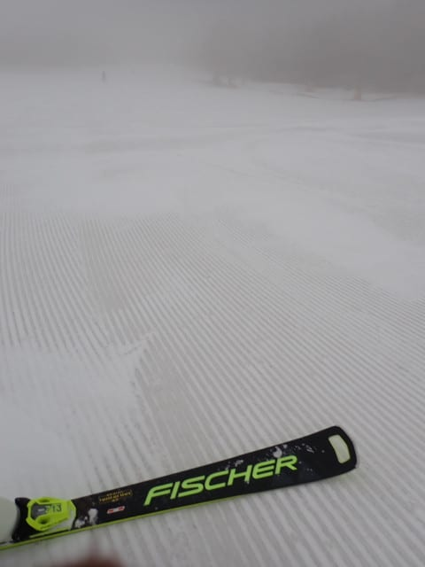

カリカリバーンにところどころうっすら

新雪が被っているけど，バーンはほぼ完全に

ガチガチに凍ったバーンで，板がめっちゃ

走ります！！

私のような硬いバーン好きにはたまらん！！

硬いバーンが嫌いな人は辛いだろうけど…

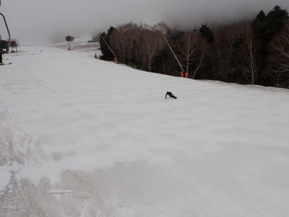

こんないいコンディションにもかかわらず，

今日の熊の湯の早朝はガラガラで，リフト待ち

完全にゼロ…

というか，20人くらいしか滑ってなかったのでは？

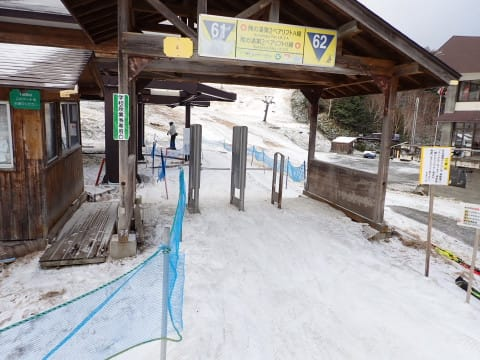

ゲレンデの気温は劇冷えで，トップシーズンの

恰好をしていないと寒い感じで…

9時ごろになっても全くゲレンデは緩まない

感じ！！

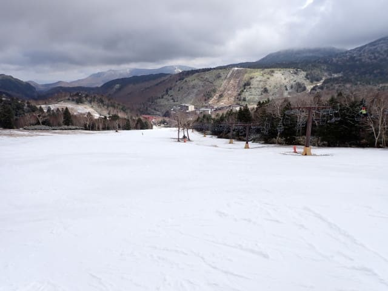

いや…この時期としては恵まれたコンディション！！

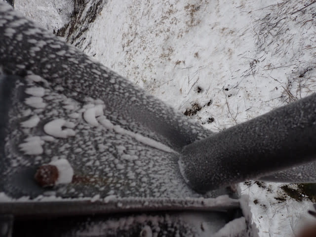

ただ…

熊の湯も滑れるのはペアリフトの下半分だけ．

3時間も滑ると飽きてきたので…

朝9時ごろ，横手山へ移動！！

劇冷えなので，雪の量は昨日と全く変わらず，

第1ペアリフトの下からリフトに乗って，

横手にアプローチできます…

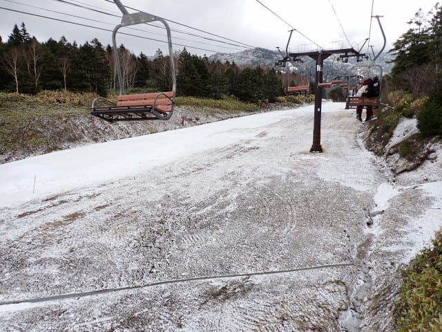

横手山も，リフトはガラガラ！！

ベストコンディションにもかかわらず，

リフトは終日ほぼ待ち無しでのれました…！

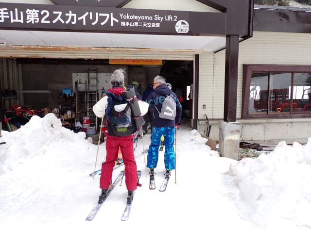

でも，今日は第1・第2リフトは動いたけど，

強風のため第3リフトは終日運休（涙）

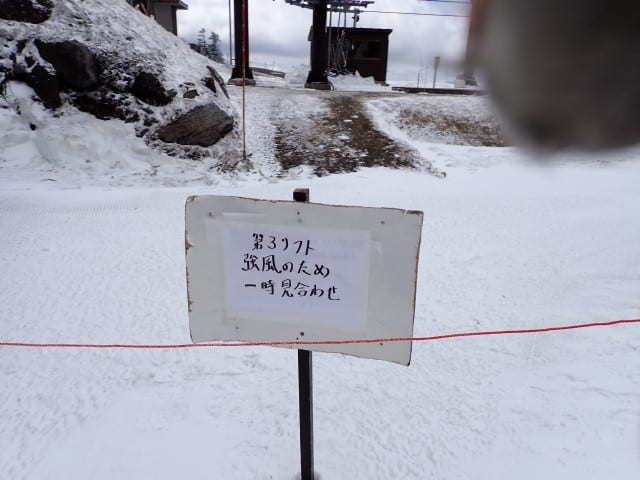

とはいえ，メインバーンの第2が滑れたので

問題なし！！

朝9時過ぎの第2ゲレンデは，雪も硬いのに

うっすら新雪が乗っているせいでカリカリじゃなく，

エッジも噛むのに板もよく走って，GWとしては

最高レベルの恵まれたバーン！！

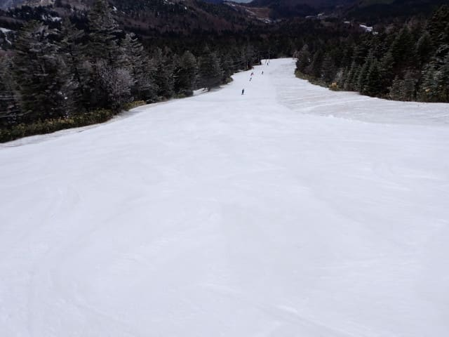

いいんですか？？

GWにこの快適バーンを，待ち無しで

思いっきりぐるぐるできていいんですか…！？？

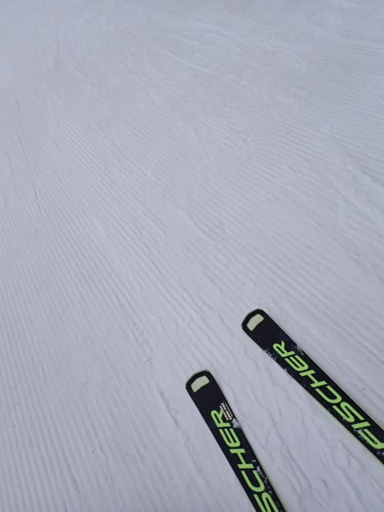

メインバーンまでの連絡路は，昼近くまで

かなりカリカリつるつるだったけど…

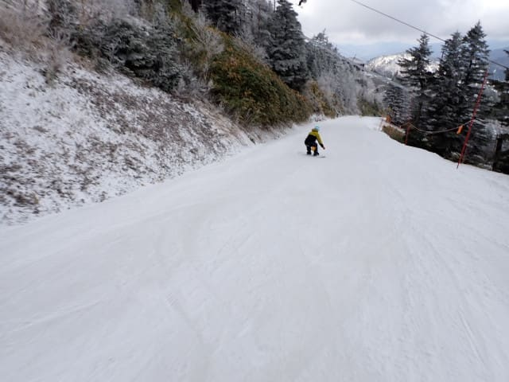

そのかわり，連絡路以外のバーンは，

9時ごろには晴れてきたにもかかわらず．

昼過ぎまで硬めでフラットな，すごい気持ちいい

バーンコンディションをキープしてくれました…！

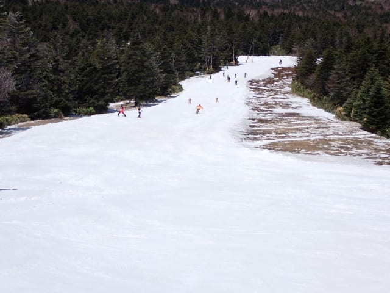

さすがに晴天になっただけあって，昼を過ぎてくると

日差しでバーンが緩み始めてきたけど…

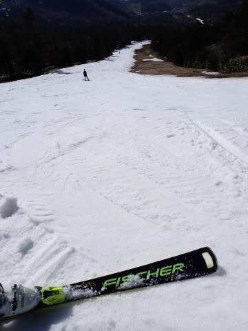

それでもこの時期としては冷え冷えの

気温が続き，昼間もウェアのジャケットをしっかり

着てないと寒いくらいだったので

バーンはそこまでひどいザブザブにならず，

また，硫安をまきまくっていたので，

雪は結構よく滑りました！！

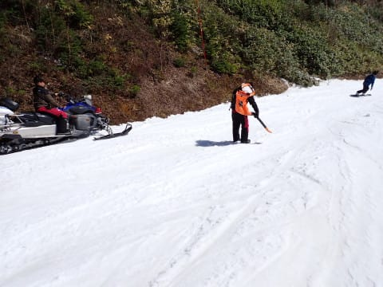

そして，リフト待ちはほぼなくて，

終日がらがら！！

いいんですか…？？

GWに，午後になってもこんなにいいコンディションで

ガラガラバーンで滑れて，いいんですか…？？

という感じで．

夕方になるとさすがにバーンは荒れ始めてきた

ものの…

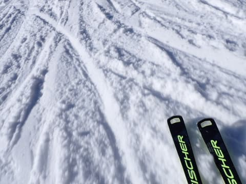

リフト営業終了の午後4時まで結構冷え気味

だったので，昨日のようにバーンに穴が開いたり

することなく．

荒れ気味とはいえ，かなり気持ちよく滑れたの

でした…！！

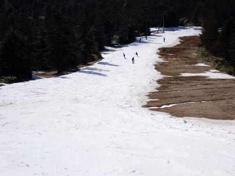

いやーー．

よかった．

今日は9時ごろから晴天だったにも

かかわらず，終日気温は冷え冷えで

ガラガラという，GWにしてはいい感じの

一日でした…

でも，明日からは気温が上がりそうだし，

5連休が始まるのでかなり混むんだろうなぁ…

明日からはザブザブバーン覚悟（涙）

ってなことで，眠いのでお休みなさい…

休日というのに，今日もこれから4時間くらいしか

眠れない…←飲んでないで早く寝ようよ
