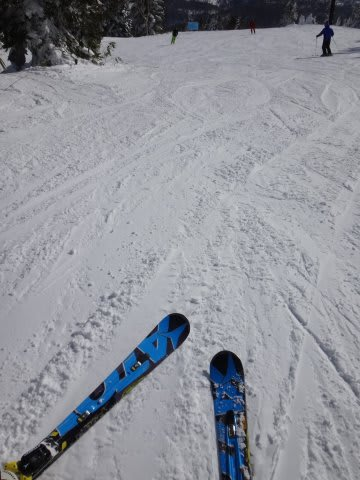
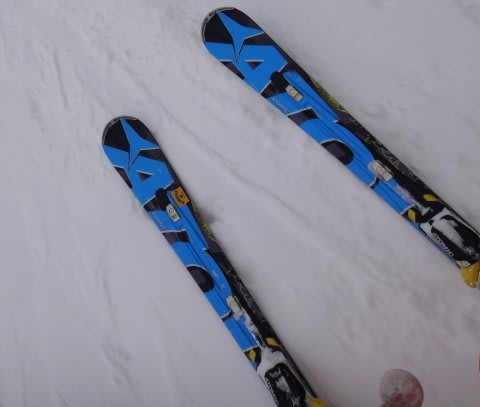
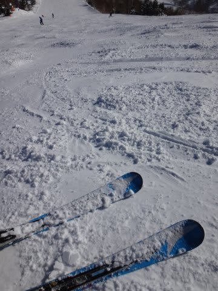

# この正月休み，ついに'14 ATOMIC Bluester DEMO SXデビュー！…させてみた

📅 投稿日時: 2014-01-08 02:32:21

🏷️ カテゴリ: [スキー雑談](c1f9d2cb7478308da16419928ea3945e9.md)

ということで．

この正月休み．

[予想外に購入](e9a16d9757c2d52b7254fe8a802071c63.md)してしまった， ←ほとんどの人が想定の範囲内だったと言う説もあるが

今シーズンモデルのBluester DEMO SXを，ついにデビューさせました～

まだ，昨シーズンモデルのBluester DEMO SXがヘタっている感じは無かったので，

急いでデビューさせなくても良いか…

と，雪が良くなるまで待っていて．

トップシーズンに入ってきたので，ぼちぼちデビューさせようか．

と．

新しい板を履いてみたわけですが．

1ターン．

「うむ？」

2ターン．

「うむむむっ？」

3ターン…

「…さ，昨シーズンモデルと，ぜんぜん違う乗り味なんですが…っ！！？」

bluester DEMO SXって、こんなに強い板だったっけ？

昨シーズンモデルに戻してみると．

今シーズンモデルに比べ，

マイルドなフレックス．

穏やかなエッジグリップ．

おとなし目の旋回力．

ゆっくり目の板の返り．

…

…うーーーむ．

[昨シーズン3月ごろに，今シーズンモデルを試乗したとき](e726cab54be3de58a921195324593fe55.md)は．

昨シーズンモデルと今シーズンモデルとの差は，ほとんど感じなかったはず…っ！

＃ATOMICの人も，デザインチェンジだけだと言ってたし

…これは．

これは．

[これまでと同じよう](e7fa96c3f88bd94ba6390c710d6538679.md)に．

私の昨シーズンモデルのSXが，もうヘタ…

いやいやいやいや．

そんなわけがない．

そんなこと，ありえない．

そんな恐ろしいことを考えてはいけないっ！

…

…そうだっ！

きっと．

きっと．

どうやら，私が買った今年のBluester DEMO SX．

ほかの板と違って，

フレックスが特別に強い，スペシャルバージョンを

買ってしまったようですっ！！！

Bluester DEMO SXX(エスダブルエックス）

とか書いてあるんじゃないかな～っ！！

＃んなわきゃない
