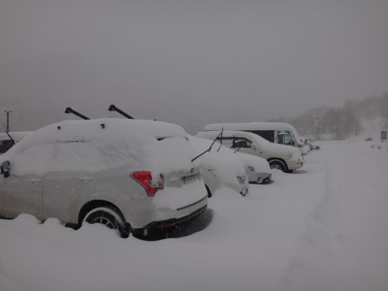

# いつまで続くの？1月2日の志賀高原は…プチパウダーの雪のち晴れ！

📅 投稿日時: 2014-01-02 21:29:57

🏷️ カテゴリ: [2014スキー滑走日記](c992167609b6415052179ee69ea1ea7d8.md)

えー．

まだまだ志賀高原滞在中のSkier_Sです．

天気予想では，1日夜から2日にかけて雪が降りそうだけど，

そんなに積もらないかな～．

って感じの予想でしたが…

明け方から，ぼちぼち積もってくれて．

20cm強くらい積もりましたでしょうか…

山頂の気温はマイナス10度で，今日も冷え冷えっ！

その中で雪が降ったり止んだりで…

圧雪コースは圧雪の上に新雪が5cmほど．

せっかく新雪が積もったんだから，当然オリンピックコースへ！

ここは…

こんな感じで．

ブーツぱふ程度の新雪．

うーむ．

もう少しほしいところだけど…

でも．

ふむ．

うほーっ！

底付きがする，ブーツぱふだったけど．

…結構楽しめたかな．

しかし．

午前中は雪で視界が悪く…

いつもどおり，10時近くには人もいっぱい出てきたけど…

幸いなことに，焼額第1ゴンドラは，今日もそんなに混まず．

一番待った10時から11時でも，最大3分かな～．

それ以外の時間はこんな感じで，待ち0で．

今日も待ち時間が短くてよかったですね～．

んで．

今日は．

予想通り．

午後からは天気が回復っ！

日が射してきました～

でも．

新雪が蹴散らされたオリンピックコースは全面コブ．

それ以外のコースもちょいと全面バンピーになってて．

楽しめました～←そっちかっ！普通の人は楽しめないレベルのような気がする…

って感じで．

午後は全面コブコブの，体力消耗バーンでしたが．

日が射して，

「あー．やっぱりスキーは太陽の下やるのがいいなぁ…」

と思った一日だったのでした．

…そして．

私の志賀高原滞在は，まだ続く…

＃いつまで続くのか？？
