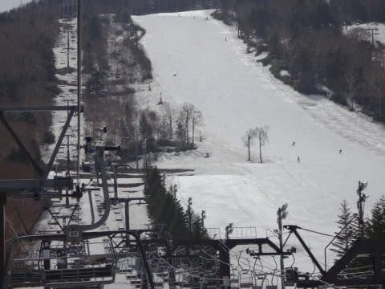

# 気象庁，ラニーニャ発生を速報！…ラニーニャの年の志賀高原スキー場は雪が多かったのか，過去の写真を比較してみた

📅 投稿日時: 2020-09-11 02:19:50

ということで．

[数日前の記事に](ee9b4073208faa38b84de91620b22a9cd.md)て，気象庁が3か月予報にて

　ラニーニャが発生する可能性が60%

と予想していることを書きましたが．

気象庁は本日，

「ラニーニャが発生したとみられる」

という速報を出しました…！！

（[気象庁ホームページ，エルニーニョ監視速報ページ](http://www.data.jma.go.jp/gmd/cpd/elnino/kanshi_joho/kanshi_joho1.html)より）

冬の冷え込みが厳しくなると言われる

ラニーニャ現象が，きましたね…！！

しかし．

前の記事で書いたように，

ラニーニャが起きた年は10，11，12月は冷えて，

日本海側の降水量も増えるけど．

1，2，3月は

気温が多少冷えるものの，

統計的には日本海側の降水が減ってしまう

可能性が高いという．

スキー場にとっていいのかどうか，

微妙な状況です…

だもんで．

過去の志賀高原の写真をひっくり返し．

果たして，過去のエルニーニョ・ラニーニャの

年に，それぞれ雪が多かったか少なかったか

ちょっと調べてみましょう！！

（[気象庁，エルニーニョ現象及びラニーニャ現象の発生期間（季節単位）のページ](http://www.data.jma.go.jp/gmd/cpd/data/elnino/learning/faq/elnino_table.html)より）

…この図の赤がエルニーニョの期間，

水色がラニーニャの期間です…

とりあえず．

2006年からのGW，5月の営業最終日の

志賀高原の写真を見返してみましょうか…

2006年

…この年は，雪が多いですね！

GW最終日でも，ダイヤモンドスキー場が全面真っ白，

そして，奥志賀もコース全面

雪が残ってます…！

2007年

…この年は…ちょい少なめでしょうか．

一の瀬正面バーン，かなり穴が開いて，

まともに滑れなさそうな状況です…

焼額のパノラマコースも，雪寄せされて，

コース幅が狭くなってますね…

そういえば．

このころはまだ，GWに一の瀬がナイター営業を

やってましたね…

いい時代だった…

2008年

…この年は，雪が多いですね！

一の瀬ファミリーも真っ白だし．

なんてったって，一の瀬ダイヤに全く土が

出てないってのは…かなり雪が多めですね．

2009年

…この年は，うーん．一の瀬正面バーンは

大きな穴が開いてないけど…

でも，ダイヤモンドは終わった感じだし．

一の瀬下側も人工雪が無いバーンは

雪が剥げてますね…

この年は，ちょいと少な目の年ですか．

2010年

…この年は，一の瀬正面バーンは全面

雪がついてますし．

ダイヤモンドも全面とは言わないまでも，

まだ十分滑れそうだし．

焼額のパノラマコースも，

問題なくコース幅いっぱい滑れてて…

うん．この年も，雪は多めの年でした…

2011年

この年は…むちゃくちゃ雪が多かったです！

一の瀬正面バーンも，まだいっぱい雪がありますし…

ダイヤモンドスキー場も全面滑れそうです！

雪の厚みも十分．

これで営業終了するの？って感じです．

積雪量には恵まれた年でした…

2012年

この年は…前の年と違って，

ちょっと雪が少なめですね．

正面バーン，ところどころ穴が開いてるし…

ファミリーの下はあみだくじ状態．

ダイヤモンドはほぼ全面土が出てます．

焼額の唐松コースもコース半分ほどの幅だし．

とはいえ，正面バーンに大きな穴が

開くほどでもなかったので．

ちょっと少なめ，って程度でしょうか．

2013年

…この年は，一の瀬正面バーンは穴が

開いてないけど…

ダイヤは雪がかろうじて残っている

レベルで，滑れなさそう…

とはいえ，焼額はコース幅いっぱい

滑れたので．

まぁ，平年並みかな？

2014年

…この年は，正面バーンも穴が開いてないし．

一の瀬下半分にも土は出ておらず，

ダイヤモンドもそこそこ滑れそうな感じ

なので．

うーん．

平年より多めくらいの感じですかね…

2015年

…ダメな感じ…

この年は，GWに入ってから気温が上がり，

結構やられちゃったんですよね…

正面バーンは巨大な穴が開いてますし．

ファミリー下も，ダイヤも結構土が

出てます…

ちょい少なめの年でしたね．

2016年

…もう，この年は思い出したくもない

ひどい年で．

5月の写真が無いので，4月の写真です…

4月でこれ．紐ゲレンデ．

熊の湯を除く全スキー場が4月で息絶えた

年でした…

2017年

…この年は，雪が多いですね！

昨年の反動か，ファミリーゲレンデも全面

真っ白だし．

正面バーンに穴も開いてなければ…

ダイヤモンドもまだまだ行けそう！

これで営業終了とは，勿体ない…

2018年

…この年は，またダメな年でした…

確か，GW後半は一の瀬正面バーンが営業

出来ず．

焼額のGSコースも土だらけで，

GW最終日まで営業できず．

奥志賀も，GW最終日を待たずして

息絶えました…

2019年

…この年は，また雪が戻ってきてくれました～！

一の瀬正面バーン，うっすら土が見え始めてきた

ところもあったけど．

ダイヤもまだまだ滑れたし．

ファミリー下も，穴が1か所開いてるけど．

人工雪を打ってない側も，ちゃんと

雪が残ってました…

ってな感じで．

雪が多かった（冷えた年）に青矢印を，

少なかった（暖かかった年）に赤矢印を

エルニーニョ・ラニーニャの図に加えてみました．

上からの矢印がGW,

下からの矢印が，今回写真は載せなかったけど，

シーズンインの雪の多い・少ないです…

（12月第1週にヤケビゴンドラが滑れれば多い，

12月下旬まで滑れなければ少ない）

矢印の大きさは，雪の多さ・少なさの

程度を示してます．

…

…

…うーん．

なんとなく，ラニーニャの水色部分に，

雪が多い青矢印が多く．

エルニーニョの赤色部分に

雪が少ない赤矢印が多い気がするけど…

でも，

ラニーニャで雪が少なかった・

エルニーニョで雪が多かった

という逆パターンにマークしてみると．

うーむ…

2018年はラニーニャなのに雪が少ないし．

2019年はエルニーニョなのに雪が多いのか…

なんだか，単純にラニーニャだから雪が多い，

ってのは期待できないかな…

ラニーニャは，

2005-6シーズン，2007-8シーズン，2010-2011シーズン，

2017-2018シーズンと4回あるけど．

シーズンインが早かったのは2回，50％

平年並みが2回，50％

遅かったのは0回．

シーズン終わりのGWに雪が多かったのは3回，75％

雪が少なかったのは1回，25％．

…ある程度有意な相関はありそうだけど…

でも，「ラニーニャだから，必ず恵まれた

シーズンインになるよ！」

というわけではなさそうです…

ただ，ラニーニャの年は，

シーズンインが遅かった

という年は無かったので．

（n=4の統計が有意が微妙だけど）

まぁ，今年は早めのシーズンインに

なる可能性が高く．

悪くても平年並みのシーズンインなり．

さらにGWも，75％の確率で雪が多く．

25％の確率で雪が少ない…

ということになりそうです

（サンプル数n=4だけど…）

ということで．

写真を探しまくったり，かなり時間をかけて

調べて書いたこの記事だったのに．

結局のところ，今は確実なことは言えないので．

11月になったら，冷え冷え踊りを踊っておきましょう

と，いつもの皆さんへのお願いで

締めるしかなさそうです…

## 💬 コメント一覧

### 💬 コメント by (Goku)
**タイトル**: シベリア寒気団いらっしゃーい！
**投稿日**: 2020-09-11 20:47:15

コロナ禍でどうなるのか不透明なシーズンなだけに、雪の心配だけは避けたいですね。

今シーズンから、横手山に人工降雪機が導入され、１１月第２週にオープンするとのことなので、しっかり冷え込んでほしいものです。

で、焼額山オープン日にゴンドラが動いてくれたら最高なんだけどな～。

### 💬 コメント by (Skier_S)
**タイトル**: ＞Gokuさま
**投稿日**: 2020-09-12 02:43:53

横手山，カイワゲレンデって南向きのような…

北向きの熊の湯より悪条件なので，11月第2週にオープンできるのか

ちょっと心配ですが，季節が伸びるのはいいことですね！

人工降雪が全く無かった横手山，水を溜めるプールから地下配水管まで

全て作らなくてはいけなくて．

国の補助と同額の自己資金を出さなきゃいけなかった今回のシステム．

1億円近く自腹を切っているのでは？？？

民事再生で土俵際から復活した横手山，頑張ってますね…

とりあえず．

焼額はオープン日からゴンドラが動くよう，踊りましょう！

### 💬 コメント by (ゆーき)
**タイトル**: Unknown
**投稿日**: 2020-09-13 09:40:19

横手は消去法であそこだったんですかね。

本当は6月を見込むなら、渋峠だったんでしょうけど、

道路の通行止めが始まると行けなくなるし、高速リフトの方は距離があるから大変だしと、、、

焼額山も第2高速から降雪を頑張ってほしいです、第4からはやめてほしい、リフトがおそすぎる。

### 💬 コメント by (Skier_S)
**タイトル**: ＞ゆーきさま
**投稿日**: 2020-09-14 01:29:58

渋峠だと，人工雪を付けるには長すぎるコースなのか

もしれません…

渋峠の方が，確かに人工雪を付けるには良さそうですが．

あるいは，水の確保が群馬側だと厳しいのかも…

焼額も，確かにまずは第2高速側に着けてほしいですよね．

でも，あっちはモロ南斜面なので，第4ロマンス側より

条件厳しいんですよね…

### 💬 コメント by (いちと)
**タイトル**: Unknown
**投稿日**: 2020-09-15 20:26:06

こんばんは

年始にgotoで宿予約しました　感染予防もあり、少し奮発しました　さて雪は降るのでしょうか？　また地域クーポンはリフト券使えるのでしょうか？　goto対策も教えて下さい

### 💬 コメント by (Skier_S)
**タイトル**: ＞いちとさま
**投稿日**: 2020-09-17 00:14:23

今年，雪降ってほしいですね…

私はGoToトラベル使ってないので，よくわからないのですが．

今のところ，志賀高原がGoToの地域振興クーポンに対応したという

情報は全く無いですね…

どうなるんでしょうか…

### 💬 コメント by (いちと)
**タイトル**: Unknown
**投稿日**: 2020-09-20 06:51:54

S様リプライありがとうございます

gotoで取るのと取らないでは、雲泥の差になりますよ

高速代含めて半分帰ってきますので、S様のブログ充実のためにも是非ご活用と情報提供して頂ければありがたいです

しかしながら、志賀高原は合宿宿が多いので、goto対象になる宿が少ないかもしれません

### 💬 コメント by (ikkun)
**タイトル**: Unknown
**投稿日**: 2020-09-22 11:27:46

今さら( *´艸｀) ゲレンデにはないと困りますが「住宅街」には欲しくない……そうは参りませんよね(・・;)  昨年はインが遅く雪が少なく「スキーやボード」でゲレンデ整備して～のスタートでした  まうちのゲレンデは雪はなんとかでしたがあやつがってやつでした。

### 💬 コメント by (Skier_S)
**タイトル**: ＞ikkunさま
**投稿日**: 2020-09-23 02:26:56

まぁ，確かに，雪はスキー場にだけピンポイントで降ってほしいですね（笑）．

ただ，ホントに今シーズン，雪があってもスキーどころじゃない…

とかいう，今年の3月下旬以降の状況にならないよう願うばかりです（祈）．

