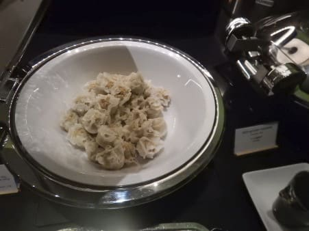

# 2019年8月，4度目のモアルボアル・小6の娘Cカード取得1周年！その1…出発，4度目のかの地へ

📅 投稿日時: 2020-07-21 01:50:18

えー．

月山に行って以降．

またここしばらく，ほとんどの週末を

自宅で過ごしており．

7月に入っても，全くK奈川県を出ていない

という日々を過ごしているのですが…

明らかに普段より運動量が減り．

「コロナ太り」という危険なワードが，

周りから聞こえるようになってきて．

…これは，[スキーダイエット](edd0452732278bcfc87b9419cd5bf3f1e.md)で全く太れない体質（？）

になっている私も，さすがにちょっと

太ったのでは…？

と思い，体重計に乗ってみたところ．

なぜか全く太っていない

という事実にちょっと驚いている今日この頃，

皆様いかがお過ごしでしょうか．（時候の挨拶）

…普段，特にスキーシーズンの私は，

ごはん大盛り男で，かなりの量を

食べるのですが．

スキーをやらなくなってからここしばらく，

いつものアホのような食欲がなくなって．

仕事で時間が取れなかった場合とか，

「ま，いっか」って感じで，食事を抜い

ちゃった…とか多く．

アウトプットが減った分，インプットが

ちょうどよく減っているようです…

…でも，これって．

スキーダイエットが，

「ご無体仕事でプチ絶食♡仕事ダイエット」

に変わっただけなのかも…

ってなことで，今日の本題へ．

この記事の時は明らかに

アクセス数が下がるという，不人気の

ダイビング日記です…

では，どうぞ～！

----

ということで．

例年通りの強引な日程での

出発となった，この夏休みの

モアルボアル遠征，出発の日．

この日は，14:30成田発の飛行機で出発なので．

朝9時半ごろに家を出て，成田に向かい…

交通状況が順調だったので，出発時間の

3時間前，11時半ごろに成田に着いて．

ちょっと早いかな…

と思ったけど，ちょうど搭乗手続きが

始まってました…

今回乗るのは，Philippine air.

LCCのバニラエアが無くなり，

セブ島行きの直行便の一番安い

チケットは，今ではPhilippine airに

なってます…

で．

このPhilippine air．

Star Allianceのメンバーではないのですが，

今はANAとマイレージ提携を始めたので，

ANAのゴールド会員は，ラウンジを

使えるようです…！

Philippine Airは，成田ではAmerican Airlinesの

ラウンジを供用しているようなので，

AAのラウンジの利用券が出ました…！

スターアライアンス会員は，

国内だとANA，アメリカだとUAの

ラウンジなので…普段は絶対入ることが

ないAAのラウンジ．

一体どんなところか，すごい楽しみっ！！

と，入ってみますが…

をを…

中は結構広い！

そして，アメリカ行き飛行機が出る時間から

ずれているので，ガラガラです…

食べ物も種類が多く…

これは，成田のANAのラウンジよりいいのでは…？？

飲み物も，アルコール類の種類が

多くて…

をを！スパークリングワインまで

あるじゃないですか！

…ってことで，

出発前，贅沢にスパークリングワインで乾杯！

さらに，ちょうどお昼ご飯タイムだったので．

ついついいろいろ食べ物を取ってしまい…

飛行機を眺めながら，赤ワイン＆白ワインで

ランチを過ごすゼイタク…

うむ…

初めて使ったAAのラウンジだったけど，

結構いいじゃないですか…

海外旅行時は格安のLCCばかりで，

国際線ラウンジをほとんど使ったことがない

娘は，結構喜んで．

「また，ラウンジが使える飛行機会社がいい！！

　次もラウンジ使える飛行機にして！！」

と言ってましたが…

うむ．

今回はたまたま一番安いPhilippine Airで

ラウンジが使えたからいいけど．

普通の旅行の時に，わざわざラウンジを

使うだけのために高い航空会社のチケットを

買うなら．

その差額でおいしいものを

飲み食いする方が正解だよ…

ってなことで．

搭乗時間ギリギリまで2時間ほど

ゆっくりラウンジでくつろぎ，

搭乗口向かい…

そして，フィリピンへ出発！
