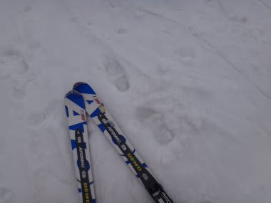
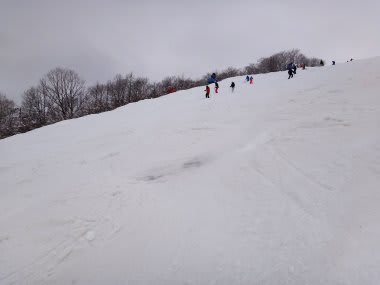
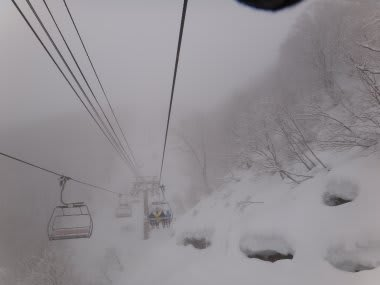
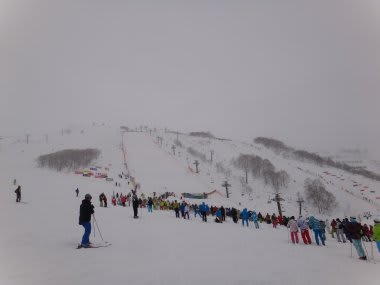
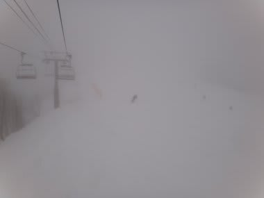
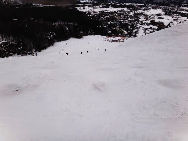
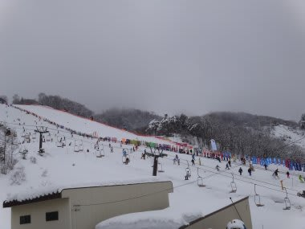
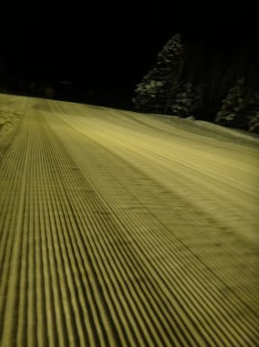
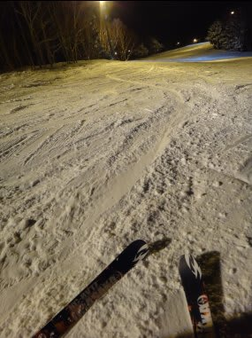

# 3月10日　土曜日は八方尾根

📅 投稿日時: 2012-03-13 00:32:34

うーーむ．

ちょっと体調を崩しぎみだなぁ…

とりあえず，八方尾根のスキー場レポートを．

この日は朝から曇り～雪．

雪っつーか，ふもとでは霙っぽい感じだなぁ．

名木山のゲレンデに出ると…

朝8時というのに．雪，ドボドボの春雪なんですけど．

なんか，名木山，雪も薄くなってわずかに土が出始めてるところも

あるんですけど…

とりあえず，八方といえば，朝イチリーゼンでしょう！

と，リーゼンを登るものの…

なんか．

ふもとはドボドボだけど．

リーゼンわずかに登ったくらいから気温が冷えて．

リーゼン，全面アイスバーンなんですけど（涙)．

で．

技術選の大回り種目が始まったので．

兎平で観戦だ！

と，見ていたら．

今度はガスって見えなくなってきたんですけど(泣）．

競技も中断されてしまったので，リーゼンを滑るものの．

人が多くて凍ってて見えなくて死にそうなんですけど(悲）．

で．

昼ごろになると．

さすがにウスバあたりから下はアイスバーンも緩んで，

柔らかくなってきたけど．

今度はウスバ，ドボドボであっという間にコブコブに

なっちゃったんですけど．

…この写真は名木の壁ですが．

コブコブな上，結構土が出てきてるよ…（涙）．

という感じで．

午後は，リーゼン上半分より上はガス＆アイスバーン．

下半分はどろどろ雪＆コブ．

おかげで，リーゼンクワッドは終日ガラガラだったけど…

た，楽しくない…

まぁ，コースが楽しくないので，技術選観戦で

あんまり滑れなくても，悔しくないからいいかも…

（得意のポジティブシンキング)

という感じで．

夕方3時半に全競技が終了して．

4時まで滑って，ナイター滑りに，志賀へ移動！

（普通の人は真似するところではありません）

志賀のナイターは…

なんか．

ぜんぜん雪質が違うよっ！

パウダーだよっ！

圧雪シマシマだよっ！！！！！

最高だよ…（今度は感動の涙）

八方と志賀って，ここまで雪質が違うとはっ！

もう，ドボドボ雪が固まったアイスバーンを

覚悟してきたのに．

人も少ない，雪質もきゅっきゅ言う雪．

こんな快楽のナイターだとはっ！

いやー．

無理して八方⇒志賀の移動を強行して良かった！

…と思えるナイターでした．

（良い子はまねをしてはいけません）

しかし．

焼額のナイターはこの日で今シーズンの営業も終了．

…シーズンももう終盤ですねぇ…
