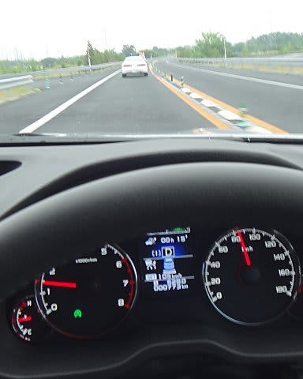

# プロジェクトX第2章…EyeSight，使ってみた

📅 投稿日時: 2013-06-25 02:41:51

🏷️ カテゴリ: [車](cba0e8330b3f2ded7c1addfacc75d4547.md)

…スキーシーズンも終わりが近づき．

＃まだ終わってないけど

このBlogが「徒然ドライバー日記」と化してる今日この頃．

みなさま，いかがお過ごしでしょうか．

…ってことで．

紆余曲折を経て購入したレガシィのインプレッションが続いてるわけですけど．

今回から．

そう，スバル車といえば愛妻と…もとい，アイサイト．

この，アイサイトを使ってみた感じを報告してみます…

えー．

あえて，アイサイトの基本的なところから書いておくと．

アイサイトの効果ってのはいくつかあって．

1．なんと！勝手に前の車についていく前車追尾オートクルーズっ！

(設定速度が105kmなのに，85kmで走ってます)

2．オートクルーズを使っていないときでも，ぶつかりそうになったら

　自動でブレーキが効いたり加速できなくなったりする，

　衝突軽減ブレーキや踏み間違い防止(飛び出し防止)機能付き！

3．オートクルーズを使っていないときでも，いろいろ教えてくれる

　親切な警報機能付き！

って感じですが．

この中で，1番の前車追尾オートクルーズは「ついていく車」って

CMで，比較的有名ですよね～．

EyeSightで，これが一番便利なんですが．

まぁこれは，また次回以降の報告ってことで…

んで．

2番の衝突軽減ブレーキも，「ぶつからない車」として有名ですよね…

しかし残念ながら(?)，この2番目の機能はまだ試したことがありません(笑)．

いや，普通の道路で運転してて，これらが働くような運転してたら，

それはかなりマズいでしょう…(^^;

…いや，予想のとおり，「実際にぶつからないか，テストしてみようかな～？」

という，かなーーり強い衝動に駆られることはありますが．

失敗したときの影響を考えると．

まだ，テストする根性がありません(笑）．

で．

3番目の警報ですが．

これは結構お世話になります．

画面上に表示が出て，ピピッって感じの軽い警報音が出ます．

これまで見た警報としては，

・「はみ出し注意」

　→ウィンカーを出さずにレーンをまたぐと出ます

　

・「障害物注意」

　→前方に壁があるときなど，壁に近づいてくと出ます．

　　これを無視すると自動的にブレーキがかかるはず…

・「前方注意」

　→走っているときに，先行車に近づきすぎると出ます．

　　先行車がバイクでも，ちゃんと警報が出るってのがすごい…．

　　これも，無視すると自動的にブレーキがかかるはず…

・「歩行者注意」

　→直前を人が横切ると出ます．

　　とまっていても，前に人が出てくると出ます．

　　停車時は，かなり近くを人が通らないと出ないようになってる感じ．

　　これが出てると，アクセル踏んでも発進できないんでしょうね～．

　　＃今度試してみようかな

あと，これは見たこと無いけど，

・「ふらつき注意」

　→レーンをはみ出さなくても，ふらつくと出るようです．

…って感じで．いろんな警告が出るんですが．

実は，一番便利で，助かる警報が，次のこいつなのだ．

・「先行車発進」

　→信号待ちなどで前の車に並んで止まっていて，前の車が

　　発進しても自分が発進しなかったときに出ます．

　　だいたい，前の車が3m以上動いて自分が発進しないと

　　注意してくれます…

いやー．この警告が便利なんですよ．

信号待ちとかで，他の作業に気をとられて前の車が発進したのに気づかず，

後ろの車にクラクションを鳴らされるとかありますが．

そういう心配が要らなくなります…

これら警報だけでも，結構便利なアイサイト．

でも．

やっぱり．

一番便利なのは，前車追尾式オートクルーズなのだ．

(…まだまだ続く)
