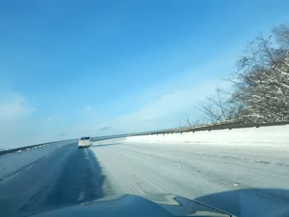
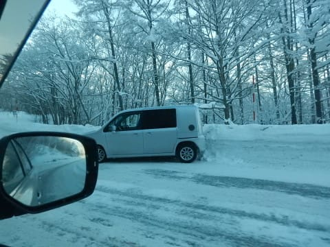
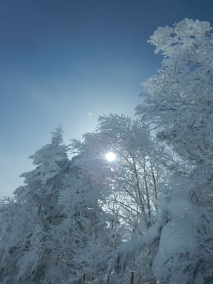
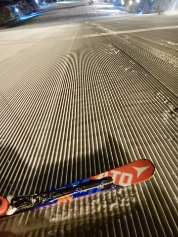

# 1月5日，3連休前日の志賀高原は…久しぶりの晴れ間＆ぴかぴか圧雪！最高のスキー日和！

📅 投稿日時: 2018-01-05 22:56:01

ということで．

28日の日帰り志賀以降．

29日に一日休み．

また4日に1日休み…

という感じで．

2度の帰宅をはさみ．

3回目の志賀高原へやってきた，Skier_Sです．

年が明けてから，かなりの新雪＆吹雪の毎日でしたが．

本日は久しぶりに太陽の下，シマシマ圧雪を

滑れましたよ～！

ってことで．

本日朝．

真冬モードの本格積雪路を登ってくる

ところからスタートですが…

久しぶりの晴れの朝です！

…しかし．

新雪が積もった道路は多少滑りやすく．

…下りの車がスピンして壁に突き刺さってたり

しましたが…

そんな道路を登り，やってきました焼額．

今朝の山頂の気温は-11度ですか．

結構いい感じで冷えてます！

朝イチゴンドラで山頂へ出ると…

なぜか，残念ながらすっきり晴れでなく，

薄雲がかかった天気になっちゃいましたが…

でも，ゲレンデは…

うはははは！

久々のシマシマっ！

最高のピカピカ圧雪だよ！！

ちょいとやわらかめで，板が食い込みすぎるけど…

でも，久しぶりの圧雪！

久しぶりの朝イチ大回り！

そして．

営業開始から1時間ほどたつと，

雲が切れて晴れ間がのぞいてきましたよ！

晴天だ…

久しぶりの晴天のスキーだ！

晴天の中，最高雪質の圧雪で滑れるなんて…

あぁ…シアワセ…←あなたは吹雪の新雪でもシアワセって言ってなかった？

一通り圧雪大回りを堪能したので．

非圧雪のオリンピックコースへ行ってみると…

10㎝ほどの，すごく軽い新雪が積もった

バーンで．

これはこれで楽しいよ！！

第2ゴンドラ側のパノラマ～サウスコースへ

足を延ばしてみましたが…

うーむ．

こっちは人が多いな．

そして，第2高速は…

ありゃ．

ちょっとリフト待ちがありますね…

ってことで．

第1ゴンドラの待ちはせいぜいこの程度だし．

やはり第1ゴンドラが一番だな！

と．

わが生息地，第1ゴンドラをグルグルしますが…

いや～！

ひさびさの晴天．

やっぱりスキーは晴れた日にやりたいですな！

晴天なのに，昼間の気温はせいぜい-5度程度

までしか上がらず．

雪質は昼間も最高の冷え冷えパウダー！

柔らかいし，軽いので，

なんでもできる気分になる最高雪質！

そして，ゲレンデ混雑も，3が日に比べると

少ないとなると…

もう，最高じゃないですか～っ！！！

ただ，雪が柔らかかったので．

午後になると，ちょっとゲレンデが荒れ気味に

なってきましたが…

でも．これだけ人が少ないゲレンデ．

荒れ方もそれほどひどくなることはなく．

朝は新雪が残っていたオリンピックコースも，

午後は凸凹になったとはいえ，雪はやわらかく．

コブも手ごわくなかったし．

午後までかなりいいコンディションで

楽しめましたよ～！！

ただ，夕方3時過ぎから，またちょっと雲が出てきて，

ゲレンデが見にくくなったのがちょっと惜しかった…

このまま夕方まで晴れ続けてくれれば良かったんだけど

なぁ…

まぁ．

でも．

雲も出たけど，夕日が沈むころには

こんな光景も見れて．

夕日が沈む，16:15の最終リフトまで．

今日もたっぷり滑ったのでした…

で．

そうです．

皆様の予想通り．

夜は当然，ナイターに行くわけですね…

平日のこの日は，一の瀬ファミリーペアしか

動いてなかったけど．

一の瀬宿泊客は1100円で滑れるのでリーズナブル．

朝イチに続く，やわらか圧雪の最高シマシマバーンを…

また，たっぷりいただきま～す！

…修学旅行か，学生の団体さんが入っていたので，

リフトが結構混んだのは残念だったけど…

でも，冷え冷え最高の冷え冷えを．夜9時まで

たらふく堪能したのでした…

明日も，朝イチは積雪がほぼなさそうな

予想になって来たので．

明日の朝イチはまたぴかぴかシマシマ圧雪バーンで

スタートできそうかな～！

## 💬 コメント一覧

### 💬 コメント by (michi)
**タイトル**: 明けましておめでとうございます（遅）
**投稿日**: 2018-01-06 05:54:18

今年もよろしくお願いします。

悪天を避けていたので昨日が2018年初滑りでした。朝の曇りが1日続くのかと思っていたので晴れて良かったです。午前中はGSコースを堪能して、荒れてきたので午後は白樺〜二高〜三高を滑ってました。

次は7日に行こうかと思ってます。

また宜しくお願いします。

### 💬 コメント by (Goku)
**タイトル**: Unknown
**投稿日**: 2018-01-06 07:34:29

うぎゃ～‼羨ましい～

私もこのところ、雪降りが続いたのでそろそろ晴天シマシマバーンが滑りたい‼

私は明日から行きまーす。

### 💬 コメント by (Skier_S)
**タイトル**: 明日もいい感じ
**投稿日**: 2018-01-07 00:41:59

＞michiさま

昨日も，結局朝しかお話しできませんでしたね…

7日は雪降りだけど，，いいコンディションで滑れそうです．

では，また明日お会いしましょう~！

＞Gokuさま

久しぶりの晴天圧雪でしたよ~！

明日は雪降りっぽいですが，楽しめると思います．

また明日！

