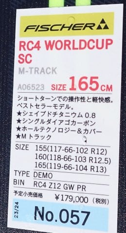

# 2024シーズンモデルのスキー板，試乗レポートその2…FISCHER RC4 WC SC M-track

📅 投稿日時: 2023-05-13 00:06:17

🏷️ カテゴリ: [スキー板試乗](c0bd8048615710cee890e403a36cc9a2b.md)

うん．

やっぱり，明日の土曜は志賀・かぐらともに，

昼ごろから雨になりそうです（泣）

明後日も，一日雨が降ったり止んだりになりそう…

ただ，2日間ともそれほどザーザーぶりには

ならなさそうかな？

ってなことで，私は明日日帰りで，かぐらに滑りに

行ってきます～！！

雨だから，混まないと信じてるんですが…

やっぱり混むかな～…

…で．

いつも通り，あと4時間後に出発なので…

睡眠時間は3時間かな（涙）

ってなことで．

もうすぐ出発ですが…

今日は特派員レポートもなくて，

記事がこれだけじゃ寂しいので．

2024シーズンモデルのスキー板の

試乗レポートをば…←時間ないんだから早く寝ようよ

今回もフィッシャー編．

前回はSC Proでしたが，今回はプレート違いの

SC M-Trackです．

では，どうぞ～！！

〇FISCHER RC4 WC SC M-track 165cm

基礎小回り用

こちらは小回り用SCでも，前回レポートした

しっかりしたM-PlateをつけたSC PROとは違い，

優し目のM-trackを着けたSC M-trackになります．

（M-plateとM-trackが似ててややこしい…）

SC-Proは黄色に変わったけど，このモデルは

昨年同様の黒になりますね…

でも，今シーズンと同じく水色バージョンも

出るようです．

で．

今シーズンモデルからそんなに変わってない

はずだけど…

PROを履いた後ではかなり優し目．

ガッツリグリップではなく，スピードを

出して圧を強くかけすぎると，板が

優しく逃げていく感じ．

そこそこの（普通のゲレンデで使う程度の）

スピードであれば問題ないですが，

思いっきり私のトップスピードまで出すと，

ちょっと板が弱いかな…と思う板です．

ただ，思いっきりのトップスピードでなければ，

角を立ててしっかり切っていこうと

思えば結構気持ちよく切って行けて，

カービング小回りまで行ける板です．

その中でも板を動かせる優しさと

自由度がある板．

PROと比べれば軽さも感じるので，

板を動かしていきやすいです．

コブ斜面とかでも行けそう！

常にトップスピードを求めてカービング

する…って感じではなく，

急斜面で板をずらしてスピードをコントロール

したいけど，普段はある程度きっちり

カービングで滑りたい…

という人が，小回りベースのゲレンデ板と

して使うにはちょうどいい感じの板じゃ

ないでしょうか．

ただ…

この板，税込み定価20万か…

ちょっと高いですね（涙）
