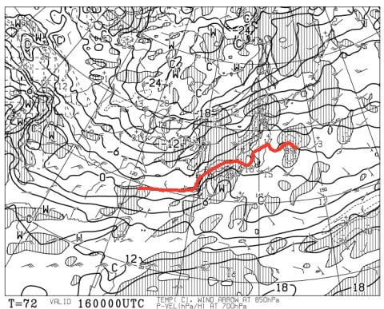
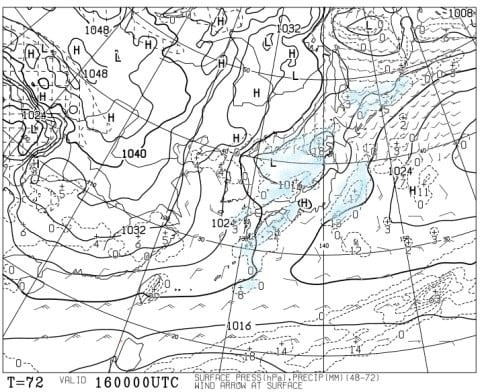
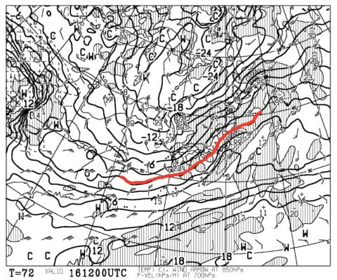
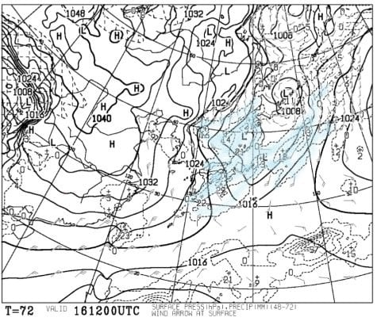
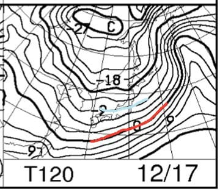
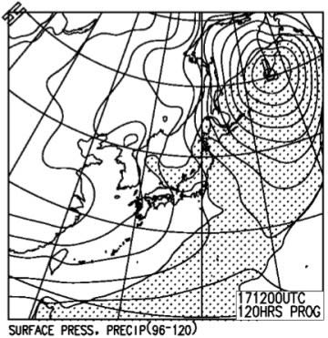

# 12月16，17日の週末の志賀高原スキー場の天気は…大丈夫！液体は降らなさそう…土日とも雪の天気

📅 投稿日時: 2017-12-14 06:31:17

🏷️ カテゴリ: [スキー天気予想](c6554f5c3c106093b511a8daae23757e8.md)

ということで．

昨日の記事で，

明日水曜から明後日木曜朝にかけては．

志賀でも，結構積もると思いますよ～！！

と書いた通り．

これから明日木曜朝にかけて，積もります．

志賀高原でも結構降ります．

…明日の朝は，志賀でもパウダーパフパフが行けそう…

なんだけど．

気になるのはこの週末．

土曜は，空から落ちてくるのは液体かも…！？？

という恐ろしい気配が感じられる天気図でしたが．

さて．

本日の最新天気図．

どうなっているか．

土曜朝9時の850hpa気温予想を見てみましょう…！

ををっ！！

0℃線はぎりぎり志賀高原にかかってます！

志賀より北には行ってません！

きわどいながらも，降っても雪の気温です！

そして，土曜朝9時の地上天気図を見てみると．

水色で塗った降水域は志賀に掛かっていないので．

土曜の朝は，昨晩からの積雪が無い状態で

スタートっぽいですね．

そして，土曜夜9時の850hpa気温予想は…

これも，0℃線はきわどいところ志賀より南！

うーむ．

きわどいところ，セーフ！

で，

土曜夜9時の地上天気図は…

うむ．水色で塗った降水域．

日本全体にかかっているので…

土曜の日中は，志賀も湿った雪が降りそう．

風はそんなに強くなさそうなので…

ゴンドラには厳しい南風だけども，

ゴンドラは止まらずに運転してくれそうかな．

続いて，日曜朝9時の850hpa気温は…

…今度は極端に冷えますね．

-9℃線が志賀に掛かるレベルなので，志賀高原は

-10℃級の冷え込みですよ！？？

そして地上天気図は…見事な冬型．

降水気の網掛けも志賀に掛かっているので．

志賀も雪降りの天気になりそう．

…ってことで．

まとめると

土曜：朝は雲が出てるけど…晴れてるかな？

　昨晩からの積雪は無し．

　気温は朝から高く，焼額山頂で-3度程度か…

　昼に向かって雲が増えていき，昼にはくもり．

　昼ごろは，気温が山麓では0度付近まで上がって

　しまい．

　午後は雪がぱらつき始めるけど，気温が高いので

　かなり湿った，重い雪…

　雪は一晩中ぱらぱらと降り続ける

日曜：曇り時々雪，

　土曜の夜から雪が降り続け，

　積雪量は10cmを超えるか…

　朝は夜のうちに積もった雪が圧雪された

　ちょい柔らかめの圧雪かな．

　気温はぐっと冷えて，朝は-10℃以下，

　昼間も-5℃以上まで上がらないレベル．

　基本的に終日パラパラと雪が降りつづけ，

　太陽はほとんど拝めないかな…

　風向きによっては，時折日が射すかも．

　昼間も雪が降り続けるので，ゲレンデは

　荒れ気味．

って感じでしょうか…

日曜は，また志賀はそれほどじゃないけど，

日本海側のスキー場は結構つもるかも…

とりあえず，土曜は雨の心配がなくなって

一安心の，Skier_Sなのでした．

## 💬 コメント一覧

### 💬 コメント by (Reader)
**タイトル**: 天気図が？
**投稿日**: 2017-12-14 07:33:08

土曜夜9時の850hpa気温予想・・・朝の地上天気図になっています．

諸般の事情で・・・シーズン券が泣いています．

せめて目の保養だけでもと，毎日，拝見しています！

### 💬 コメント by (まいる)
**タイトル**: スノーシーズン始動
**投稿日**: 2017-12-14 23:09:09

Sさん、お疲れ様です。

やっとスノーシーズンがスタートしました。

週末は、かぐらにいく予定です。

液体、降ってこないですよねー

### 💬 コメント by (Skier_S)
**タイトル**: 日曜朝は日本海側は超パウダーねらい目！
**投稿日**: 2017-12-15 01:29:15

＞Readerさま

いつもご愛読ありがとうございます～！

天気図貼り付け間違いの指摘，ありがとうございました．

直しました！

スキーに行けない人がこのBlogを読むと，

目の保養じゃなくて目の毒かもしれません（笑）

＞まいるさま

お久しぶりです～！

今週末はかぐらですね…

日曜朝はかなりの積雪だと思いますよ～！

土曜に液体が降る危険性は，限りなく0です．

かなり湿った重めの感じですが，

雪になるはずです．

