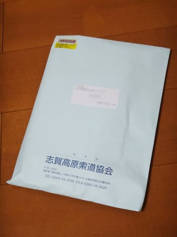
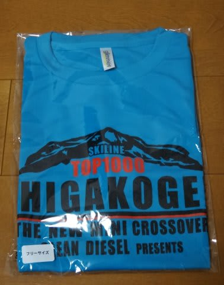
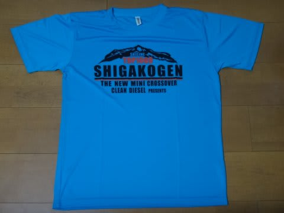

# うむ？志賀高原からなんか届いたぞ．

📅 投稿日時: 2015-06-07 02:38:36

ということで．

Skilineによると．

[今シーズンの滑走標高差が志賀高原で13位だった](e30425cf3e3521cb5ac277ac977303d67.md)らしい

私ですが．

志賀高原から，何か届きましたよ…

なんじゃいな？？

ふむ…

これは．

志賀高原トップ1000に送られるらしい，

Tシャツではないか…っ！？？

…デザインについては，

あまり何も言わないでおこう…

でも．生地はすぐ伸びちゃうような

安い生地じゃなく，速乾性のやつで，着心地もそんなに悪くないし．

上位1000人全員に，こんなTシャツが当たるというのは

なかなかではあるな…

…しかし．

このTシャツが送られてきたということは．

上位1000人から抽選で2名に当たらしい，

来シーズンの志賀高原シーズン券は外したということだな…（残念）．

でも．

まぁ．

シーズン券の67000円というお高いお金のうち．

1000円分くらいは戻ってきたのかな…

という気分になった，Skier_Sなのだった…

## 💬 コメント一覧

### 💬 コメント by (Goku)
**タイトル**: Unknown
**投稿日**: 2015-06-07 06:31:53

私の所にも届きました～

ちなみに180位だそうです（Ｓさまには遠く及びません）

生地は去年までに比べグーンとグレードアップしましたね。

ところで、禁断症状は大丈夫ですか（笑）

### 💬 コメント by (Skier_S)
**タイトル**: Gokuさま
**投稿日**: 2015-06-08 14:34:42

blog見ました～!

そちらにも届いたみたいですね。

去年は住所を登録してなかったので、

もらってないんですよ…

今年初めてもらいました。

でも、どこで着るか微妙なデザインですよね…

