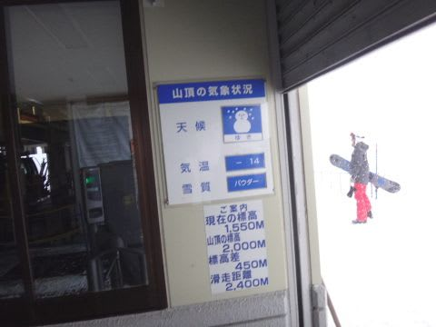

# 2月12日（日）の志賀高原，濃密詳細レポート！…腰パフのディープ新雪！激しい雪降り，昼間は晴れ間も…！

📅 投稿日時: 2017-02-14 02:23:46

🏷️ カテゴリ: [2017スキー滑走日記](c7d777cecfc91bdf0fa464ad62c6d49ab.md)

えー．

今週金曜，17日．

高温になる予想が出ているようですが．

…今のままの天気図だと．

風でゴンドラ止まるかもしれないけど，

志賀高原は雨にならないんじゃないか…？

と思っている，Skier_Sです．

＃この土曜日みたいに，これから天気図が変わっちゃうとヤバいけど

というところで．

昨日速報した，日曜の志賀高原．

詳細レポートです～！！

えー．

まず．

日曜の朝，起きてみると…

えええええ！！！！

こ，これは．

…す，すごい積雪だ…

一晩で，50cm以上積もったか？？？

…これは．

車を発掘していると，焼額の朝イチに間に合わない！

…と．

いつもの車での焼額移動をあきらめ．

一の瀬スタートにしたわけですが…

除雪作業で営業開始が遅れ．

予定の8:30を過ぎてもリフトが動く気配がなく…

一の瀬ダイヤモンドに至っては，8:30になっても搬器が

出ていない状態（涙）

…これは．

一の瀬ファミリーが動いても，いつ焼額に移動できるか

分からん！

…ということで．

営業開始を待つ長いリフト待ちから抜け出て…

シャトルバスで焼額へ移動！

焼額第1ゴンドラも，営業開始が15分ほど遅れ．

8:45スタートだったようで…

営業開始から5分遅れ程度で第1ゴンドラへ！

そして．

山頂に出ると…

気温は-12℃ですか．

見事に，水曜の予想ドンピシャの気温ですね（笑）．

で，ゲレンデは…

結構な勢いで雪が降っていて．

視界が悪めではあるけど…

朝に圧雪されているはずなのに，ブーツパフ！

端っこに近いところだと，所によっては

脛パフ！

圧雪コースでこれなんだから…

これは，新雪狙いのオリンピックコースに

行かねばなるまいっ！

…と，

オリンピックコースに行くと．

うむ？？

なんだろう，この人だかりは？

…と，不思議に思いつつ，

この中に自分も突っ込むと…

うはぁ！！！

スタックっ！！

腰まで新雪に埋もれて．

雪が重すぎて，進まない…！

…進まない雪の中，

何とか進もうともがき苦しむ人々！

そして，私も見事その一人として仲間入り（涙）．

…重い．

進まないよ…（泣）．

重い雪に捕まり．

全く進めずもがき続ける人々を見て．

ゴキブリホイホイ

を思い出さずにいられなかったのは，たぶん

私だけでなかったはずだ…

とりあえず．

緩斜面の「ゴキブリホイホイ地獄」

を脱出して．

斜度のあるところに来ると…

うほーーーーーーー！

激烈腰パフ！

もう，顔面スプレー状態の，

激烈ディープパウダーっ！！

最高っ！

最高だよ！！

…

…

でも．

また，急斜面が終わった後の緩斜面で．

ゴキブリホイホイに捕らわれ，

うごめいている人々が見えてるんですが…

って感じで．

1本目はかなりのゴキブリホイホイ斜面でしたが．

あら踏みされた3本目あたりからは，

踏まれたところを選べばスタックすることもなく．

うひょ～！！

って感じの．

間違いなくわが人生ベスト10に入る

ディープパウダーを楽しめたのでした！！

ただし．

雪がちょいと重めで．

滑ったシュプールがさらさらと埋もれていくような

雪ではなく．

踏まれたところが固まっていくような雪だったので．

…残念ながら，5本ほどでオリンピックコースの

シアワセタイムは終了．

だもんで．

GSコースへ行ってみますが…

こちらも，コース脇はかなりパフパフで．

午前11時ごろまでは結構楽しめましたかね～．

…ただ．

ちょっとコース上，人が多めだったかな～．

あ，でも．

この日は，ゴンドラはそれほど混まず．

ピークでもゲートの外まで列が並ぶことは無くて，

空いてて良かったですよ～！

＃2月の週末で待ちがないって，焼額の営業的にはマズい気がするのだが…

で．

12時を過ぎてくると…

をを！

なんと！

日が射してきましたよ！

「風向きによってはチラチラ日も射すかも？」

と水曜の予想に書いた通り．

日が照ってきましたよ！！！

そして．

1時近くには青空も見え…

をを！

すっきり晴れ！

で．昼間も，気温は-7℃と低く，

わずかに-10℃を超える程度だったので…←ここも水曜の予想通りだったと主張しておく

雪質は最高！

オリンピックコースは，新雪が踏まれて

コブ斜面化しちゃったけど．

でも，やわらかコブで，

人も少なくて…

これはこれで，気持ちいいね！！！

と，思ったら．

日が射したのは，わずか1時間程度．

2時前には，また掻き曇り…

激しい雪が降りはじめ…

3時ごろには，またコースがパフパフ化！

ってことで．

激しい雪でちょっと視界が悪くなってきたけど．

プチパフ化しつつあるコースを，

リフトストップまで楽しんだのでした…

…で．

駐車場へ行ってみると

な，なんと．

…こ，これが我が車か…っ！！！

ディープパウダーを楽しんだその代償として．

必死に車の発掘作業をするはめになったのでした…

いやーーー．

でも．

朝はすごいパウダーだった…

今シーズンは，パウダーに恵まれてるなっ！！！

＃何か物欲が激しく刺激されているのは，なぜだろう…

## 💬 コメント一覧

### 💬 コメント by (かず)
**タイトル**: 月曜
**投稿日**: 2017-02-14 12:20:14

朝一圧雪だったのでSGS行ったのですが新雪15cm位にコブに底つき滑りにくく2本でお隣りに移動です

熊落とし？も底つきだったのでがっかりだったのですが　その他の非圧雪膝位の底つき無しで楽しめました　平日パウダー最高でした

### 💬 コメント by (Skier_S)
**タイトル**: かずさま
**投稿日**: 2017-02-15 01:43:35

15cmですか…

夕方の降りっぷりだと，

もう少し積もるかと思ったのですが．

でも，平日パウダー楽しめたようですね…

私も平日スキーに行きたいけど，

今の職場だと絶対無理（涙）

