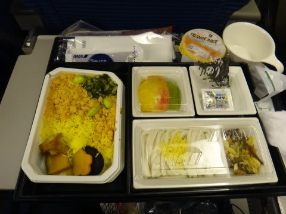
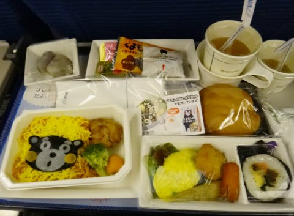
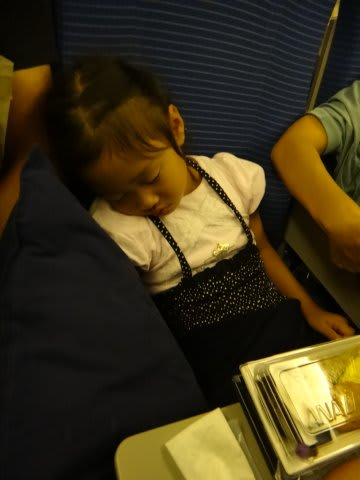
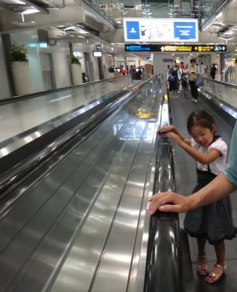
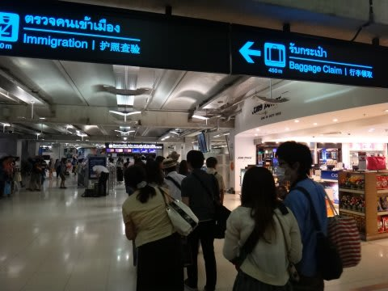
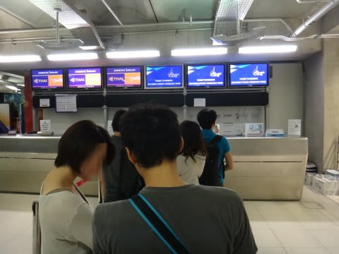
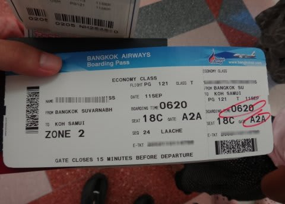
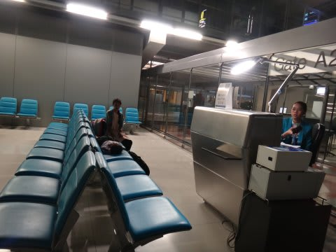

# 2013年9月　子連れタイ・タオ島ダイビング旅行記　その2…なんだか不思議なバンコク乗り継ぎ

📅 投稿日時: 2013-10-02 02:21:49

…なんだか．

今日のレポート．

…旅行ガイドの空港案内みたいになっちゃった…．

面白くなくてごめんなさい…←おまえの記事が面白かったことがあるのか？という声は聞こえないフリ

ってことで．本編へ！

-----

バンコク行きの飛行機のフライトはわずか6時間．

軽食の後，3時間もうとうとしたかな…ってところで，

今度は朝食が配られます．

…うーむ．

あんまり，寝てないんだけど．

…でも．

出されたものは食べるというポリシーの私．

とりあえず，食う！

…どーでもいーけど．

チャイルドミール，ご飯がくまモンだよ…

…でも．

せっかくのくまモンだったけど．

娘は熟睡中だったので，一目も見ることなく．

私がありがたく全ていただきました．

ってことで．

食事が終わってしばらくすると，約6時間のフライトも

終わり，バンコクに到着です．

…時間は，朝5時前…

日本時間で朝7時とはいえ，あんまり寝てないので眠いよ…．

ここで，サムイ行きの飛行機に乗り換えですが．

空港に到着すると．

飛行機やら空港が好きな娘は，パッチリお目覚めのようで．

「また飛行機乗るんだよね～！(喜）」

…

…6時間の国際線に乗ったばかりだと言うのに．

…おまえ，ホントに飛行機が好きなんだな…

で．

到着したら，空港内にいっぱいある両替所でまずは両替．

…両替レートですが，バンコクが一番いいので．

バンコクの空港で必要額を両替してしまうのがBest！

＃間違っても日本で両替しないことをお勧め…

両替が終わったら，国内線乗り継ぎカウンターへ向かいます．

国際線到着ターミナルから，空港内をとぼとぼとぼとぼ，

15分くらい歩くでしょうか…

…遠いよ…

あー．

そういえば．

東京→(ANA国際線)→バンコク→(バンコクエアウェイズ・国内線)→サムイの乗り継ぎ．

ちょっと…というか，かなり特殊です．

まず．

預け入れ荷物は，羽田から直行でサムイまで行きます．

入国地のバンコクで，荷物を一旦ピックアップ＆再預け入れ

する必要がないんです．

…だけど．

荷物は直行なんだけど．

バンコクからサムイの搭乗券は，なぜか東京では

発券されないんですね～

＃ホントに荷物は直行でサムイへ行くのか？と心配になる

バンコクに着いたら，空港の国際線→国内線乗り継ぎエリアに

ある乗り継ぎカウンターで，サムイまでの搭乗券を発券して

もらう必要があります．

(この乗り継ぎカウンターで，パスポートと預け入れ荷物のタグを見せると，搭乗券を発券してもらえる)

で．

乗り継ぎカウンターのすぐ横に，乗り継ぎ専用入国審査があるので．

入国審査と手荷物検査をくぐると，そこはもう国内線エリア．

…普通は，入国審査と同時に税関があるけど．

今回，荷物はサムイに直行しているので．

税関はサムイで通過することになります．

…ってことで．

・荷物はサムイへ直行

・だけど，バンコクで搭乗券を受け取る必要あり

・入国審査は，乗り継ぎのバンコクで．

・税関は，最終目的地のサムイ空港で…

という感じで．

他にあんまり例のない，不思議な乗り継ぎ方法に

なっています…

＃荷物がサムイ直行なのは便利でいいんだけど…

って感じで．

不思議な手続きの後，国内線エリアに入ったら．

早朝で乗客も少なく．

寂しい搭乗待合室で待つこと1時間半ほど．

朝7時の便で，サムイへ向けて出発です．
