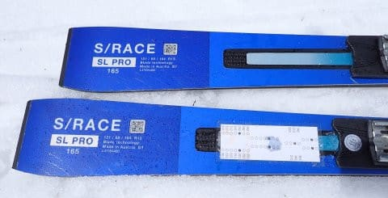

# 2025シーズンモデルのスキー板，試乗レポートその17…SALOMON S/RACE SL PRO

📅 投稿日時: 2024-06-22 02:05:22

6月8日の月山でスキーシーズンを終えて

はや2週間近く…

それまで，ほぼ毎週スキーで体を動かしていた

のに，先週末は運動しなかったので．

そろそろ身体を動かさないといけないのでは？

という強迫観念に駆られてきた，Skier_Sです．

ということで．

明日はちょっと軽く近場の山を歩いて（走って？）

来ます～！！

…混んでる山はあまり好きではないので，

朝5時ごろから登ろうと思うと…

明日4時前に家を出ないといけなくて．

で．今日も帰宅は深夜0時で．

今はすでに深夜2時．

これからお風呂に入って寝ると…

2時間寝られないんですが←なんでそれで山に行く？？

…それでも，身体を動かさないと腐りそう

なので，身体を動かしに行ってきます～！

…そして，帰ってきたら仕事しないと（涙）

ってなことで，本題へ．

本日も2025シーズンモデルのスキー板の試乗レポート．

今回も，昨日に続いてサロモン編です！

〇SALOMON S/RACE SL PRO + ICON 10 165cm

基礎小回り．

サロモンの基礎小回りシリーズ，

SL PRIME

SL PRO

SL 12

SL 10

の4種類のうち，上から2番目のモデル．

これもSL 12と同じく，昨年からの継続

かと思ったら…

なんと，ICONビンディングがついてました！

板自体は継続みたいですが，ビンディングが

変わってます！！

ってなことで．今年まではXビンディングが

標準だったけど，来年からICONビンディングが

標準セットになるらしいこの板．

今シーズンのICONビンディングは，開放値が

すごい強いモデルしかなかったけど．

来シーズンからは，最大開放値10という

優しめのビンディングも出るんだな…

しかし．

もともとSALOMONはビンディング

メーカーだったはずなのに．

ATOMICとSALOMONが同じアメアスポーツ

配下になったあとに，トップモデルが

SALOMONビンディングを捨て去って

ATOMICのXビンディングを採用した時も

驚きだったけど．

まさかSALOMONの板にマーカーの

ビンディ…

（これ以上言うと消されるので自主規制）

ってなことで．

初体験のICON ビンディング板．

今シーズンモデルのXビンディングから

どう変わったのか，期待して履いてみた

ところ…

いや！！これもいい板！！SL12より足元が

しっかりして，反応も早い！

板の反応の早さは，たぶん板そのものより，

ビンディングとプレートの影響が大きい

気がする…

Xビンディング付きのATOMICを6台，10年以上

履き続けた経験から言うと．

ビンディングは今シーズンモデルが着けてる

Xビンディングより軽いんじゃないかな？

そのため，足元付近の軽さによる軽快さが

ちょっと上がった気がするし（気のせいかも…）

さらに，テール付近のしなやかさが

上がったのに，返りのレスポンスの良さで

すごい抜けが良く感じる！

普通，板の抜けを良くしようとすると，

テールが硬くてまっすぐ走り気味の

板になるけど．

テールのしなやかさでターンを最後まで

しっかり仕上げることができるのに，

それでいて反発のタイミングが絶妙で，

板の抜けが良く感じます…

しっかりキレキレの滑りができて，

板全体がきれいにたわんでグリップも強く，

カービング小回りのたわみの出方，

抜け方が気持ちいいので，

板が最後まで回りきってスッと抜けていく

抜けも気持ちいい！！！

かなり快感度の高いカービング小回りが

できます…！

それでいて，SL 12と同様，キレもズレも

滑りやすい…

グリップが強めのカービング板なのに，

ずらそうと思えば板をしっかり動かせて，

またグリップさせよう…と思ったら

エッジ方向に走っていくという，

ズレとキレの出し入れの自由度が高く．

ズレに入った時の板の旋回性も高いので，

ズレたときもしっかり板が雪面を捉え

ながら回っていきます．

とりあえず，ハイスピード域でも快感度が

高い脳内麻薬系のキレかたをする板なのに，

ズレのコントロールもできるという，

恐ろしい万能板．

ある程度の体重と脚力があれば，SL 12では

なく，SL PROをゲレンデ普段履きとして

選びたいですね…！

そして．たぶん．

ICONビンディング，Xビンディングより

いいですね．

これは，ATOMICのビンディングより，

マーカーのビンディ…（ヒットマンに消されるSkier_S）
