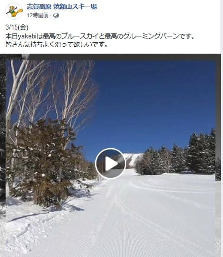

# そして今週末も志賀高原で滑ってます～！…土曜は冷え冷え雪降り．日曜も昼過ぎまで雪降りっぽい…

📅 投稿日時: 2019-03-15 22:45:00

本日の焼額山特派員からのレポートによると．

冷え冷え，晴天，最高雪質

だったようですね…

（[焼額山FB](https://www.facebook.com/yakebitaiyama/posts/2083561121739223)より）

あぁ…

今日，滑りたかった…

でも．

明日も冷えますよ～！

明日土曜は，500hpaの-30℃の寒気が

すっぽり本州を覆います！

これは，真冬のトップシーズン並みの

冷え込み！

…そして．

明日は終日雪が降り続けそうです．

…視界が悪くならなければ

いいんですが…

そして，日曜になっても，

500hpaの-30℃の寒気が

引き続き志賀高原より南まで

下がるっているという，

真冬でもそうそうない冷え込み！

850hpa図を見ても．水色の-6℃線が

志賀高原にかかっているので．

朝は-10℃クラスまで冷えますよ～！

…ただ．

日曜は，矢印で示したプチ低気圧が

発生しそうなので…

うーん．すっきり晴れとは

行かなさそう．

朝は雪が降ってそうですね．

昼過ぎまで，雪が降り続けるか…

でも，夕方には晴れそうな感じ．

とりあえず．

言えることは．

土日とも冷えそうです．

雪が降り続き，天気は悪そうだけど．

日曜の午後に晴れてくることに期待！

ってな感じで．

今週末も，志賀高原を滑ってます～！

## 💬 コメント一覧

### 💬 コメント by (ヒロ18)
**タイトル**: Unknown
**投稿日**: 2019-03-16 05:28:55

現在、志賀高原は晴天です！

星空が見えるくらいです！

昨日の夜は雪が降ってたので今朝は(´∀｀)ｳﾍﾍ

以上、志賀高原最速レポートでした。

### 💬 コメント by (若杉勲71)
**タイトル**: Unknown
**投稿日**: 2019-03-16 06:01:37

昨日午後は久々の寺子屋が良かった。地肌も埋まり楽しくて四本も滑ってしまいました。からまつは午後には柔らかくなっていました。今日火曜日は、８時奥ゴンです。

### 💬 コメント by (とっき)
**タイトル**: Unknown
**投稿日**: 2019-03-16 17:11:15

はじめまして。

何時も楽しみにブログを拝見しています。

昨日から、今シーズン初の志賀高原に来てます。

つれづれさんが居るかと思い焼額を滑って居ました。

明日も焼額を滑ります。

### 💬 コメント by (Skier_S)
**タイトル**: トップシーズン並みの一日だったよ！
**投稿日**: 2019-03-17 00:54:46

＞ヒロ18さま

今日はお会いできて良かったです～！

志賀高原は満足されましたでしょうか．

このコメント読むころはもう自宅でしょうか．

また，志賀高原でお会いしましょう～！

＞若杉さま

今日は，天気は良くなかったけど．

雪は最高の一日でしたね…

でも，今日もお会いしませんでしたね（涙）

＞とっきさま

コメントありがとうございます～！！

志賀高原にお越しなんですか．

土曜は一日焼額1ゴンをグルグルしてましたが…

お会いしませんでしたね．

明日は早朝は焼額ですが，通常営業からはほかの

スキー場に遠征に行くかもしれません…

ただ，朝イチは焼額滑ってます．

明日は子連れの大勢で滑ってると思いますが，

見かけたら声をかけてください～！

### 💬 コメント by (私もスキーしないと病気になっちゃう2号)
**タイトル**: Unknown
**投稿日**: 2019-03-18 15:33:04

徒然スキーヤーさん、こんにちは。

はじめてのコメントします。私も徒然さんと同じ病気にかかって5年ほどです。

私は、志賀高原、野沢温泉、黒姫高原、菅平高原のどこかに週末行ってます。

先週土曜日は、志賀高原へ行き、徒然さんと思われる方と焼額山の1ゴンで目が合いました。

私は、長野市在住のため、日帰りでのスキー場通いですが、徒然さんは、毎週関東方面よりで大変ですね。でも、病気ですから、しょうがないてすよね。

また、見かけたら声かけます。

### 💬 コメント by (Skier_S)
**タイトル**: ＞私もスキーしないと病気になっちゃう2号さま
**投稿日**: 2019-03-19 02:26:44

コメントありがとうございます～！

あら．

先週土曜日，同じゴンドラに乗り合わせたんですか！？？

ぜひ，声をかけていただければ…銀のお札もお渡しできたのですが．

同じ病気にかかっているようですから．

今シーズン，まだまだ志賀高原にいらっしゃいますよね．

また今度見かけたら，声をかけてください～！

