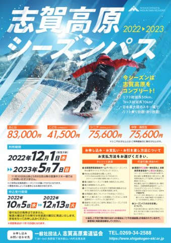
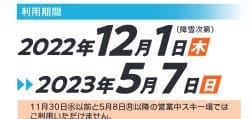
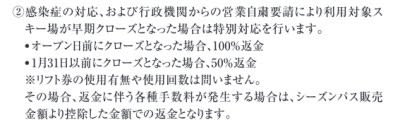
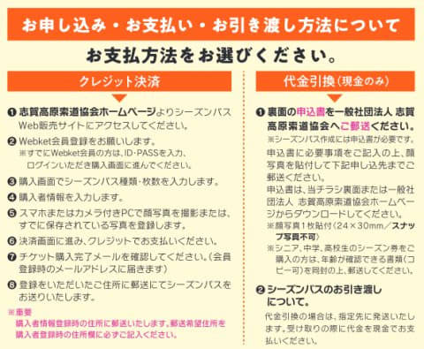
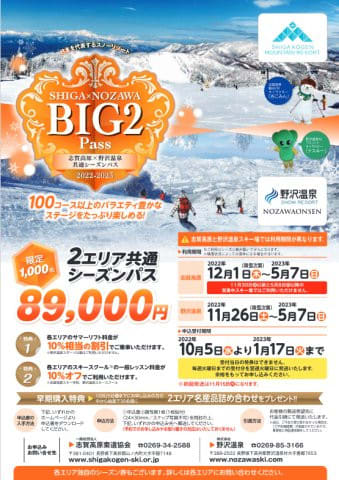
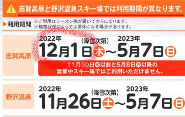
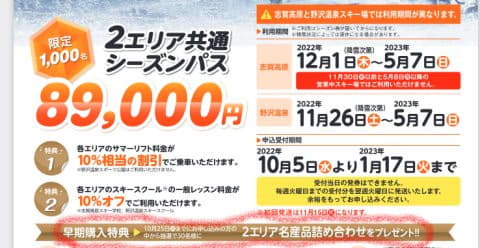

# 志賀高原の2022/2023シーズンのシーズン券情報が出たよ…大人83000円と6000円値上げ（涙）

📅 投稿日時: 2022-10-03 03:22:33

10月ですね…

ついに．

ついに10月になりましたね…

ようやくスキーシーズンが始まる月が

やってきました…！！！

…Yeti，今シーズンも10月にオープンして

くれると信じてますが，まさか11月

オープンってことは無いよね…？？

ってなわけで．

スキーシーズン突入の10月になったこともあり．

本日ようやく，志賀高原シーズン券情報が

出てきました！！

早速，志賀高原索道協会のページで

案内を見てみると…

（[志賀高原索道協会のシーズン券のページ](https://shigakogen-ski.or.jp/winter/news/ArticalImages/22-23_Season-pass_Jp_crs.pdf)より．以下同）

うぎゃーー！

志賀高原の全山共通シーズン券，

83,000円！！！？？？

昨シーズンの77,000円から，6,000円値上げ！！！

…まぁ，昨シーズンの77,000円から

1割値上げして85,000円くらいかな？と

覚悟していたので，それよりは値上がり

幅が抑えられてたけど…

でも．

2014シーズン　65,000円

2015～17シーズン　67,000円

2018シーズン　70,000円

2019シーズン　72,000円

2020～2021シーズン　77,000円

という歴史を考えると．

9シーズンで1万8000円，3割近い値上げ

ですね…（泣）

そして．

利用可能時期は昨シーズンと変わらず．

12月1日からです（泣）

11月中は使えません…

ちなみに，今シーズンも

感染症などで

オープン日前にクローズとなったら全額返金，

1月31日までにクローズとなったら50％返金

というルールは残るみたいです．

今シーズンも申し込み方法は2種類．

・クレジットカードでのネット申し込みと

・紙の申込書を郵送して代引き受取り

の2種類です．

どちらにしろ，志賀のシーズン券は

申し込んでから発送されるまで

結構時間がかかるので，買おうか

どうしようか悩んで，直前に申し

込んでも利用日までに家に届かない

というパターンもあり得ます．

志賀のシーズン券を買ったことがない

人はその点にご注意を！！

そして．

志賀高原全山共通シーズン券と同時に，

志賀と野沢で使えるBig2パスの案内も

出ましたが…

（[志賀高原索道協会Big2パス案内ページ](https://shigakogen-ski.or.jp/winter/news/ArticalImages/2022-23_BIG2pass_crs.pdf)より，以下同）

こちらは8万9000円ですか…

確かこれまで，志賀のシーズン券+5000円だった

気がするけど，プラス6000円になりましたね…

そして．

野沢ではオープン予定日から使えるけど．

志賀ではやっぱり12月1日しか使えないのね…

うーん．

しかし．

やはりリフト代，大幅値上げか…

円安の影響で来シーズンはスキー用具も

お値段が爆上がりしそうだし．

ガソリン代も高いし．

お財布に痛い…

と思いながら．Big2パスの案内を読んでいると…

え？

早期購入特典，2エリア名産品詰め合わせ

プレゼント…？？

…

…うむ．

名産品送る手間賃とコストをかけるくらいなら．

他のスキー場と同じく，早期購入割引を

やった方がよっぽどリフト券の売上が

増えると思うよ…

と．

声にならない声をこのBlogでつぶやいてみる，

Skier_Sなのだった…

## 💬 コメント一覧

### 💬 コメント by (スシネコ)
**タイトル**: Unknown
**投稿日**: 2022-10-03 17:37:12

私のような雪の降らない遠隔地に数んでいる一般スキーヤーにとっては、シーズン券は「地元の人」や「競技をやる人」が買うものだ、とずっとずっと思っていました・・・あの出会いを知るまでは（爆）。

ということで、私はこれまで一度もシーズン券を持ったことがないのですが、実は昨シーズン、多くの方から「スシネコさんってシーズン券の方が安くありません？」って聞かれて　（´△｀）ｴｯ!?

一般スキーヤなので笑われそうですけど、今年はシーズン券デビューしてみようかなと。

### 💬 コメント by (Skier_S)
**タイトル**: ＞スシネコさま
**投稿日**: 2022-10-04 03:40:01

そうでしたね…

スシネコさん，シーズン券じゃなかったんでしたね！！

いや．あれだけ滑ってシーズン券じゃないって，勿体ない…

ぜひシーズン券デビューして，終わった人の仲間入りしてください！！

…って，もう終わった人でしたね（笑）

### 💬 コメント by (新米パパ)
**タイトル**: Unknown
**投稿日**: 2022-10-04 13:43:09

名産品のくだり、笑っちゃいました。

ホント、この辺の無駄って日本のサービスでよく見かけますよね。

ま、地場が潤うのかなー。ホンマかいな。

### 💬 コメント by (Skier_S)
**タイトル**: ＞新米パパさま
**投稿日**: 2022-10-05 06:16:09

せめて地場が潤うんならいいんですが…

1000枚限定だから，安くしなくても売り切れちゃうのかも？

でも，お昼ご飯代を削ったり，高速代を削ったりしてスキーに行っている人からすると，

特産品いらないからそれだけ安くして…って思う人が多い気がする…

