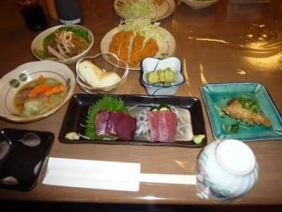

# 2010年7月，2歳の子連れで座間味でダイビング！その4…1日目終了，泊りはペンション高月さん

📅 投稿日時: 2021-09-23 04:54:24

どうやら，明日…というか，もう日付が

変わっているので．

一般社会は，祭日と呼ばれる日のようですね．

祭日…

あぁ．近年忘れていた，なんて甘美な言葉．

最近，ほぼ毎日在宅勤務になり．

家が仕事場になり．休日でも仕事が

できちゃう環境になると…ダメですね．

ええ．ダメです．

いろんな意味で…（涙）

そういえば，先日の週末も，

祭日があって3連休だったわけですが．

土曜に1回目のワクチン接種で．（苦労してなんとか予約が取れたよ…）

副反応で何かあったらヤバいので．

何も予定を入れずに過ごしてしまいました…

でも．

副反応がひどくないと言われる1回目だったので．

翌日一日の間だけ，

「押さえると腕がちょっと痛いかな？」

程度で終わりました！

…ただ．2回目の接種では，かなりの発熱で

翌日をつぶす人が多いし，ヘタすると

翌々日の午前くらいまで不調が続くと

いろんな人から聞いていて．

かつ，2回目の予定は，半期締めが

終わったあと＆緊急事態宣言が解除された

あとの，10月初めの土曜なので．

「久しぶりにやっとまともに遊びに行けそうな

　土日だというのに，熱出して家で寝こんで

　過ごすことになるのか…（涙）」

と，ちょっと落ち込んでいるSkier_Sです．←いや，普通は

「仕事が忙しい時期に熱を出して仕事が止まらなくて良かった」と思う

ところでしょ？？遊びの方が重要なの！？？

2回目接種が終わった皆さん，2回目の

副反応はどんな感じだったでしょうか…

ちなみに私が受けたのはファイザー製です．

…という前フリのあとは，本題へ．

10年以上前のダイビング日記の続きです…

ーーーー

ってなことで．

派手なゴーストやら，自然光とフラッシュ光の

ミックス調整がほぼ不可能ということが

判明して．

ちょっと残念感にあふれたニューカメラの

デビューダイブとなった今回．

すでにこの時点で，

カメラ買い換える気分95％

だったわけですが．

…このカメラがダメなことに，本番の

夏休みに入る前に気づいて良かった…

と，前向きに捉えよう．←いや，座間味ダイビングが「本番前の練習」ってゼイタクすぎ．普通は座間味で十分本番だから…！

ってな感じで．

ちょいと凹みながら港へ戻ってくると．

私がダイビングに行っている

一時間ほどの間，

娘と妻は，港の周りをお散歩していた

みたいで…

港に戻ると，妻と娘が出迎えてくれました．

妻「どうだった？？？」

私「カメラ，ちょっとダメそう…」

妻「…カメラじゃなく，海はどうだったの…？」

私「はうっ！………あんまり覚えていない…」

…ニューカメラの操作に必死で，海が

どんなだったか覚えてなかった…．

んで，宿に戻ってシャワーを浴びると．

今日は午後2時過ぎに座間味入りで，

ダイビングのスタート時間が遅かった

こともあり，すぐに夕食タイム．

この時の宿は，このあとに常連となる

ペンション星砂さんではなく，

座間味小中学校の前にある，

ペンション高月さん．

高月さんの食事も，かなりのボリューム！

手作りの地元料理！って感じで．

民宿の食事，いいなぁ…

…ってなことで，夕食後．

この日は2時間睡眠で車→飛行機→

モノレール→徒歩→高速船と乗り継ぎ，

その後にダイビングをした疲れのために．

夜は9時過ぎに寝てしまう健康さでした…

## 💬 コメント一覧

### 💬 コメント by (mae)
**タイトル**: Unknown
**投稿日**: 2021-09-23 19:32:25

私は7月に職域接種で2回目の接種を終えました。

翌日は発熱と倦怠感でとても仕事ができる状態ではなかったです。

3回目の接種はスキーに行く前日に接種してはダメな事が分かりました。

ウチは子連れダイビングは長男が1歳の時に連れていきました。

宮古島東急ホテルのプールで初めて一人で立てるようになったことを鮮明に覚えています。

### 💬 コメント by (ほっぽ)
**タイトル**: 何とも無し
**投稿日**: 2021-09-23 20:59:35

Ｓさん

私は7月上旬＆下旬でファイザー2回接種済ですが、２回とも全く問題無し。

注射した箇所に翌日傷みが残る程度。

夕方接種して、その日の夜に普通にウォーキング。

翌日も普通に早起きしてウォーキングしていました。

職場では発熱したとか、会社休むとか言ってる部下がいるので、

ワクチンなんて気合で吹っ飛ばせ！とパワハラ発言全開です(^^;

ちなみに我が家は義母、妻、娘×２と全員２回接種済ですが、

妻と娘が若干発熱した程度で、普通の生活を送りました。

まぁ、個人差があるので私の事例は特殊なのかもしれません(^^;

いや、特殊体質？(^^;

### 💬 コメント by (Skier_S)
**タイトル**: 副反応も人それぞれですね…
**投稿日**: 2021-09-24 06:15:01

＞maeさま

maeさんが熱で寝込んでいる姿はとても想像がつきません（笑）．

そんなにひどかったんですね…

そして，お子さんの初一人立ちが宮古島ですか！

それは忘れられない思い出ですね．

＞ほっぽさま

えーーー！

2回目も副反応ほとんど無しですか！

それはうらやましい…

私も翌日に山歩きに行きたいなぁ…

うちの職場は，接種後2日目の午前まで休んでいる人がいました．

こちらの職場は，ワクチン接種は出勤扱い，副反応が出た場合は

特別休暇扱いでいいという，かなりホワイトな感じの職場です…

私の会社，私個人は複数部署兼務で死にそうですが，会社自体はかなりホワイトなんです…

