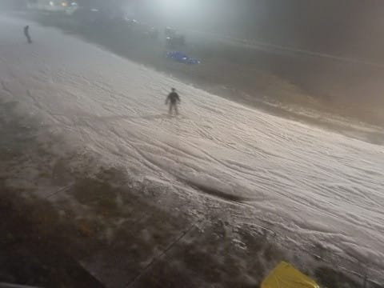

# 2018/11/10(土)のイエティ詳細レポート…午後は時折小雨がぱらぱら＆ガス（涙）混雑はそれほどでもなかったか…

📅 投稿日時: 2018-11-12 00:04:20

ということで．

本日は，土曜に行ったイエティの詳細

レポートです！

まず．

昨日書いたように，到着は午後2時過ぎだったのですが…

なんだか，晴れの予想が．

いきなりガスってますね…（涙）

そして．コース幅は2週間前より，わずかに

広がっているものの…

やっぱり，2週間前とほぼ同じところが．

ところどころ，雪が薄くなってますね（泣）

今日は午前中は結構天気が良かったみたいなので．

それで雪が解けちゃったようです…

でも，穴が開いているのは，写真で写って

いる部分だけで．

それ以外は，穴が開いているところは無かった

かな．

日が陰っていたので，雪は板に貼りつくことなく，

割と滑ってくれる雪だったので．

そこは良かったかな．

で．

リフト待ちはこの程度だったので．

この時期の日曜午後としては空いている

方かですね…

並行しているペアリフトも動いてましたが．

そちらにはほとんど誰も乗ってないような感じでした．

しかし，コース幅はこんな感じで．

うーん．この2週間，それほどすごく

広がった感はないですね～

混雑度も，午後だとこんな程度で．

ひどい激込みというほどではない感じ．

でも．

時折ガスが濃くなって，前が見えなくなるのが

厳しい！

そして．

午後2時過ぎ到着ということは．

1時間半ほど滑ると…

そうです．16時からのコース整備時間．

まだ滑り始めたばっかりなのに…（涙）

まだ全然滑り足りない！

もっといっぱい滑らせろっ！！！

ってなわけなので．

コース整備完了まで，1時間ほどコースの

外で待機するわけですが．

本日出遅れて，朝イチの人が少ない

気持ちいいバーンを逃している私．

当然，ナイターオープンのポールポジションを

ゲットし，圧雪作業の完了を待って…

コースオープンと同時に，コースイン！

前に誰もいない圧倒的ポールポジションで…

シマシマをいただきました～！

…が．

ガスで前があんまり見えず．

そんなに気持ちよくなかった…（涙）

それどころか．

ナイタースタートのころには，霧雨っぽい

雨だったのが．

時折バラパラと雨粒が落ちてくるようになり…

そして，ガスは相変わらず濃い目で．

だのに，リフトには結構人も並び．

さらにはコース上の人口密度が高いという…

ガスで前が見えにくいので，人口密度が高いと

かなり怖いです（涙）

うーん．

私の日ごろの行いは，すごくいいはずなんだけど…

むちゃくちゃいいはずなんだけど…

私が今シーズンイエティに来た3日中，

2日で雨＆ガスやら雷雨中断やら…

何かに呪われているんだろうか（激涙）

とはいえ．

ナイターになると，気温が冷えて雪が締まって

来たので．

板はすごく走って，スピードが出るよ！

そして，午後8時近くになると．

なんとかガスが晴れてきて…

コース上が，良く見えるようになってきました！

ラスト2時間は，視界も良く．

リフト待ちも少なくなっていき．

板もかなり滑る締まった雪だったので．

かなり気持ちよく飛ばせましたね～．

ってなことで．

午後からしか滑れなかったうっぷんを晴らすべく，

しっかりナイター営業の終了まで滑りましたが．

うん．

ラスト2時間は，気持ちよく滑れたので良かったかな～．

この日も睡眠3時間で朝7時から活動して，

激烈な睡眠不足状態だったけど．

来てよかった…

## 💬 コメント一覧

### 💬 コメント by (ほっぽ)
**タイトル**: Unknown
**投稿日**: 2018-11-13 07:00:59

Ｓさん

昨夜ナイターへ行ってきました。

ここのところずっと暖かくて、

ゲレンデコンディションも悪化しているように感じます。

海外出張中ですね。体調を崩さないようお気をつけて。

http://www2.tokai.or.jp/nana_hoppo/

### 💬 コメント by (Skier_S)
**タイトル**: ほっぽさま
**投稿日**: 2018-11-13 17:19:58

やっぱり，ゲレンデコンディション」悪化してますよね（涙）

そろそろ冷えてほしいのですが…

とりあえず，こちらはすごい寒いです．風邪ひかないようにします…

ありがとうございます．

