# 2021/4/28(水)の志賀高原スキー場，特派員レポート！…朝は曇り，午後は晴れてしまって滑りが悪い雪に…

📅 投稿日時: 2021-04-29 00:01:19

えー．

昨日の記事で．

明日，29日は終日雨

…と予想したわけですが．

…一晩寝て起きたら予想が変わってないかな…

と，奇跡を期待していたものの．

当然のごとく全く予想は変わらず，

今晩からひたすら明後日金曜の朝まで

雨が降り続けそうです…(涙）

さらには．

相変わらず1日も2日もポツポツ雨が

落ちてくる可能性もあり．

(2日は一瞬雪になるかも？？？）

やはり，このGWはスキー場にとっては

辛いGWになりそうだと思っている，

Skier_Sです(時候の挨拶)

どうも，ここ数シーズン．

恵まれないGWが続く気がするのは

気のせいか…(涙）

あ，2019シーズンは良かったけど．

とりあえず．

今日も志賀高原には特派員が行っていた

ようなので．

今日の志賀高原特派員レポートです！

えー．

まず．

朝は曇り空でスタートですね…

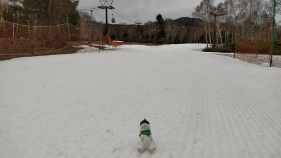

朝から気温は高めで．

あさイチから雪は緩んでおり，

硬くは無かったとのことですが…

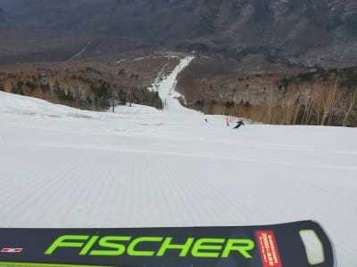

なんだか奥志賀第2高速ペア沿いの

エキスパートコース，ちょっとヤバい

感じになってきましたね…

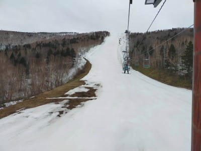

特に下の緩斜面部分．

これ…明日の雨を乗り越えられるのか？？

ちょっと心配…

いや，かなり心配…

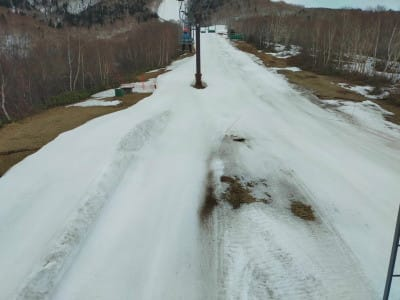

で．

こちらは，焼額の第2ゴンドラのパノラマコース．

焼額のこのあたりは一見，まだ雪が

ありそうに見えますが…

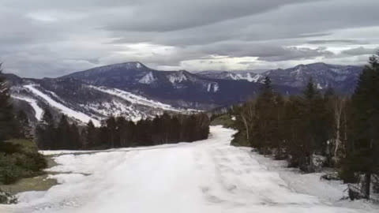

でも，ちょっとヤバい部分もありますね…

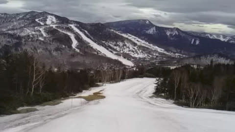

この廊下部分も，いろんなところから雪を運んで，

まだしっかり雪をつけてありますが．

もう雪出しをするところがないので．

明日の雨が心配…

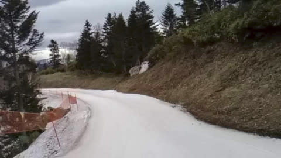

とはいえ，まだこれだけ雪があるので，

GW前半は何とかもちそうな感じかな…

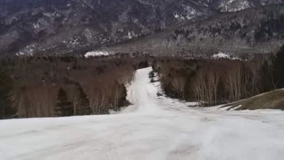

で．

午前は曇り空だった志賀高原．

午後は無駄に晴れてしまったようで．

うーん．

この時期，意味なく晴れちゃうと

雪が解けるし，貼りついて滑らない

雪になるので，曇っていてほしい…(祈)

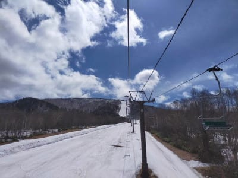

トップシーズンは晴れてほしいけど，

この時期は晴れてほしくない

という，身勝手な願いではあるけれども．

この残念な晴天のおかげで，

午後2時ごろにはもう滑りの悪い

雪になっていき，下の緩斜面は

妖怪板掴みが絶賛大量発生

していたようです(涙）

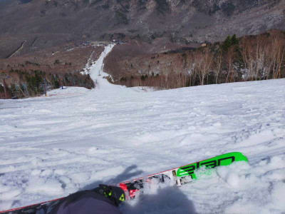

とはいえ，エキスパートのコブ斜面は

ちょうどいい感で楽しめたみたいです！！

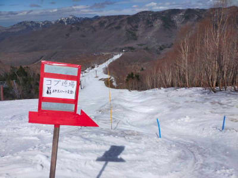

…しかし，一の瀬ファミリー下部も，人工雪を

着けてない側に土が出始めてきて．

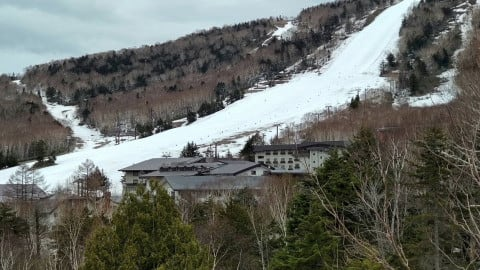

高天ヶ原は，GW最終日までの営業を

狙って，クワッドリフトの営業を終了．

上部の雪を下ろしてトリプルリフトに集約，

GWはトリプルリフトで生き残りをかける

ようです…

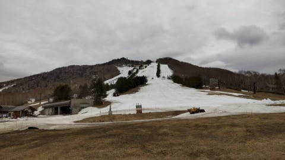

…ということで，これからGWの

営業終了の5月5日まで，残りわずか

あと1週間．

志賀高原はこれからの1週間，

無事最後まで生き残れるのか！？？？

高温・強風・雨の三重苦に見舞われる，

明日の雨を乗り切れるかどうかが正念場です…（祈）

## 💬 コメント一覧

### 💬 コメント by (Unknown)
**タイトル**: Unknown
**投稿日**: 2021-04-29 00:29:46

マイアも悪天候の木、金曜日は休業し、

５月からの営業に備えたみたいです。

木曜日の雨が小雨なら良いのですが、、、

大雨予報でとても心配です。

### 💬 コメント by (ikkun)
**タイトル**: Unknown
**投稿日**: 2021-04-29 19:21:01

やはり朝から雨(泣)……山と反対方向に参ってしまいました(笑)

やけびは???

### 💬 コメント by (Skier_S)
**タイトル**: 今日は小雨の一日
**投稿日**: 2021-04-30 00:20:11

＞Unknounさま

あら…マイアも一時休止ですか！

今日は意外と小降りでたすかりました…

でも，夜も降り続けているので，早く止んでほしい…

＞ikkunさま

朝から雨でしたが，意外と楽しかったですよ！！

### 💬 コメント by (ikkun)
**タイトル**: Unknown
**投稿日**: 2021-04-30 10:46:30

おはようございますm(__)m頭が下がる➰❤️(笑)

行くならば４日かなと❗分かりませんが(笑)

