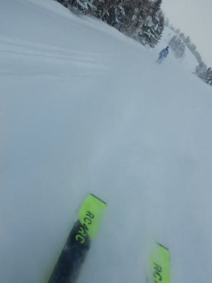

# さらば，'20 FISCHER RC4 Worldcup RC！…え？今シーズンにデビューさせた板，もうドナドナされちゃうの…？

📅 投稿日時: 2022-02-05 00:08:04

🏷️ カテゴリ: [日記](cc4b5682fb7b8b144980957a978653fb0.md)

本日の志賀高原ですが．

雪が降ったり止んだりという誰かの

予想は外れて．

晴れの一日だったようです…

いや．

だって．

今日の天気図見ても晴れそうな

要素なかったじゃん？？

…と思っていたけど…

なんだか，水曜深夜段階の予想天気図では

こんな感じで能登半島より西に延びていた

JPCZ．

（水曜段階の，4日の予想天気図）

本日の天気図だと…

JPCZがかなりの西風で流されて，

能登半島より東に着弾する予想図に

変わってるじゃないですか！！

（昨日の夜中発表の4日予想天気図）

これは…志賀高原で降らないパターン

なんだけど…

なんでこんな風に変わったの？？？

と，思ったら．

どうやらこんなところにプチ低気圧が

発生して．

こいつに向かって風が吹き込む形で

JPCZが歪んでいたようで…

実際，今日の気象衛星写真を見ても，

風が低気圧に向かって吹き込み…

志賀高原近辺では，西風どころか

南に近い風になってました．

これでは雪雲が日本海から流れて

こないわけだ…

ということで．

今日の予想を外したのは，私のせいではなく．

水曜夜段階の予想図で，プチ低気圧の

発生を予想していなかった気象庁の

予想図が悪いんです！！←これを責任転嫁と呼ばずなんというのか？？

しかし．

ご安心ください．

明日，土曜の朝は脛パフ以上で

終日雪降り，

明後日日曜の朝は，膝パフ，

ヘタすれば太ももパフくらいで

日中も激しく降るエンドレスパウダーデー

という予想は変わりません！！

土日とも，

根性の無いスキーヤーふるい落とし機能

フル発動です！！←新雪は嬉しいが，ふるい落とされる天気は嬉しくないんだけど…

ってなことで．今週末は予想通り，

久しぶりの土日ともパフパフパウダーデー

ですね…

土日とも，朝のスキー場への道路はすごいことに

なっていると思うので，ご注意を…

ってなことで，本題へ．

昨年GWに買った，2本目の大回り板，

'20 FISCHER RC4 Worldcup RC Yellowbase 180cmを

今シーズンデビューさせて．

普段履きとして酷使愛用していたのですが．

焼額で一緒に滑っていた，某氏．

これまでロングの板を履いたことがない

ということで，

ロングの板ってどんな感じか興味があったらしく…

たまたまブーツサイズが私と同じだったので，

「履いてみますか？」

と，試し履きしてもらったのですが…

やはり，[自分もかなりの名機だと思う](ef17d940e4683a8609220b4491e9856df.md)

'20のFISCHER RC．

180cmの板ならではの安定性と

スピード耐性が気に入ったようで．

履き終わった後，

「これと同じようなロングの板が欲しい…！」

とのことでしたが，

残念ながら，この板は2シーズン前の板なので，

今はもう手に入りませんよ…

とお答えしたところ．

「同じような板か後継機が無いかな…」

と，探すということになったのですが．

…ちょっと待て

焼額常連メンバーの某氏から，

「'21 FISCHER RCの185cm，自分はもう

　履かないから買わない？」

と打診されていたなぁ…

ということを思い出したのでした．

R=18.5mの'20 FISCHER RC 180cm．

ロング板とすると，ちょっと回りすぎると

感じる時もあったけど．

…まぁ，このくらい回ってくれる方が，

オールラウンドな普段履きとしては

ちょうどいいかな…

と思っていたところではあるものの．

うーむ．

R=20mの185cmも捨てがたいなぁ…

小回り板と履き替えて，ある程度の

大回り用と割り切れば，185cmでも

いいのかも…

…180cmのバックアップ用に185cmを

買おうかな？

とも心揺らいでいたものの．

「でも，また物欲に負けて，これ以上板が

　増殖していくのもヤバいよな…」

と，珍しく（？）自制していたのですが．

「…ちょっと待て．

　180cmを欲しいと言っている人が

　いるんだから，この人に180cmを

　譲って，私が185cmを買えば…

　185cmを売りたい人も，180cmを

　買いたい人も，私も喜ぶ

　Win-Win-Winなのでは？？」

って感じの，気の迷いとしか思えない判断で．

’20 FISCHER RC4 WC RC Yellowbase 180cmを売り，

’21 FISCHER RC4 WC RC M/O Plate 185cmに買い替える

という，焼額常連間での謎のトレードが

実施され，

私のメイン板が185cmに変わってしまいました～！！

カンの良い方は気づいている．

先週末のレポート写真に，見慣れない

’21 FISCHER RC4 RCが写っていたことを…

うーむ．

ヤバい．

ブーツを買い替えてからというもの．

大回り板ばかり履くようになってきたけど．

さらに，より長い板が欲しくなり，

180cmから185cmに履き替えるとは…！

これは…

来年になったら，2mくらいの板を

履いてるかも…！？？←カービングスキー以前じゃあるまいし，2mはありえないから

## 💬 コメント一覧

### 💬 コメント by (m&t)
**タイトル**: Unknown
**投稿日**: 2022-02-05 00:35:58

Sさんの天気予報当たるんだよなぁ...

と、言うことで、太板の無い我々は、明日はホームのアサマにしました

でも、もしかしたらセミファットのオールラウンド板をポチッとしちゃうかも（でも今週は間に合わない...）

### 💬 コメント by (カンタロス)
**タイトル**: Unknown
**投稿日**: 2022-02-05 07:41:16

Sさま、こんにちは。

大丈夫です。

世の中にはSG板やDL板がありますよ！

R45とか、もはやサイドカーブがあるようには見えないですよ。

総合すると、来シーズンはfIS板ですね（笑）

### 💬 コメント by (おおすぎ)
**タイトル**: Unknown
**投稿日**: 2022-02-05 11:40:02

ココ近年（とは言っても、20年以上！）１６６cmより長い板を履いたことが無いのですが・・・

（有っても無縁だと思っていました）

１８０以上のロング用の板は、どのような感じなのでしょうか？

わたしも、そのお譲りされた方に近い感覚だと思っております。

リフト並んでいるときとか、不便はないでしょうか？なんか地元の子供たちに踏まれまくっているようで・・・

### 💬 コメント by (レインボー74)
**タイトル**: Unknown
**投稿日**: 2022-02-05 14:35:58

土曜日の志賀高原情報

湯田中は車に25cm新雪。上林-5℃　蓮池-11℃。雪降りの一日。

真っ先にスーパーに飛び込むも、硬いコブに当たって実力不足を痛感。40cm以上あるのに残念。

GSサイドは底づきもなくまずまず。

イチゴン乗り場でボーダーが治療を受けていました。ニゴンに一番で並んでいた人かなあ。懸命な措置でなんとか甦ったみたい。無事だといいけど！

降り続く雪でパノラマでも10cm越え。

三高に行くと、10時オープンのウオールを凄いのが二人。新潟県人の真似はできない。

ミドルに入るも、ゴーグル&メガネが！外して滑ったら目が痛いこと。。

今日は初めて予備のゴーグルをポケットに忍ばせたんです。そのあとこれが大当たり。本日一の感動でした。

獅子で昼食して、東館で珈琲飲んで、レインボー前に退散。今日も根性なしふるい落とし網にかかりました。

### 💬 コメント by (ヒータロゥ)
**タイトル**: Unknown
**投稿日**: 2022-02-05 16:22:49

1ゴン前で蘇生措置受けていた方、なんとか甦っていたんですね。他人事ながら心配しておりました。スキーヤーとボーダーの違いがあれどこのような悪天候の中を滑る者として親近感を感じ無事を祈るのみです。

### 💬 コメント by (副院長)
**タイトル**: Unknown
**投稿日**: 2022-02-05 19:37:30

S様、明日の朝、京都からの道中が修行のようですが、頑張ります。梯団走行につかまらなければいいのだけど。ついたころは新雪はほぼ蹴散らかされてるだろなぁ。少しは残しておいてくださいね。

### 💬 コメント by (Skier_S)
**タイトル**: 明日もパウダー！！
**投稿日**: 2022-02-06 00:33:44

＞m&tさま

ぜひ，太板を買うべきです…

買った後，「なんでもっと早くに買わなかったんだろう？？」

と思いますよ…！！

＞カンタロスさま

SG板は私には無理です…（笑）．

私にはR27くらいがちょうどいい感じです．

＞おおすぎさま

ロングの板もいろいろありますが，FICSHERの板は

安定性が高くて，スピード出した時の安心感が短い板とは全然違います！！

…逆に言うと，スピードを出さないと本領を発揮できない板かも…

激混みリフト待ちに並んだことはないですが，166cmと180cmって，前後5~6cm長さが違うだけなので，

そんなに差は感じないです…

＞レインボー74さま

今日はふるい落とされてもやむなしの天気だったかと…

しかし，ゴーグル2個持ちとは…！！

＞ヒータロゥさま

衝突や転倒ではなかったようですが，体調には気を付けないと…と思いました．

もし復活されたならちょっと安心です…

＞副院長様

明日，志賀の登り坂はすごいことになってる可能性が…

今日のナイター終了後の下りも新雪20㎝の坂道を降りてきました．

明日の登り，お気をつけていらしてください！！

### 💬 コメント by (ikkun)
**タイトル**: Unknown
**投稿日**: 2022-02-07 06:29:41

ヤバい 羨ましいです(泣)  やはりかねなし人間には悲しい スポーツですな  しかもコロナとこのクリスマスからの大雪でゲレンデはヤバい そしてアシスタントには仕事は回って来ない???とか？色々がっかりな今です  ちなみに来シーズンのロシニョール183履きました 良かったですよ

### 💬 コメント by (Skier_S)
**タイトル**: ＞ikkunさま
**投稿日**: 2022-02-09 00:51:20

すいません．コメントに気づくの遅れ回答遅くなりました…

今年の大雪はすごいですよね…

しかし，もう来シーズンモデル履いたんですか！？？

### 💬 コメント by (ikkun)
**タイトル**: Unknown
**投稿日**: 2022-02-09 13:17:48

いやいや(笑)スキー場にロシニョールとディナスター来てました スーパービラージュ？乗れずフォルクル175にと言ったら選んで頂きましたよ🎵長さ感じませんでした後ね➰(笑)ディナスター OMEGLASSMASTERSL168？軽くてびっくりでした

### 💬 コメント by (Skier_S)
**タイトル**: ＞ikkunさま
**投稿日**: 2022-02-10 04:33:10

来シーズンモデル，いいなぁ…

早く乗ってみたいです．

